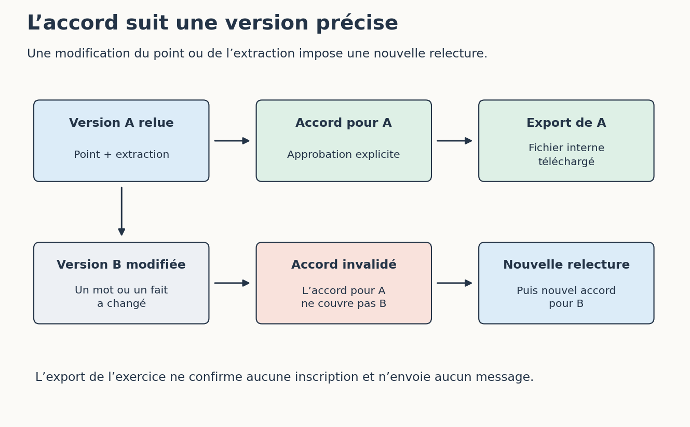

# 5. Relire avant d’agir

**TL;DR** — Nous allons relire le point, approuver sa version actuelle et constater qu’une modification retire cet accord. Le résultat sera un fichier téléchargé sur notre ordinateur ; la date et les confirmations d’inscription resteront à décider.

Un brouillon peut être prêt à circuler dans l’équipe tout en contenant une question ouverte. C’est même l’une des raisons de préparer notre point de vendredi : Camille doit pouvoir voir les deux dates et décider laquelle retenir.

Reprenez `pipeline/index.html` dans votre navigateur. Nous allons séparer trois gestes que les interfaces mélangent parfois : contrôler des données, approuver un document et effectuer une action. Un bouton vert ne devrait pas nous faire oublier ce que nous venons d’autoriser.

## Approuver une version précise

Pour retrouver un point de départ connu, ouvrez l’application dans un nouvel onglet sans importer d’état. Cliquez sur **Charger l’exemple fictif**, puis sur **Contrôler et préparer**. Si vous préférez utiliser votre propre extraction, conservez-la d’abord dans un fichier : l’exemple remplace le contenu de la zone « Extraction JSON ».

Regardez « Point proposé ». Vous pouvez le modifier comme un texte ordinaire. Avant de l’approuver, gardez les pièces de départ à côté et relisez les éléments qui changeraient une décision : Nora demande deux places en Reliure ; Léo demande deux places sans préciser l’atelier ; sa demande nécessite donc une question. M005 demande un horaire, sans ajouter de place. Samir est déjà connu sous M004.

Retrouvez aussi les deux dates avec leurs sources et l’horaire encore absent. Le contrôle de l’application retrouve un extrait dans le bon fichier et vérifie la forme des données. Il ne lit pas le français à votre place. Un extrait authentique peut être associé à une interprétation erronée ; c’est précisément ce que la comparaison avec les messages doit repérer.

Cochez « J’ai comparé ce point aux sources, vérifié les informations manquantes et les décisions laissées ouvertes », puis cliquez sur **Approuver cette version**. Avant de l’exporter, ajoutez une courte phrase dans « Point proposé », par exemple : « À discuter lors du point de vendredi. » Regardez l’état de l’approbation et le bouton d’export : l’accord doit être retiré et la case décochée. Même une modification anodine produit un contenu que vous n’avez pas encore approuvé.

Une modification du point impose une nouvelle approbation. Cela évite qu’un document validé avec « date à clarifier » puisse être remplacé ensuite par « rendez-vous le 17 octobre » sous couvert d’une amélioration de style.

Figure: L’accord porte sur le contenu relu

Relisez votre ajout, cochez à nouveau la confirmation de lecture et approuvez. Si vous repartez de l’extraction JSON pour préparer une autre proposition, reprenez également le contrôle et la relecture. Le bouton « Contrôler et préparer » régénère le point : sauvegardez d’abord vos corrections si vous voulez les conserver. L’accord porte sur le point obtenu dans cette préparation ; il ne donne aucune avance sur les versions à venir.

## Garder les décisions à leur place

Que venez-vous d’approuver ? Dans notre application, le point interne est prêt à être exporté. La demande de Léo reste incomplète et la date reste à clarifier. Ces informations font partie du document approuvé. On peut parfaitement approuver la phrase « la date reste à décider ».

Cela nous permet de continuer le travail utile. Nous pouvons relever les nouvelles demandes, préparer la question à Léo et rapprocher les deux comptes rendus. En revanche, annoncer une date certaine ou confirmer les inscriptions dépend d’une décision de l’équipe qui manque toujours. Le point interne rend ce blocage visible sans arrêter toute la préparation.

| Proposition | Décision possible avec notre dossier |
| --- | --- |
| Conserver deux places demandées par Nora en Reliure | Oui, comme demande à examiner |
| Préparer la question sur l’atelier souhaité par Léo | Oui, sous forme de brouillon |
| Exporter le point qui expose les deux dates | Oui, après relecture |
| Annoncer le 17 octobre comme date définitive | Attendre la clarification de l’équipe |
| Confirmer les places aux participants | Attendre les décisions et une autorisation d’envoi |
Table: Ce que le point permet de préparer et ce qui reste en attente

Le nom de l’action compte. « Valider le dossier » serait vague : une personne pourrait comprendre « la synthèse est fidèle », une autre « on peut annoncer la journée ». Dans une vraie application d’équipe, préférez un accord qui nomme le document, sa version et l’action suivante. Pour un courriel, la personne qui décide doit voir le destinataire, l’objet, le texte et les éventuelles pièces jointes. L’approbation d’un résumé ne suffit pas à approuver un message différent.

Vous pouvez refuser le point en le laissant à l’état de proposition. Notez alors ce qu’il faut corriger, en vous appuyant sur une source : « Léo n’a pas choisi Reliure ; conserver l’atelier non précisé, voir M002. » Cette demande donne un travail précis à la personne ou à l’assistant qui reprend le document. « Recommence mieux » laisse beaucoup plus de place à une nouvelle invention.

Dans notre atelier, aucune nouvelle décision de Camille n’arrive au cours de la manipulation. Ne modifiez donc pas la date pour réussir à terminer l’exercice : l’export du point interne n’en a pas besoin.

## Modifier, relire et exporter

Une fois votre point relu et approuvé, cliquez sur **Exporter le point**. Ouvrez `point-quartier-01.md` dans un éditeur de texte. Vérifiez que vous retrouvez la version approuvée, y compris la phrase ajoutée pendant l’essai. Le dossier de téléchargement dépend de votre navigateur ; celui-ci peut aussi vous demander où enregistrer le fichier.

Ce geste crée une sortie locale. L’application ne connaît aucun compte de messagerie et n’envoie pas le document. Si vous souhaitez un jour le transmettre, ce sera une autre action, avec sa propre décision. Pour cet exercice, le fichier reste sur votre ordinateur et ses destinataires restent fictifs.

Retournez à la vue **Journal**. Elle conserve les événements de la manipulation et aide à retrouver l’ordre de vos gestes : préparation, approbation, modification éventuelle, nouvelle approbation, export. Cherchez où votre premier accord a cessé d’être valable. Si vous comparez deux essais, ce détail permet d’expliquer pourquoi l’un a produit un fichier et l’autre s’est arrêté avant l’export.

Le journal et l’état de cette application sont locaux et modifiables. Ils servent à comprendre et à reprendre l’exercice. Ils ne permettent pas d’authentifier Camille, d’établir qu’un collègue a réellement cliqué sur un bouton ou de prouver qu’aucune ligne n’a été retouchée. Une application utilisée par plusieurs personnes aurait besoin de comptes, de droits et d’un historique gérés en conséquence. Ajouter un nom dans un fichier texte ne résout pas ces questions.

Enfin, cliquez sur **Exporter l’état** et gardez `etat-quartier-01.json` avec votre point. L’état conserve les informations nécessaires à la reprise du pipeline. Le fichier du point, lui, est le document à lire. Les deux répondent à des besoins différents : conserver une synthèse et retrouver où en était le traitement.

Après l’export du point, M001, M002 et M005 sont considérés comme pris en compte dans ce rapport. M004 était déjà connu au départ. Cette progression ne transforme aucune demande en inscription confirmée. Pour savoir qui dispose effectivement d’une place, l’équipe devra toujours reprendre son suivi de référence et ses décisions.

L’application marque cette progression dès qu’elle déclenche le téléchargement. Elle ne sait pas si vous avez ensuite annulé l’enregistrement dans votre navigateur. Vérifiez donc la présence du fichier avant de fermer la page. Si vous avez annulé le téléchargement, exportez l’état : il contient aussi le point préparé et permet de le retrouver.

Gardez également l’extraction et, si vous avez fait appel à un assistant, sa réponse avant correction. Avec ces pièces, vous pourrez examiner si l’erreur venait de la lecture du message, d’une modification manuelle ou de la reprise du lot. Sans elles, nous risquerions de demander au modèle de corriger un problème apparu après son intervention.

Nous avons un point relu, un fichier exporté et un état de travail à conserver. L’approbation s’est appliquée à une version précise ; modifier le texte a demandé une nouvelle décision. Les questions ouvertes ont pu rester dans le point sans empêcher sa préparation.

Reste à savoir ce qui arrive quand nous fermons la page ou que nous présentons à nouveau les mêmes messages. Nora ne devrait pas se retrouver avec une seconde demande simplement parce que notre ordinateur a redémarré. Nous allons reprendre l’état sauvegardé et rejouer le lot.

