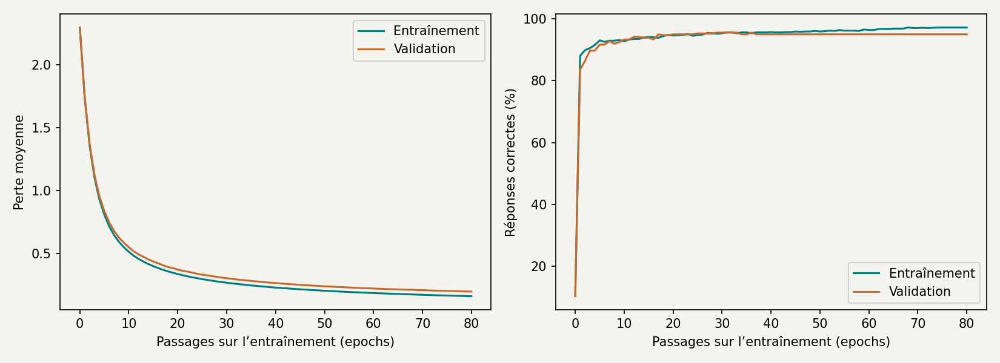
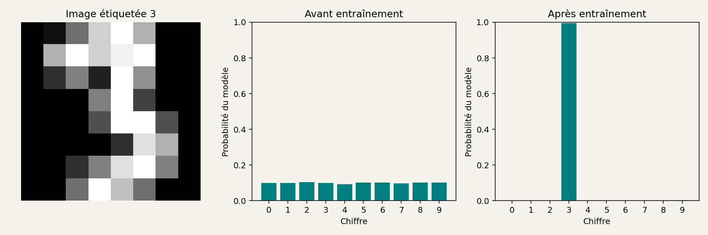
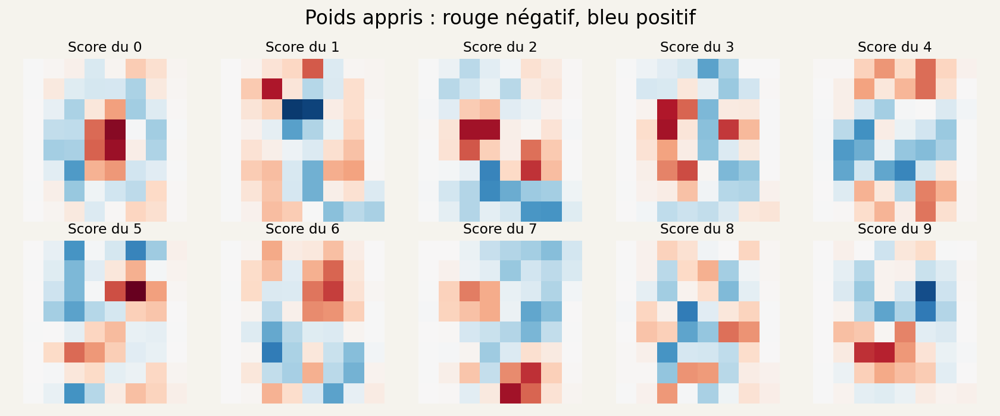
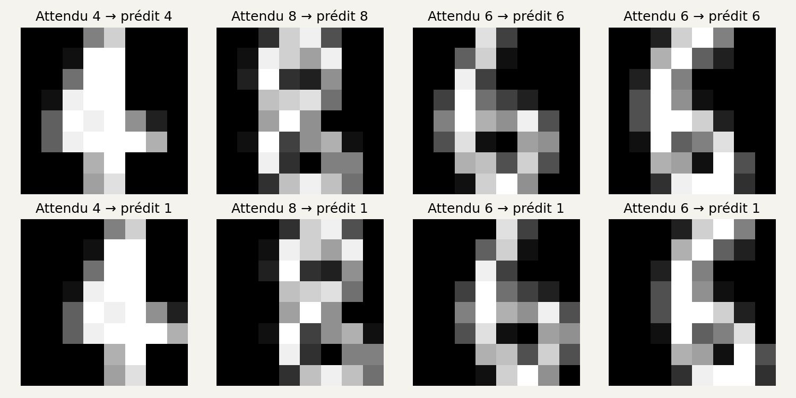
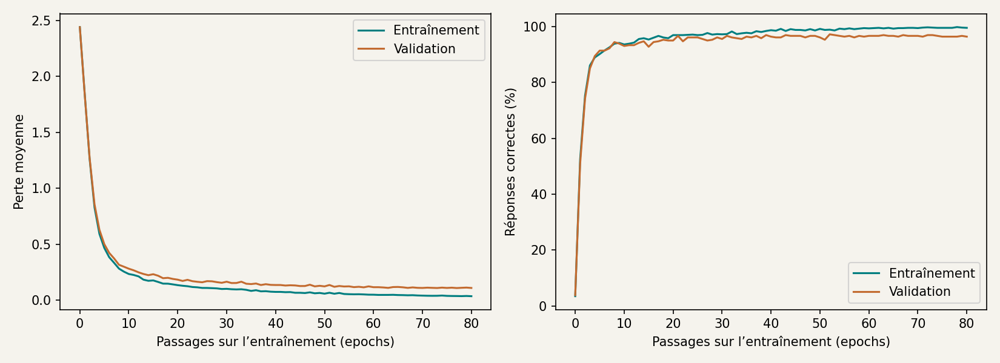
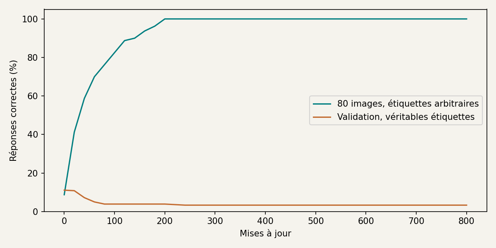
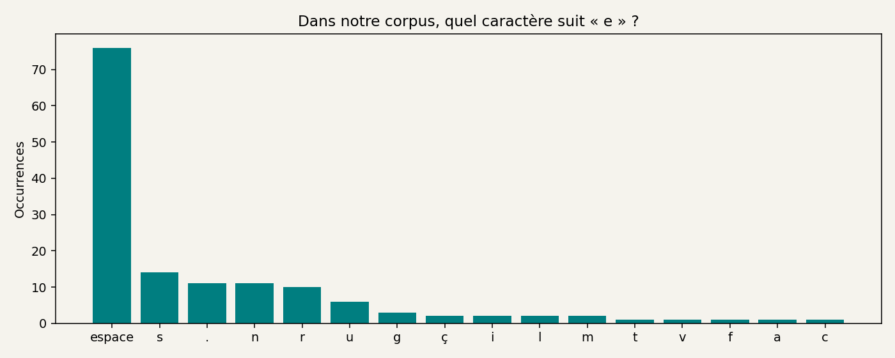
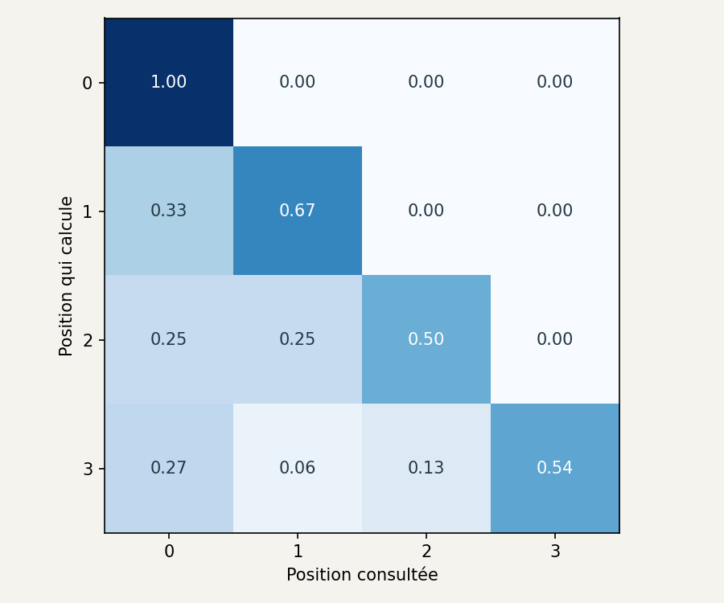

# Comprendre un modèle en le construisant

**TL;DR**

- Nous allons entraîner un programme à reconnaître des chiffres, puis lui soumettre nos propres dessins. Tout fonctionne sur CPU, sans abonnement ni carte graphique dédiée.
- Un modèle reçoit des nombres, calcule une réponse et ajuste ses paramètres pendant l’entraînement. Nous écrirons ces calculs avec NumPy.
- Nous garderons des images à part pour vérifier les résultats. Le modèle pourra réussir ses exercices et se tromper sur un chiffre légèrement décalé. 😅
- Un second petit projet produira du texte. Nous manipulerons les tokens, le choix du caractère suivant et un calcul d’attention, avant de regarder où interviennent les outils d’un agent.

Prenez un crayon et écrivez un trois. Vous avez probablement fait deux courbes, sans mesurer exactement leur position. Écrivez-en un deuxième : il ne sera pas identique au premier, mais vous le reconnaîtrez quand même.

Pour un programme, nous allons devoir préciser ce qui entre, ce qui sort et comment décider qu’une réponse est correcte. Les images feront huit pixels de côté. C’est petit, mais suffisant pour commencer à lui donner du travail.

Vous aurez besoin de savoir lancer une commande et de connaître les bases de Python : variables, fonctions, boucles et listes. Les calculs sur des tableaux seront expliqués au moment où nous les utiliserons.

## 1. Installer notre petit atelier

Notre programme devra choisir un chiffre entre zéro et neuf. Pour l’instant, il ne sait rien reconnaître. Commençons par lui fournir des images et par regarder ce qu’elles contiennent.

### Préparer Python et les fichiers

[Télécharger les fichiers de l’atelier](annexes-atelier-ia-v1.zip).

Décompressez l’archive. Elle contient deux dossiers :

- `atelier-ia` : le code, les données du petit corpus et la grille de dessin ;
- `resultats-reference` : les modèles entraînés, les graphiques et les journaux de nos essais.

Ouvrez le dossier `atelier-ia` dans votre éditeur. Les commandes partiront de ce dossier. Le programme y créera `sorties` pour vos propres résultats ; ceux de référence restent à part.

Vous pouvez commencer en regardant ces fichiers :

| Fichier | Rôle |
| --- | --- |
| `01_observer.py` | Charger les images et les afficher |
| `commun.py` | Préparer les données et les trois groupes |
| `modele.py` | Calculer les réponses et les gradients |
| `03_entrainer.py` | Répéter les mises à jour et sauvegarder |
| `dessiner.html` | Dessiner un chiffre à fournir au modèle |

Les autres scripts seront utilisés au fil des manipulations.

Nous utiliserons **Python 3.12 en version 64 bits**. Les exécutions présentées ici ont été faites avec Python 3.12.14 sous Linux. Les commandes d’installation pour Windows et macOS suivent la documentation de Python ; elles n’ont pas été exécutées sur ces deux systèmes.[^p2-1-installer-windows][^p2-1-installer-mac]

Ouvrez un terminal dans `atelier-ia`. Sous Windows, utilisez ici l’**Invite de commandes** (`cmd`). Vérifiez que Python est disponible :

```bat
py -3.12 --version
```
Code: Windows, Invite de commandes

```bash
python3.12 --version
```
Code: Linux et macOS

Si la commande est introuvable, installez Python 3.12 depuis les distributions proposées par Python ou par votre système. Si votre commande `python3` affiche déjà Python 3.12, vous pouvez l’utiliser à la place de `python3.12`.

Créons un **environnement virtuel**. Il gardera les bibliothèques de cet atelier dans son propre dossier, `.venv`.[^p2-1-installer-venv]

Sous Windows, dans l’Invite de commandes :

```bat
py -3.12 -m venv .venv
.venv\Scripts\activate.bat
python -m pip install -r requirements.txt
```

Sous Linux ou macOS :

```bash
python3.12 -m venv .venv
source .venv/bin/activate
python -m pip install -r requirements.txt
```

L’installation utilise Internet. Ensuite, les expériences se déroulent localement : les données sont incluses dans scikit-learn, et aucun appel à une API d’IA n’est nécessaire.

Dans les commandes suivantes, `python` désigne celui de cet environnement activé. À chaque nouveau terminal, revenez dans `atelier-ia` et relancez la commande d’activation. Sous PowerShell, vous pouvez aussi appeler directement `.venv\Scripts\python.exe` à la place de `python`, sans activer l’environnement.

Le fichier `requirements.txt` fixe les versions utilisées :

```text
numpy==2.3.5
scikit-learn==1.8.0
matplotlib==3.10.8
threadpoolctl==3.6.0
```
Code: requirements.txt

NumPy effectuera les calculs sur les tableaux. scikit-learn fournira les images et leur découpage en groupes. Matplotlib écrira les graphiques dans des fichiers PNG. `threadpoolctl` limitera les multiplications matricielles de l’entraînement à un seul fil CPU.

Nous n’utiliserons pas de modèle de reconnaissance déjà entraîné : les paramètres partiront de valeurs initiales et seront ajustés par notre propre code.


[^p2-1-installer-windows]: [Python 3.12, installation sous Windows](https://docs.python.org/3.12/using/windows.html).

[^p2-1-installer-mac]: [Python 3.12, installation sur macOS](https://docs.python.org/3.12/using/mac.html).

[^p2-1-installer-venv]: [Python, environnements virtuels avec venv](https://docs.python.org/3.12/library/venv.html).

### Afficher les chiffres

Lancez :

```bash
python 01_observer.py
```

Voici la sortie obtenue :

```text
Images : 1797 ; pixels par image : 64
Entraînement : 1077 ; validation : 360 ; test : 360
Valeurs normalisées : 0.0 à 1.0
exemple.json : chiffre 3, provenant de l'entraînement
Image écrite : sorties/chiffres.png
```

Ouvrez `sorties/chiffres.png` dans votre visionneuse d’images.


Figure: Images issues des données d’E. Alpaydin et C. Kaynak, UCI, [CC BY 4.0](https://creativecommons.org/licenses/by/4.0/). Les nombres au-dessus sont leurs étiquettes.

Vous pouvez reconnaître la plupart des chiffres malgré le petit nombre de pixels. Le programme, lui, reçoit **64 nombres par image**. L’étiquette fournit la réponse attendue : pour une image de trois, elle vaut `3`.

Dans `commun.py`, ces deux lignes chargent les données et changent leur échelle :

```python
chiffres = load_digits()
X = chiffres.data.astype(np.float64) / 16.0
```

`load_digits()` fournit 1 797 images de 8 × 8 pixels. Les valeurs d’origine vont de 0 à 16. Nous les divisons par 16 pour obtenir des nombres entre 0 et 1 : le fond vaut zéro et les pixels les plus clairs valent un.[^p2-1-premieres-images-digits]

Ces images proviennent d’un jeu de chiffres manuscrits préparé par E. Alpaydin et C. Kaynak. Le jeu original utilise des images regroupées en blocs pour obtenir ces 64 mesures ; il est distribué par UCI sous licence CC BY 4.0.[^p2-1-premieres-images-uci]

Dans le code, `X` contient les images, et `y` leurs étiquettes. Les noms sont courts parce qu’ils reviennent souvent dans les formules. `X.shape` vaut `(1797, 64)` : 1 797 lignes d’images, avec 64 valeurs sur chaque ligne.

Pour afficher une de ces lignes sous forme de carré, nous utilisons :

```python
X[index].reshape(8, 8)
```

`reshape` réorganise les valeurs. Il ne devine rien et ne change pas l’image. Nous rangeons simplement les 64 nombres en huit lignes de huit.


[^p2-1-premieres-images-digits]: [scikit-learn 1.8, load_digits](https://scikit-learn.org/1.8/modules/generated/sklearn.datasets.load_digits.html).

[^p2-1-premieres-images-uci]: [E. Alpaydin et C. Kaynak, Optical Recognition of Handwritten Digits, UCI (1998), CC BY 4.0](https://doi.org/10.24432/C50P49).

### Mettre des images de côté

Nous pourrions entraîner le modèle sur toutes les images, puis compter ses bonnes réponses sur ces mêmes images. Mais nous voudrions aussi savoir comment il se comporte sur celles qu’il n’a pas utilisées pour apprendre.

Nous formons donc trois groupes :

| Groupe | Images | Usage |
| --- | ---: | --- |
| Entraînement | 1 077 | Calculer les modifications des paramètres |
| Validation | 360 | Comparer les réglages, observer l’apprentissage |
| Test | 360 | Faire le bilan une fois les choix arrêtés |
Table: Le découpage utilisé par les programmes de cet atelier.

Dans `commun.py`, `train_test_split` tire d’abord le test, puis sépare l’entraînement de la validation. `stratify` conserve approximativement la proportion de chaque chiffre dans les groupes. `random_state=42` permet de refaire le même tirage.[^p2-1-repartir-split]

Pourquoi ne pas prendre simplement les premières images ? Parce que leur ordre peut avoir une signification : une série de chiffres écrits par la même personne, par exemple. Un découpage mérite toujours qu’on regarde comment les données ont été produites.

Notre tirage sépare des **images**, pas des personnes. Un bon résultat ne prouvera donc pas que le modèle reconnaît aussi bien l’écriture d’une personne absente de l’entraînement. C’est justement ce que nos propres dessins vont mettre à l’épreuve.

La division par 16 reste la même pour les trois groupes : cette valeur vient du format des images. Si nous calculions une moyenne pour normaliser les données, il faudrait la calculer sur l’entraînement, puis la réutiliser ailleurs. Calculer ce réglage avec le test lui ferait déjà influencer le modèle.[^p2-1-repartir-fuite]


[^p2-1-repartir-split]: [scikit-learn, train_test_split](https://scikit-learn.org/1.8/modules/generated/sklearn.model_selection.train_test_split.html).

[^p2-1-repartir-fuite]: [scikit-learn, prétraitements et fuites de données](https://scikit-learn.org/1.8/common_pitfalls.html).

### Si la première commande ne fonctionne pas

Les erreurs les plus courantes à cette étape concernent l’environnement, pas les réseaux de neurones.

| Ce que vous voyez | Ce qu’il faut vérifier |
| --- | --- |
| `No module named numpy` ou `sklearn` | Réactivez `.venv`, puis relancez `python -m pip install -r requirements.txt`. |
| `can't open file ...01_observer.py` | Le terminal doit être dans le dossier qui contient les scripts. |
| `No module named venv` ou absence d’`ensurepip` | Installez le composant venv correspondant à votre Python avec les paquets de votre distribution. |
| Aucune fenêtre ne s’ouvre | C’est le fichier `sorties/chiffres.png` qu’il faut ouvrir. |
| Un script a été enregistré en `.py.txt` | Affichez les extensions dans l’explorateur et conservez uniquement `.py`. |

Pour vérifier quel Python travaille réellement :

```bash
python -c "import sys; print(sys.executable)"
```

Le chemin doit contenir le dossier `.venv` de l’atelier. Cela évite de chercher pendant vingt minutes pourquoi une bibliothèque est « installée » et « introuvable » en même temps. 🙂

Nous avons des images, leurs réponses attendues et trois groupes distincts. Aucun paramètre n’a encore été entraîné. Le modèle va maintenant devoir transformer les 64 pixels en dix scores.

## 2. Des pixels à une première réponse

Pour reconnaître un chiffre, nous allons calculer un score pour chaque possibilité : zéro, un, deux… jusqu’à neuf. Le score le plus élevé donnera notre choix.

Il faut d’abord décider comment calculer ces scores. Nous commencerons avec des multiplications et des additions.

### Ce que fait un poids

Imaginons que nous regardions seulement trois pixels d’une image. Ils valent `1`, `0,5` et `0`. Pour calculer un score, nous leur associons les poids `0,2`, `−0,4` et `0,7`, puis nous ajoutons un nombre de départ, appelé **biais**, égal à `0,1`.

```text
score = 1 × 0,2 + 0,5 × (−0,4) + 0 × 0,7 + 0,1
score = 0,1
```

Le deuxième pixel fait baisser le score : son poids est négatif. Le troisième ne contribue pas ici, puisqu’il vaut zéro. Le biais ajoute une valeur même lorsque tous les pixels sont noirs.

Dans notre véritable modèle, nous faisons ce calcul avec les 64 pixels, et nous le répétons pour chacun des dix chiffres. Nous avons donc 64 × 10 poids et dix biais, soit **650 paramètres**.

Dans `modele.py`, la version sans couche intermédiaire commence ainsi :

```python
return {"W": rng.normal(0, 0.01, (64, 10)), "b": np.zeros(10)}
```

`W` est un tableau de 64 lignes et dix colonnes. Une colonne contient les poids d’un chiffre. `b` contient les dix biais. Les poids sont initialisés avec de petites valeurs aléatoires ; les biais commencent à zéro.

Calculons les scores pour un lot d’images :

```python
scores = X @ p["W"] + p["b"]
```

Le symbole `@` effectue une **multiplication de matrices**. Il condense les produits et les additions que nous venons de faire à la main. Avec 64 images en entrée, les dimensions sont :

```text
X : 64 images × 64 pixels
W : 64 pixels × 10 chiffres
scores : 64 images × 10 chiffres
```

Le premier `64` est la taille du lot ; le second est le nombre de pixels. Ils sont égaux ici par choix, mais ce sont deux choses différentes. Nous pourrions traiter 12 images à la fois sans changer le nombre de poids.

### Transformer les scores en probabilités

Les scores peuvent être positifs ou négatifs. Nous les passons à une fonction appelée **softmax**, qui produit des nombres positifs dont la somme vaut un.[^p2-2-softmax-softmax]

```python
def softmax(scores):
    decales = scores - scores.max(axis=1, keepdims=True)
    e = np.exp(decales)
    return e / e.sum(axis=1, keepdims=True)
```

`np.exp` calcule l’exponentielle de chaque score. Nous divisons ensuite ces valeurs par leur somme. La soustraction du maximum empêche les exponentielles de devenir inutilement grandes ; elle ne change pas les probabilités obtenues.

`axis=1` signifie « séparément pour chaque ligne », donc pour chaque image. Sans cette précision, nous risquerions de mélanger les résultats de plusieurs images.

Le modèle peut ainsi attribuer `0,60` au trois, `0,25` au huit et répartir les `0,15` restants sur les autres chiffres. Pour choisir une classe, nous prenons la position de la plus grande valeur :

```python
chiffre = probas.argmax()
```

Un score de 60 % est une probabilité **calculée par le modèle**. Ce n’est pas automatiquement la garantie que 60 % des dessins ayant ce score seront bien reconnus. Pour savoir si les scores correspondent aux fréquences de réussite, il faudrait aussi étudier leur calibration.


[^p2-2-softmax-softmax]: [Dive into Deep Learning, Softmax Regression](https://d2l.ai/chapter_linear-classification/softmax-regression.html).

### Lancer le modèle avant l’apprentissage

Exécutez :

```bash
python 02_predire.py
```

```text
Étiquette attendue : 3
Probabilités : [0.099 0.099 0.104 0.099 0.092 0.103 0.102 0.097 0.102 0.102]
Classe choisie : 2
Paramètres : 650
Exactitude avant entraînement : 10.3%
```

Le chiffre attendu est un trois. Le modèle choisit un deux. Ses probabilités sont toutes proches d’un dixième : les poids viennent d’être tirés au hasard, il n’a encore reçu aucune correction.

Les 10,3 % de bonnes réponses ne sont donc pas une panne. Avec dix classes assez équilibrées, une règle naïve ou un choix au hasard peut déjà obtenir un résultat de cet ordre. C’est un point de comparaison, pas un objectif.

Ouvrez `02_predire.py`. Remplacez :

```python
index = train[0]
```

par :

```python
index = train[1]
```

Relancez le programme. Nous avons changé l’image, pas les paramètres. Le score peut bouger, mais le modèle n’apprend rien en exécutant cette prédiction.

Vous pouvez conserver cette modification ou remettre `train[0]` pour retrouver l’exemple du trois. Le script d’entraînement choisit ses propres lots et ne dépend pas de ce changement.

Nous avons une première chaîne complète : une image devient des scores, puis des probabilités, puis un chiffre choisi. Elle fonctionne, mais les réponses sont mauvaises. Il manque un moyen de corriger les paramètres.

## 3. Faire apprendre le modèle

Le modèle se trompe sur un trois. Nous pourrions lui dire « non, c’est un trois », mais il faut traduire cette correction en calculs. Quels poids faut-il changer ? Et de combien ?

### Mesurer ce qui ne va pas

Prenons la probabilité attribuée à la bonne réponse. Si l’image représente un trois et que le modèle lui donne une probabilité de `0,9`, nous voulons une petite erreur. S’il lui donne `0,01`, nous voulons une erreur beaucoup plus grande.

Nous utilisons la **perte logarithmique**, ici l’entropie croisée pour une classe attendue :

```python
perte = -np.log(probabilite_de_la_bonne_classe)
```

| Probabilité de la bonne classe | Perte, arrondie |
| ---: | ---: |
| 0,9 | 0,105 |
| 0,1 | 2,303 |
| 0,01 | 4,605 |

Cette perte tient compte de l’assurance de la mauvaise réponse. Deux modèles peuvent choisir le mauvais chiffre tout en n’étant pas aussi éloignés de la bonne réponse.

Dans `perte_gradient`, le code calcule directement les logarithmes à partir des scores décalés. Cela évite de prendre le logarithme d’une probabilité arrondie à zéro par la machine. `np.arange(len(y))` fournit les numéros des lignes, et `y` indique la colonne attendue pour chacune.

```python
perte = -log_p[np.arange(len(y)), y].mean()
```

La moyenne donne une perte pour le lot entier. L’**exactitude**, elle, compte seulement les réponses dont la classe choisie est correcte. Nous conserverons les deux mesures.

### Trouver dans quel sens déplacer les poids

Imaginons maintenant que nous augmentions un poids d’une toute petite quantité. Si la perte augmente aussi, nous avons intérêt à partir dans l’autre sens. Si elle diminue, nous avons trouvé une direction utile, au moins près de notre point de départ.

Le **gradient** rassemble ces indications pour les paramètres. Nous n’allons pas essayer séparément chaque poids à chaque étape : les dérivées du calcul permettent de les obtenir ensemble.

Pour la combinaison softmax et entropie croisée, le point de départ est particulièrement court :

```python
d = np.exp(log_p)
d[np.arange(len(y)), y] -= 1
d /= len(y)
```

`d` commence avec les probabilités. Nous retirons un dans la colonne de la bonne réponse, puis divisons par la taille du lot. Pour une image dont la réponse attendue est trois, cette colonne contient donc `probabilité_du_trois − 1`.

Faisons le calcul pour une seule image et trois classes. Supposons que les probabilités soient `[0.2, 0.5, 0.3]` et que la classe attendue soit la deuxième. Après avoir retiré un à cette deuxième case, nous obtenons :

```text
d = [0.2, -0.5, 0.3]
```

Le lot ne contient qu’une image, donc la division par sa taille ne change rien. Avec trois pixels valant `[1, 0.5, 0]`, chacun multiplie cette ligne pour contribuer aux gradients :

| Pixel | Vers la première classe | Vers la bonne classe | Vers la troisième classe |
| ---: | ---: | ---: | ---: |
| 1 | 0,2 | −0,5 | 0,3 |
| 0,5 | 0,1 | −0,25 | 0,15 |
| 0 | 0 | 0 | 0 |

Prenons le poids qui relie le premier pixel à la bonne classe. Son gradient vaut `−0,5`. Avec un pas de `0,2`, la mise à jour lui ajoute `0,1`, puisque `−0,2 × (−0,5) = 0,1`. Sur cette image, le pixel contribue alors davantage au score de la bonne réponse.

Le troisième pixel, nul, ne fait modifier aucun de ses poids pendant cette mise à jour. Avec plusieurs images, leurs contributions sont moyennées.

Dans le modèle linéaire, les gradients des poids et des biais sont alors :

```python
gradients = {"W": X.T @ d, "b": d.sum(axis=0)}
```

`X.T` échange les lignes et les colonnes de `X`. Chaque pixel contribue à l’ajustement des poids auxquels il participe. Un pixel toujours égal à zéro dans un lot ne fournit aucune contribution au gradient de ces poids.

La mise à jour se fait ensuite dans `03_entrainer.py` :

```python
for nom in p:
    p[nom] -= args.pas * gradients[nom]
```

Le **pas d’apprentissage** règle la taille du déplacement. Nous utilisons `0.2`. Ce nombre est choisi par nous, contrairement aux poids qui sont ajustés par l’entraînement : c’est un **hyperparamètre**.

Un pas trop petit peut demander beaucoup de mises à jour. Un pas trop grand peut faire osciller le modèle ou augmenter la perte. Le signe moins indique que nous cherchons à descendre la perte, mais il ne garantit pas qu’un déplacement immense soit une bonne idée.

### Lancer les mises à jour

Lancez :

```bash
python 03_entrainer.py
```

Le programme mélange les indices d’entraînement, traite les images par lots de 64, puis recommence. Un passage sur toutes les images d’entraînement s’appelle une **epoch**. Nous en effectuons 80.

Voici les lignes obtenues. De chaque côté de la barre oblique, vous retrouvez l’entraînement puis la validation :

```text
0 | perte 2.2987 / 2.2985 | exactitude 10.3% / 10.3%
 20 | perte 0.3363 / 0.3716 | exactitude 94.6% / 95.0%
 40 | perte 0.2290 / 0.2651 | exactitude 95.7% / 95.0%
 60 | perte 0.1853 / 0.2213 | exactitude 96.4% / 95.0%
 80 | perte 0.1600 / 0.1973 | exactitude 97.2% / 95.0%
Calcul : 0.107 s ; modèle : sorties/lineaire.npz
```

La ligne zéro montre l’état avant les mises à jour. À la ligne 80, la perte d’entraînement a beaucoup diminué et 97,2 % des images d’entraînement sont bien classées. La validation est à 95,0 %.

Ouvrez `sorties/lineaire-courbes.png` :


Figure: Les courbes sont calculées sur les mêmes groupes après chaque passage d’entraînement.

Regardez le graphique de droite : le résultat de validation reste souvent à 95 %, alors que sa perte continue à diminuer. Certaines probabilités s’améliorent sans changer le chiffre choisi. C’est pourquoi les deux mesures racontent des choses différentes.

Le programme a écrit `sorties/lineaire.npz`. Ce fichier contient les poids et les biais. `sorties/lineaire.json` contient les réglages, la durée du calcul et les valeurs des courbes.

Essayez maintenant un entraînement plus court, en conservant le premier modèle :

```bash
python 03_entrainer.py --epochs 20 --nom court
```

Vous obtenez `court.npz` et ses propres courbes. Comparez-les à celles de `lineaire`. Le nom différent empêche d’écraser notre premier résultat.

Chaque lancement repart de l’initialisation. Cette commande ne prolonge pas l’entraînement du modèle précédent.

### Regarder ce qui a changé

L’image du trois qui était mal reconnue avant l’entraînement reçoit maintenant une probabilité de 99,4 % pour la classe trois.


Figure: Comparaison sur une image appartenant à l’entraînement.

Pour écrire les graphiques de comparaison et les cartes des poids, lancez :

```bash
python 11_figures.py
```

Ouvrez `sorties/poids.png`. Les 64 poids de chaque chiffre y sont rangés en une grille de 8 × 8 :


Figure: Poids du modèle linéaire. Un pixel clair placé sur une zone bleue augmente le score correspondant ; sur une zone rouge, il le diminue.

Ce ne sont pas dix photographies mémorisées. Ce sont les coefficients utilisés dans nos multiplications. Certaines positions favorisent un chiffre, d’autres le défavorisent.

Le modèle a maintenant une manière de séparer les classes à partir de ces positions. Il n’a pas pour autant appris que « deux boucles superposées font un huit », ni que déplacer un chiffre devrait conserver son identité.

Les paramètres ont été ajustés à partir des images et des réponses attendues. Nous pouvons mesurer la progression, sauvegarder le résultat et le regarder. Il reste à vérifier ce que cette progression vaut sur d’autres images.

## 4. Lire les résultats sans se raconter d’histoires

Un modèle qui réussit ses exercices, c’est encourageant. Mais notre objectif était de reconnaître des chiffres, pas seulement de faire monter une courbe. Ouvrons les erreurs, puis modifions les images pour voir où le résultat tient encore.

### Faire le bilan sur le test

Pour le modèle linéaire, nous conservons nos 80 epochs et notre pas de 0,2. Nous pouvons maintenant ouvrir le jeu de test :

```bash
python 04_evaluer.py
```

```text
Test : 345/360 réponses correctes (95.8%)
```

Cela fait quinze erreurs. Le résultat porte sur les 360 images de ce découpage, pas sur tous les chiffres que quelqu’un pourrait écrire.

Ouvrez `sorties/lineaire-confusions.png` :


Figure: Chaque case compte des images du jeu de test.

C’est une **matrice de confusion**. Sur la diagonale, le chiffre prédit correspond à l’étiquette. En dehors, nous voyons les confusions. La ligne du huit indique notamment ce que deviennent les images étiquetées huit : reconnues, ou prises pour un autre chiffre.

Un score global pourrait cacher un modèle qui reconnaît très bien certaines classes et presque jamais une autre. Cette grille permet d’aller regarder lesquelles.

Le test doit rester un bilan. Si nous le consultons après chaque changement pour choisir le meilleur réglage, il devient un autre jeu de validation. Garder son nom « test » dans le code ne lui rendra pas son indépendance. 🙂

### Ouvrir les images qui posent problème

Ouvrez maintenant `sorties/lineaire-erreurs.png` :


Figure: Premières erreurs dans l’ordre du jeu de test. Données d’E. Alpaydin et C. Kaynak, UCI, [CC BY 4.0](https://creativecommons.org/licenses/by/4.0/).

Regardez d’abord un chiffre sans lire son étiquette. Êtes-vous certain de votre propre réponse ? Certaines images deviennent ambiguës avec seulement 64 pixels.

Regardez ensuite les scores. Une mauvaise réponse peut recevoir un score élevé. Le modèle répartit ses probabilités entre les dix classes disponibles ; il ne possède pas une onzième classe « je ne reconnais pas ce dessin ».

Une image complètement noire passera aussi dans les calculs. Si tous les pixels sont nuls, les scores du modèle linéaire se réduisent à ses biais. Il choisira quand même un chiffre.

Nous pourrions ajouter une règle qui refuse les scores trop faibles, mais il faudrait mesurer son effet : combien d’erreurs évite-t-elle, et combien de bonnes réponses refuse-t-elle ? Choisir un seuil au hasard ne rend pas le système fiable.

### Déplacer les chiffres d’un pixel

Le script suivant prend la validation et décale chaque image d’un pixel vers la droite. Il remplit la colonne de gauche avec des zéros ; la colonne qui sort à droite est perdue.

```bash
python 06_decaler.py
```

```text
Validation d'origine : 95.0%
Décalée d'un pixel à droite : 41.4%
```

Ouvrez `sorties/decalage.png` :


Figure: En haut, les images d’origine ; en bas, les mêmes images déplacées. Données d’E. Alpaydin et C. Kaynak, UCI, [CC BY 4.0](https://creativecommons.org/licenses/by/4.0/).

Les poids sont restés identiques. Ce sont les entrées qui ont changé. Pour nous, beaucoup de ces chiffres restent reconnaissables. Pour le modèle, les zones claires ne tombent plus aux mêmes positions.

Le décalage n’est pas parfaitement neutre : sur une grille aussi petite, perdre une colonne peut retirer une partie du trait. Même avec cette limite, l’écart entre 95,0 % et 41,4 % montre combien ce modèle dépend de la présentation des images.

Une piste consiste à lui montrer des variations pendant l’entraînement : légers déplacements, par exemple. C’est une forme d’**augmentation de données**. On fabriquerait ces variantes à partir des seules images d’entraînement, puis on vérifierait leur effet sur la validation. Transformer aussi le test en exercices d’entraînement ferait disparaître la question que nous cherchons à mesurer.

Les quinze erreurs et le décalage nous donnent des informations que le seul pourcentage de réussite cachait. Nous pouvons maintenant passer à une entrée qui vient vraiment de l’extérieur : notre propre dessin.

## 5. Faire reconnaître nos propres dessins

Écrire le même chiffre de la même manière que dans le jeu de données, ce serait pratique. Mais ce n’est pas ce qui arrivera lorsque quelqu’un utilisera notre programme. À nous de dessiner.

### Dessiner puis enregistrer

Ouvrez `dessiner.html` dans votre navigateur, en double-cliquant sur le fichier. La page fonctionne localement et ne transmet pas le dessin.

Vous voyez une grille noire de huit lignes et huit colonnes. Dessinez un chiffre avec la souris ou le doigt. Le menu « Intensité du trait » permet de peindre en blanc, en gris ou d’effacer avec du noir. Gardez une petite marge et essayez d’occuper une bonne partie de la hauteur.

Le clavier fonctionne aussi : cliquez sur la grille, déplacez la sélection avec les flèches et pressez la barre d’espace pour peindre la case. Le bouton « Effacer » remet toute la grille à zéro.

Cliquez sur « Enregistrer dessin.json ». Le navigateur propose de télécharger le fichier. Déplacez-le dans `atelier-ia`, à côté des scripts, puis lancez :

```bash
python 05_lire_dessin.py dessin.json
```

Si vous préférez commencer avec un dessin déjà fourni :

```bash
python 05_lire_dessin.py dessin-exemple.json
```

Le fichier fourni représente un trois dessiné case par case. Voici ses trois meilleurs scores :

```text
Chiffre 3 : 51.4%
Chiffre 9 : 33.1%
Chiffre 7 : 11.5%
```

Ouvrez `sorties/dessin-resultat.png` :


Figure: Prédiction sur le dessin fourni dans `dessin-exemple.json`, qui ne vient pas du jeu d’entraînement.

Le modèle choisit bien trois, mais il hésite beaucoup plus que sur notre premier exemple. Votre propre chiffre pourra produire une autre réponse, même si vous avez l’impression d’avoir dessiné la même chose.

Essayez d’enlever une case, d’adoucir un bord avec du gris ou de déplacer un trait. Enregistrez à nouveau, puis relancez la commande. Le fichier image du résultat est remplacé à chaque exécution ; conservez une copie si vous voulez comparer deux dessins côte à côte.

### Le dessin devient exactement 64 nombres

Ouvrez `dessin.json` avec votre éditeur. Il contient une clé `pixels`, suivie de huit listes de huit nombres. Le début ressemble à ceci :

```json
{
  "pixels": [
    [0, 0, 1, 1, 1, 1, 0, 0],
    [0, 0, 0, 0, 0, 1, 1, 0]
  ]
}
```
Code: Les deux premières lignes du dessin fourni. Le fichier complet en contient huit.

La page a déjà produit des valeurs entre zéro et un. Nous ne les divisons donc **pas une deuxième fois par 16**. Le programme vérifie la forme et la plage des nombres, puis prépare une ligne de 64 valeurs :

```python
proba = probabilites(pixels.reshape(1, 64), p)[0]
```

Le `1` signifie que le lot ne contient qu’une image. Les calculs sont les mêmes que lors de l’évaluation de plusieurs centaines d’images.

Si le programme annonce « Dessin invalide », vérifiez que vous avez bien enregistré le JSON et non la page HTML. Il faut huit lignes, huit valeurs par ligne, et des nombres finis entre zéro et un.

Le fichier `sorties/exemple.json`, créé au premier chapitre, fournit aussi un point de comparaison : il contient une image d’entraînement. Si cette image est bien reconnue mais que vos dessins posent problème, la différence vient peut-être de leur présentation plutôt que de la lecture du fichier.

### Réutiliser le modèle sans le réentraîner

Dans `03_entrainer.py`, la sauvegarde se fait avec :

```python
np.savez_compressed(SORTIES / f"{args.nom}.npz", **p)
```

Le format NPZ rassemble les tableaux NumPy dans une archive compressée. Les clés `W` et `b` deviennent les noms des tableaux du modèle linéaire.[^p2-5-sauvegarde-save]

Dans `05_lire_dessin.py`, nous les rechargeons :

```python
with np.load(chemin, allow_pickle=False) as archive:
    p = {k: archive[k] for k in archive.files}
```

Nous utilisons uniquement des tableaux de nombres, sans charger d’objets Python sérialisés. Le fichier `lineaire.npz` obtenu ici pèse environ 5,3 Kio. Nos 650 paramètres tiennent facilement dedans.

Fermez le terminal, ouvrez-en un autre, réactivez l’environnement et relancez la commande de lecture du dessin. Vous n’avez pas besoin de relancer l’entraînement.

Cette étape s’appelle l’**inférence** : nous utilisons les paramètres existants pour calculer une réponse. Montrer un nouveau dessin au programme ne modifie pas ces paramètres.

Si vous souhaitez ensuite lui faire apprendre vos dessins, il faudra aussi leur associer les bonnes étiquettes, les intégrer à un protocole d’entraînement et évaluer le résultat sur d’autres exemples. Accumuler seulement les dessins sur lesquels on vient de corriger une erreur ne fournit pas, à lui seul, un nouveau test indépendant.


[^p2-5-sauvegarde-save]: [NumPy, savez_compressed](https://numpy.org/doc/stable/reference/generated/numpy.savez_compressed.html).

Le modèle est maintenant un fichier que nous pouvons recharger et utiliser. Nous avons aussi rencontré une limite très concrète : notre écriture ne ressemble pas forcément aux images qui ont servi à l’entraînement.

## 6. Ajouter une couche… et voir ce que cela change

Notre modèle linéaire additionne les contributions des pixels. Il n’a pas de couche intermédiaire capable de transformer leur combinaison avant de calculer les dix scores.

Ajoutons-en une. Nous pourrons comparer le résultat, mais aussi vérifier si davantage de paramètres suffit à mieux reconnaître les chiffres.

### Une transformation entre l’image et les scores

Nous choisissons une couche intermédiaire de 32 unités. Dans `modele.py`, le calcul devient :

```python
h = np.maximum(0, X @ p["W1"] + p["b1"])
scores = h @ p["W2"] + p["b2"]
```

La première multiplication transforme les 64 pixels en 32 valeurs. `np.maximum(0, ...)` remplace les valeurs négatives par zéro et conserve les autres. Cette fonction d’activation est appelée **ReLU**.

Les 32 valeurs obtenues servent ensuite d’entrée au calcul des dix scores. La softmax finale reste la même.

| Tableau | Dimensions | Paramètres |
| --- | --- | ---: |
| `W1` | 64 × 32 | 2 048 |
| `b1` | 32 | 32 |
| `W2` | 32 × 10 | 320 |
| `b2` | 10 | 10 |
| Total | | 2 410 |

Pourquoi ajouter ReLU ? Si nous enchaînions seulement deux transformations linéaires avec leurs biais, nous pourrions les regrouper en une seule transformation du même type. La non-linéarité permet au réseau de construire d’autres séparations.[^p2-6-couche-mlp]

La couche est dite **cachée** parce que ses valeurs ne sont ni nos pixels d’entrée ni nos réponses attendues. Elle n’est pas inaccessible : `h` est un tableau que nous pouvons afficher, enregistrer et examiner comme les autres.


[^p2-6-couche-mlp]: [scikit-learn, réseaux de neurones supervisés](https://scikit-learn.org/1.8/modules/neural_networks_supervised.html).

### Faire revenir l’erreur à travers la couche

Les poids de la première couche ont influencé `h`, qui a influencé les scores. Il faut donc faire passer le calcul du gradient par ces deux étapes.

Dans `perte_gradient`, les gradients de la sortie utilisent les valeurs de la couche intermédiaire :

```python
"W2": h.T @ d,
"b2": d.sum(axis=0)
```

Pour revenir vers la première couche :

```python
dh = (d @ p["W2"].T) * (h > 0)
```

Le produit par `W2.T` fait revenir les contributions à travers les poids de sortie. Le masque `(h > 0)` conserve les passages où ReLU était positive et coupe ceux qu’elle avait ramenés à zéro.

Nous obtenons ensuite :

```python
"W1": X.T @ dh,
"b1": dh.sum(axis=0)
```

C’est la **rétropropagation** : les dépendances du calcul permettent de retrouver l’influence des paramètres sur la perte. Nous n’avons pas eu à attribuer manuellement une part de responsabilité à chaque unité.

Dans les bibliothèques comme PyTorch, la différentiation automatique réalise ce travail à partir des opérations enregistrées. Ici, les expressions sont assez courtes pour les écrire et les examiner directement.

### Entraîner puis comparer

Lancez le réseau avec un nom différent :

```bash
python 03_entrainer.py --cachee 32 --nom reseau
```

```text
0 | perte 2.4407 / 2.4398 | exactitude 3.5% / 3.9%
 20 | perte 0.1352 / 0.1843 | exactitude 96.9% / 95.0%
 40 | perte 0.0750 / 0.1365 | exactitude 98.7% / 96.4%
 60 | perte 0.0499 / 0.1169 | exactitude 99.4% / 96.7%
 80 | perte 0.0365 / 0.1102 | exactitude 99.5% / 96.4%
Calcul : 0.211 s ; modèle : sorties/reseau.npz
```

Ouvrez `sorties/reseau-courbes.png` :


Figure: Même découpage de données, mêmes 80 epochs et même pas que pour le modèle linéaire.

Le réseau atteint 99,5 % sur l’entraînement, contre 97,2 % pour le modèle linéaire. Sur la validation, il finit à 96,4 %. La progression sur les données d’entraînement est donc plus forte que sur les données restées à part.

Nous conservons ces réglages et faisons son bilan :

```bash
python 04_evaluer.py --nom reseau
```

```text
Test : 345/360 réponses correctes (95.8%)
```

Eh oui : sur ce test, nous obtenons le même nombre de bonnes réponses qu’avec le modèle linéaire. 😅 Les erreurs ne sont pas nécessairement les mêmes, mais les deux modèles en font quinze.

Nous avons fixé cette comparaison à deux configurations. Continuer à essayer des tailles de couche jusqu’à dépasser 95,8 % sur ce test reviendrait à choisir nos paramètres en fonction de lui.

Vous pouvez utiliser le réseau pour votre dessin :

```bash
python 05_lire_dessin.py dessin.json --nom reseau
```

Comparez les réponses et les scores. Un modèle plus gros peut aider sur certains dessins, se tromper sur d’autres, et demander davantage de calcul. La taille seule ne tranche pas la question.

### Apprendre les mauvaises réponses

Faisons une expérience un peu désagréable pour le modèle : nous prenons 80 images d’entraînement et nous leur attribuons des étiquettes au hasard. Un trois pourra être déclaré sept, puis un autre trois sera déclaré deux.

```bash
python 07_memoriser.py
```

Ce script crée son propre réseau de 64 unités intermédiaires. Il ne remplace aucun des modèles sauvegardés.

```text
0 | étiquettes arbitraires apprises : 8.8% | vrais chiffres de validation : 11.1%
200 | étiquettes arbitraires apprises : 100.0% | vrais chiffres de validation : 3.9%
400 | étiquettes arbitraires apprises : 100.0% | vrais chiffres de validation : 3.3%
600 | étiquettes arbitraires apprises : 100.0% | vrais chiffres de validation : 3.3%
800 | étiquettes arbitraires apprises : 100.0% | vrais chiffres de validation : 3.3%
```

Ouvrez `sorties/memorisation.png` :


Figure: L’entraînement utilise les étiquettes tirées au hasard ; la validation conserve les véritables chiffres.

Le réseau a réussi à reproduire les réponses arbitraires des 80 exemples. Il n’a pas découvert une bonne façon de reconnaître les chiffres. Il a disposé de suffisamment de paramètres et de mises à jour pour mémoriser des associations qui ne l’aident pas sur la validation.

C’est une manière de rendre visible la différence entre **mémoriser les exemples** et **généraliser**. Dans un projet réel, le surapprentissage n’est pas toujours aussi spectaculaire. Il peut apparaître comme une perte d’entraînement qui continue à diminuer alors que la validation se dégrade.

Nous pouvons agir sur la quantité et la qualité des données, la taille du modèle, la durée de l’entraînement ou la régularisation. Mais aucune de ces options ne remplace le besoin de regarder les résultats hors entraînement.

Les exemples et leurs étiquettes font partie du comportement appris. Si la cible est mal définie, le programme peut très bien optimiser ce qu’on lui a demandé tout en produisant quelque chose d’inutile.

Nous avons construit un réseau à plusieurs couches et fait circuler le gradient à travers ses calculs. Il sait apprendre davantage de détails ; certains sont utiles, d’autres permettent seulement de mémoriser. Les données à part servent à voir la différence.

## 7. Produire du texte, un morceau à la fois

Nous avons donné des images au modèle et obtenu des classes. Pour produire du texte, nous allons aussi manipuler des nombres, mais la sortie devra être réutilisée pour continuer une séquence.

Commençons avec un modèle de langage qui tient dans une table. Nous pourrons compter nous-mêmes ce qu’il apprend.

### Transformer les caractères en nombres

Ouvrez `corpus.txt`. Il contient de courtes phrases sur des animaux, des objets et du code. Ce texte est assez petit pour que vous puissiez le lire entièrement, le modifier et comprendre d’où viennent les exemples.

Dans `08_langage.py`, nous construisons un vocabulaire :

```python
vocabulaire = sorted(set(texte))
vers_id = {c: i for i, c in enumerate(vocabulaire)}
```

Chaque caractère distinct reçoit un numéro. L’espace, le point et le retour à la ligne ont eux aussi un numéro. Notre corpus contient 31 caractères distincts : notre vocabulaire comporte donc **31 tokens**.

Un **token** est une unité choisie pour représenter le texte. Ici, nous avons décidé qu’un token serait un caractère. Un modèle de langage plus grand peut utiliser des morceaux de mots, des mots fréquents, des octets ou d’autres unités. Le numéro d’un token ne désigne pas à lui seul son sens.

Dans un réseau, on associe souvent chaque numéro à un vecteur de nombres, appelé **embedding**. Ce vecteur donne au calcul une représentation modifiable pendant l’entraînement. Nous n’en avons pas besoin pour notre première table de fréquences.

Le choix du découpage compte. Avec des caractères, les séquences sont longues mais le vocabulaire est petit. Avec des morceaux de mots, une même phrase peut utiliser moins de positions, mais la table des tokens est plus grande.

### Apprendre quelles lettres se suivent

Regardons deux caractères consécutifs : `l` puis `e`, `e` puis un espace, un espace puis `c`… Nous comptons combien de fois chaque paire apparaît.

```python
comptes = np.zeros((len(vocabulaire), len(vocabulaire)))
for a, b in zip(texte, texte[1:]):
    comptes[vers_id[a], vers_id[b]] += 1
```

La table contient une ligne pour le caractère actuel et une colonne pour le suivant. Si `e` est souvent suivi d’un espace, cette case aura une grande valeur.


Figure: Comptages effectués sur `corpus.txt`.

Un modèle fondé sur deux éléments successifs s’appelle un modèle à **bigrammes**. Pour produire le prochain caractère, le nôtre regarde seulement le dernier caractère disponible.[^p2-7-compter-langage]

Si la phrase commence par « le chat » ou par « un petit rat », la dernière lettre est `t` dans les deux cas. Notre modèle utilisera la même ligne de la table. Il a déjà perdu toute la différence entre les deux débuts de phrase.

Nous n’utilisons pas de descente de gradient ici : les fréquences viennent directement des comptages. L’apprentissage d’un modèle ne passe donc pas obligatoirement par un réseau de neurones.

Modifiez une phrase du corpus, ou ajoutez-en une. Au prochain lancement, le programme recomptera les paires. C’est cette modification des comptes qui change le modèle ; écrire un autre début de phrase change seulement son entrée.


[^p2-7-compter-langage]: [Daniel Jurafsky et James H. Martin, Speech and Language Processing, N-gram Language Models](https://web.stanford.edu/~jurafsky/slp3/3.pdf).

### Tirer la suite du texte

Lancez :

```bash
python 08_langage.py
```

```text
Corpus : 1010 caractères ; vocabulaire : 31 tokens
Contexte utilisé : 1 caractère ; température : 1.0
le sess à s lessta mateneust la rix ja chelerilere r.
lelere.
le mmme.
le le chelere s.
le chare ege ctrifévindata e.
lenegis lamblapaure.
ler leure fin suis rbories.
leroive décalust
```

Nous avons des morceaux qui ressemblent à du français, et beaucoup de charabia. Le modèle connaît les enchaînements de caractères de son petit corpus, mais il ne conserve qu’un caractère de contexte. Ce serait assez optimiste de lui demander un roman. 🙂

À chaque étape, le programme sélectionne une ligne de comptages, la transforme en probabilités, tire un caractère et l’ajoute au résultat :

```python
frequences = comptes[vers_id[resultat[-1]]]
```

Le dernier caractère de la nouvelle séquence sera utilisé au tour suivant. Les comptes, eux, restent inchangés pendant la génération.

Nous pouvons régler la **température**, qui modifie la répartition utilisée pour le tirage :

```bash
python 08_langage.py --temperature 0.5
```

Une température plus basse favorise davantage les continuations fréquentes. Une température plus haute rend la répartition moins concentrée. Le modèle n’apprend rien de nouveau dans les deux cas.

Voici le début réellement obtenu avec `0.5` :

```text
le re paure leist de sst ure la prre la le le e re pa are re chisore le le s.
```

La température ne répare donc pas la limite de contexte. Elle change la manière de choisir parmi les possibilités disponibles.

Essayez aussi :

```bash
python 08_langage.py --debut "la " --graine 7 --longueur 100
```

`--graine` règle le générateur pseudo-aléatoire du tirage. Avec les mêmes fichiers, la même version de NumPy, les mêmes options et la même graine, vous pouvez refaire le même essai. Avec une autre graine, les choix peuvent changer.

Le résultat est écrit dans `sorties/texte-genere.txt`. La table de comptes et son vocabulaire sont sauvegardés dans `sorties/bigrammes.npz`.

### Calculer une attention sur quatre positions

Notre table oublie tout sauf le dernier caractère. Les transformers disposent d’un mécanisme qui permet de combiner des informations venant de plusieurs positions : l’**attention**.

Nous pouvons effectuer ce calcul avec de petits tableaux. Dans `09_attention.py`, nous donnons à quatre positions des vecteurs choisis à la main :

```python
Q = np.array([[1., 0.], [0., 1.], [1., 1.], [1., -1.]])
K = Q.copy()
V = np.array([[1., 0.], [0., 1.], [2., 1.], [1., 2.]])
```

`Q` contient les **requêtes**, `K` les **clés** et `V` les **valeurs**. Une requête est comparée aux clés pour calculer des coefficients ; ces coefficients servent ensuite à combiner les valeurs.[^p2-7-attention-attention]

```python
scores = Q @ K.T / np.sqrt(K.shape[1])
```

Nous masquons les positions futures, puis appliquons une softmax par ligne. Enfin :

```python
resultat = attention @ V
```

Lancez :

```bash
python 09_attention.py
```

```text
Poids d'attention :
[[1.    0.    0.    0.   ]
 [0.33  0.67  0.    0.   ]
 [0.248 0.248 0.503 0.   ]
 [0.266 0.065 0.131 0.539]]
Valeurs combinées :
[[1.    0.   ]
 [0.33  0.67 ]
 [1.255 0.752]
 [1.066 1.273]]
```

Ouvrez `sorties/attention.png` :


Figure: Poids calculés à partir des tableaux Q, K et V du programme.

Les zéros au-dessus de la diagonale correspondent aux positions futures. La première position ne peut consulter qu’elle-même. La dernière peut combiner les quatre valeurs. Chaque ligne a une somme égale à un, à l’arrondi près.

Sur la deuxième ligne, les coefficients sont environ `0,330` et `0,670`. Les deux valeurs accessibles sont `[1, 0]` et `[0, 1]`. Leur combinaison donne :

```text
0,330 × [1, 0] + 0,670 × [0, 1] = [0,330, 0,670]
```

C’est la deuxième ligne du tableau « Valeurs combinées ». Les coefficients d’attention indiquent comment mélanger les valeurs ; ils ne sont pas eux-mêmes les valeurs à transmettre.

Essayez maintenant une autre requête. **Après la définition de `V`**, ajoutez cette ligne, avant le calcul de `scores` :

```python
Q[3] = [0., 1.]
```

Nous la plaçons après `K = Q.copy()` pour conserver les clés d’origine. Relancez le programme : la dernière ligne d’attention devient environ `[0.180, 0.365, 0.365, 0.089]`. Les trois autres lignes restent identiques.

Vous venez de changer ce que recherche la dernière position, en conservant les informations qu’elle peut consulter. Retirez ensuite cette ligne pour retrouver le calcul de départ.

Ces vecteurs ne proviennent pas d’un entraînement : nous les avons définis pour faire le calcul. Dans un transformer, des projections apprises produisent notamment les requêtes, clés et valeurs à partir des représentations disponibles. Plusieurs têtes d’attention, des transformations supplémentaires et des informations de position sont combinées dans les couches du modèle.[^p2-7-attention-transformer]

Le masque utilisé ici est **causal** : pour prédire la suite, on ne donne pas au modèle les caractères futurs. D’autres usages, comme l’analyse d’un texte déjà entièrement disponible, peuvent employer une attention sans ce masque.


[^p2-7-attention-attention]: [Dive into Deep Learning, Queries, Keys, and Values](https://d2l.ai/chapter_attention-mechanisms-and-transformers/queries-keys-values.html).

[^p2-7-attention-transformer]: [Vaswani et ses collègues, Attention Is All You Need (2017)](https://arxiv.org/abs/1706.03762).

### Pourquoi cela ne fait pas encore un assistant

Notre bigramme produit du texte. Notre calcul d’attention combine des vecteurs. Nous n’avons pourtant pas un programme capable de répondre utilement à une demande.

Pour entraîner un modèle de langage autorégressif, on peut lui fournir une séquence et lui demander de prédire les tokens suivants. Le texte fournit alors lui-même une cible d’apprentissage : nul besoin d’écrire manuellement une étiquette pour chaque caractère. On parle notamment d’apprentissage **auto-supervisé**.

Un modèle préentraîné à poursuivre du texte peut ensuite être adapté avec des exemples de consignes et de réponses, ainsi qu’avec d’autres méthodes d’optimisation. Les travaux sur InstructGPT illustrent cette distinction entre le préentraînement et l’entraînement destiné à mieux suivre des instructions.[^p2-7-reponse-instructions]

Cela explique aussi pourquoi « prédire la suite » ne signifie pas forcément « répondre à la question ». Une suite de texte peut imiter une réponse, recopier une formule familière ou continuer un dialogue dans une direction qui ne convient pas à la demande.

Et une réponse bien écrite peut être fausse. Nous avons déjà vu notre classifieur produire une mauvaise réponse avec un score élevé. Pour le langage, les erreurs prennent d’autres formes : une référence inexistante, une explication plausible mais incorrecte, une API inventée.

Nos expériences ne mesurent pas ces erreurs des grands modèles. Elles rendent visibles deux mécanismes qu’on y retrouve : produire une sortie à partir d’un contexte, et sélectionner des possibilités selon des scores. Leur fiabilité sur une tâche précise reste quelque chose à évaluer.


[^p2-7-reponse-instructions]: [Ouyang et ses collègues, Training language models to follow instructions with human feedback (2022)](https://arxiv.org/abs/2203.02155).

Nous avons produit du texte à partir de comptages et exécuté un calcul d’attention. Le contexte, les paramètres et la méthode de génération jouent des rôles distincts. Modifier l’un ne revient pas à modifier les autres.

## 8. Du modèle aux outils qui l’entourent

Le modèle de chiffres reçoit des pixels. Le modèle de langage reçoit des tokens. Pour lire un fichier, consulter une documentation ou exécuter un test, il faut aussi du logiciel autour d’eux.

Cette distinction devient très concrète dès qu’un programme peut agir sur autre chose que son tableau de sortie.

### Exécuter un appel d’outil

Supposons qu’une application dispose d’un outil nommé `lire_fiche`. Il accepte un nom de fiche et renvoie un texte. Un appel peut s’écrire sous cette forme :

```json
{"outil": "lire_fiche", "arguments": {"nom": "validation"}}
```
Code: appel.json

Notre bigramme ne sait pas choisir cet outil. Pour essayer le code qui reçoit et exécute un appel, nous lui fournissons donc directement le fichier `appel.json`.

```bash
python 10_outil.py appel.json
```

```text
{
  "outil": "lire_fiche",
  "resultat": "La validation sert à comparer les réglages sans utiliser le jeu de test."
}
```

Ouvrez `10_outil.py`. Le programme vérifie le nom de l’outil, les arguments et le nom de la fiche. Il va ensuite chercher le texte dans un dictionnaire Python.

Aucune commande système ne se cache derrière cette lecture. La valeur reçue ne passe ni à `eval`, ni à un shell. Un appel d’outil est une donnée que l’application examine avant d’exécuter une fonction.

Copiez `appel.json` dans `appel-refuse.json`, puis remplacez `lire_fiche` par `effacer_fichiers`. Lancez :

```bash
python 10_outil.py appel-refuse.json
```

Le résultat doit être :

```text
Appel refusé : Outil non autorisé.
```

Le refus vient d’une condition exécutée par Python. Il ne dépend pas de la bonne volonté d’un modèle qui aurait lu « merci de ne rien effacer ».

### Qui choisit, qui exécute ?

Dans un agent fondé sur un modèle de langage, le modèle peut proposer un appel. L’application vérifie cet appel, exécute l’outil autorisé et ajoute son résultat au contexte. Le modèle reçoit alors de nouvelles informations et peut continuer.


Figure: L’application effectue les appels ; les résultats alimentent le contexte du modèle.

Nous venons de programmer la partie qui exécute un outil. Pour obtenir un agent complet, il faudrait notamment y associer un modèle capable de proposer les appels, lui décrire les outils et organiser la boucle.

Un **MCP** peut fournir un protocole commun pour présenter et utiliser des outils exposés par un serveur. Il ne remplace pas le modèle, ni les autorisations de l’application.[^p2-8-boucle-mcp]

Un **skill** peut rassembler une procédure, des consignes et des ressources : par exemple, quels fichiers examiner lors d’une revue ou comment interpréter les sorties d’une commande. Lire ce skill fournit des informations à l’agent ; cela n’entraîne pas automatiquement les poids du modèle.

Si une procédure prévoit de lancer les tests, il faut encore un outil pour les exécuter, des droits adaptés et une manière de juger le résultat. Une sortie de commande peut fournir une preuve utile, mais elle peut aussi être incomplète ou mal interprétée.


[^p2-8-boucle-mcp]: [Model Context Protocol, architecture](https://modelcontextprotocol.io/docs/learn/architecture).

### Changer les informations ou changer le modèle

Reprenons les opérations que nous avons réellement effectuées :

| Action | Ce qui change |
| --- | --- |
| Modifier les pixels de `dessin.json` | L’entrée de l’inférence |
| Réentraîner le classifieur | Les poids et les biais |
| Ajouter une phrase à `corpus.txt`, puis recompter | La table du modèle de bigrammes |
| Changer `--debut` | Le texte de départ, donc le contexte |
| Changer la température | La répartition utilisée pour choisir le caractère suivant |
| Lire une fiche avec un outil | Les informations que l’application peut fournir ensuite au modèle |

Cette distinction évite plusieurs malentendus. Donner une documentation à lire n’est pas la même opération qu’adapter les poids du modèle. Demander une réponse plus prudente n’améliore pas automatiquement les données qui ont servi à l’entraînement.

Un agent peut aussi perdre l’accès à une information si son application la retire, la résume mal ou ne la charge pas au bon moment. Notre bigramme avait une limite extrêmement visible : un caractère de contexte. Les modèles actuels en utilisent beaucoup plus, mais la quantité d’informations accessible et la manière de les exploiter restent des contraintes.

Pour travailler sur du code, on peut vérifier des faits avec les fichiers du projet, une documentation ou une commande. Encore faut-il donner à l’agent les bons éléments, puis regarder si sa conclusion en découle réellement.

### Ce que ces expériences ont demandé

Les modèles de cet atelier sont petits. Le programme linéaire ajuste 650 paramètres ; le réseau en ajuste 2 410. Nous utilisons 1 797 images et un corpus de texte d’environ un millier de caractères.

Voici les mesures d’une exécution sous Linux avec Python 3.12.14. L’entraînement limite les bibliothèques de calcul à un seul fil CPU. Aucun GPU n’a été utilisé.

| Manipulation | Durée du processus | Pic mémoire du processus |
| --- | ---: | ---: |
| Observer les images | 2,34 s | 151 Mio |
| Entraîner le modèle linéaire et écrire sa courbe | 1,33 s | 148 Mio |
| Entraîner le réseau de 32 unités et écrire sa courbe | 1,51 s | 146 Mio |
| Évaluer le réseau et écrire les graphiques | 1,66 s | 166 Mio |
| Produire le texte avec les bigrammes | 0,92 s | 113 Mio |

Ces durées incluent le démarrage de Python, les imports et les sorties du script. Le calcul mesuré à l’intérieur de l’entraînement était d’environ 0,11 s pour le modèle linéaire et 0,21 s pour le réseau. Sur un calcul aussi court, le lancement du programme prend une grande part du temps.

Ce sont des mesures dans l’environnement d’exécution utilisé pour préparer les exemples, pas des performances garanties sur votre ordinateur. Le pic mémoire concerne le processus Python ; il n’inclut pas tout le système ni votre navigateur.

L’environnement Python installé représentait environ 429 Mio de fichiers, hors cache de téléchargement. Prévoir un peu de marge sur le disque évite de bloquer pendant l’installation. Pour les calculs, nous sommes très loin d’exiger une carte graphique de 24 Go.

Si votre machine est lente, vous pouvez réduire le nombre d’epochs avec `--epochs 20`. Cela change le résultat de l’entraînement, mais conserve toutes les étapes. Vous pouvez aussi examiner `resultats-reference` sans refaire un calcul. Pour utiliser un modèle fourni, copiez son fichier `.npz` dans le dossier `sorties` créé au lancement de `01_observer.py`.

### Ce que nous voulons déléguer

Si vous avez suivi les expériences, vous pouvez maintenant ouvrir un modèle, expliquer son entrée, identifier les paramètres modifiés et retrouver comment son résultat est mesuré. Cela ne demande pas d’en faire une religion : c’est du code que nous pouvons exécuter et discuter.

Pour apprendre, il peut être plus utile de modifier une boucle de dix lignes et de comprendre son effet que de demander à un agent de générer un projet entier. Le programme terminé n’est pas la seule chose que l’on cherche : il y a aussi ce que nous savons faire après l’avoir écrit.

L’aide d’une IA peut servir à expliquer un message d’erreur, proposer un cas de test ou trouver une documentation. Si elle modifie le modèle ou son évaluation, il faut cependant vérifier le résultat. Une fuite entre entraînement et test peut produire un joli score avec un protocole faux.

Vous pouvez aussi décider de faire ces expériences sans agent. Le matériel, les données et le code restent chez vous. Nous avons choisi des données identifiées et un petit corpus fourni avec le projet ; le fait de travailler localement ne dispense pas de regarder leur provenance.

Ce sont ces choix concrets qui déterminent la place de l’outil : ce que nous voulons apprendre, ce que nous voulons déléguer et ce que nous devons pouvoir vérifier.

Nous avons entraîné, sauvegardé, évalué et utilisé nos modèles. Nous avons aussi vu des réussites trompeuses, des erreurs provoquées par un petit décalage et la différence entre calculer une réponse et exécuter un outil.

Le code et les résultats sont assez petits pour être gardés sous la main et modifiés. C’est une bonne base pour aborder ensuite des modèles déjà entraînés, dont les besoins matériels et les capacités seront très différents.

## Conclusion

Une image est devenue une ligne de nombres, puis dix scores. Nous avons mesuré une erreur, ajusté des poids et conservé les paramètres dans un fichier. Un dessin extérieur a suffi à montrer que la présentation des données comptait autant que le bon fonctionnement des calculs.

Le réseau plus grand a mieux appris l’entraînement, sans gagner de bonnes réponses sur notre test. Avec des étiquettes arbitraires, il a même appris parfaitement des associations inutiles. Le résultat de validation nous a permis de voir ce que la seule réussite sur les exemples cachait.

Pour le texte, une table de fréquences a produit des suites de caractères. Nous avons séparé ce qui vient du corpus, du contexte et du tirage. Puis un petit calcul d’attention a combiné les informations de plusieurs positions.

Ces modèles ne remplacent pas les outils actuels de développement. Ils nous donnent en revanche des opérations que nous savons regarder : charger des données, calculer, entraîner, évaluer et exécuter un outil. Lorsque nous utiliserons un modèle beaucoup plus grand, ces questions resteront là.
