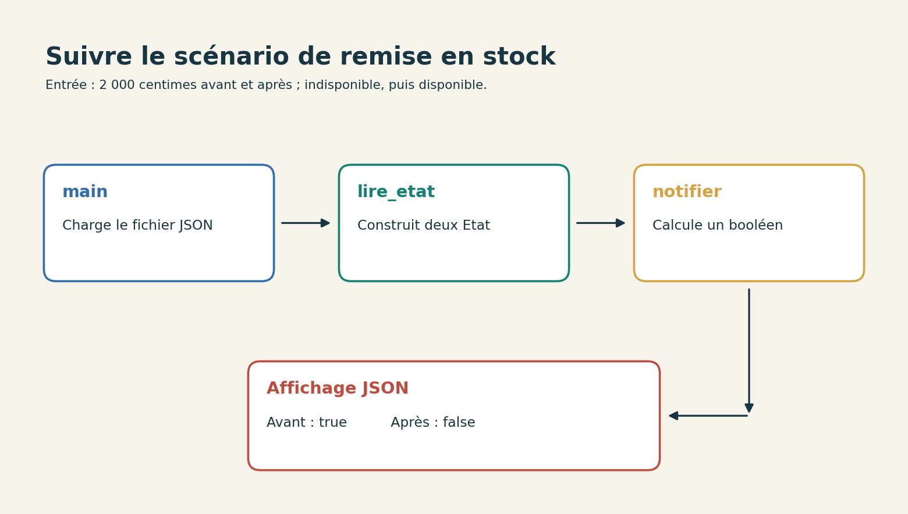
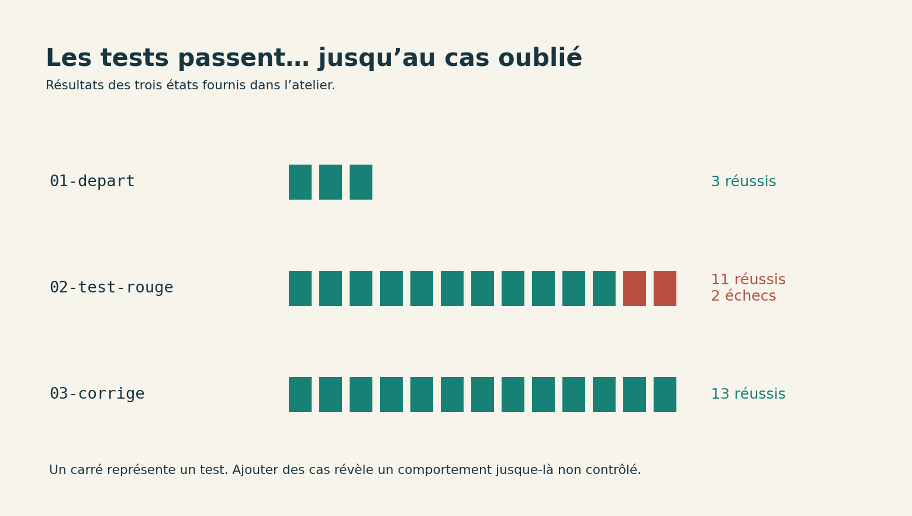

# Développer avec une IA, du problème au changement vérifié

Vous avez un ticket à traiter. Le projet existe déjà, les tests passent, et quelqu’un vous signale pourtant un comportement qui ne convient pas. Nous allons partir de cette situation assez ordinaire.

Un agent peut lire les fichiers, proposer une explication, ajouter des tests et modifier le code. Mais avant de lui confier le clavier, il nous faut savoir ce que nous essayons de changer. Sinon, nous risquons d’obtenir très rapidement une solution à un autre problème.

Notre projet sera assez petit pour être lu en entier. Pas de base à installer, pas de compte à créer : quelques fichiers Python, trois scénarios et une fonction qui prend une décision. Vous pourrez faire les manipulations avec votre agent habituel ou suivre les étapes vous-même.

**TL;DR**

- Nous partons d’un comportement observable et d’une règle précise.
- Nous ajoutons des tests qui échouent avant de corriger le code.
- Nous relisons le changement, puis nous vérifions le programme avec ses fichiers d’entrée.
- Nous gardons les traces des commandes réellement exécutées.
- L’objectif n’est pas d’obtenir beaucoup de code. Pour notre ticket, il faudra surtout en enlever.

## Ouvrir un projet que l’on peut comprendre

**TL;DR :** nous allons lire le programme et vérifier son état de départ. Un agent peut nous aider à nous repérer, mais les fichiers restent notre point de contrôle.

### Récupérer le projet et lancer les tests

[Téléchargez l’atelier de suivi de prix](annexes-developpement-v1.zip) et décompressez-le. Le dossier `atelier-developpement` contient trois états du projet : `01-depart`, `02-test-rouge` et `03-corrige`.

Copiez `01-depart` dans un nouveau dossier nommé `mon-suivi`. C’est dans cette copie que vous allez travailler. Les deux autres dossiers permettent de reprendre à une étape connue ou de comparer votre résultat ; ne les ajoutez pas au contexte de l’agent si vous souhaitez observer comment il résout le problème.

Ouvrez un terminal dans `mon-suivi` et lancez :

```bash
python --version
python -m unittest discover -v
```
Code: Contrôler le point de départ

Nous utilisons Python 3.12 et sa bibliothèque standard. Comme dans l’atelier précédent, remplacez `python` par `python3` ou `py -3.12` selon votre installation. Aucune dépendance n’est à télécharger pour ce projet.

La suite initiale contient **trois tests**, qui passent. La durée affichée dépend de votre machine ; ce qui nous intéresse pour le moment, ce sont leurs noms et leur résultat.

Si vous lisez « Ran 0 tests », vous n’avez pas encore vérifié le projet. Regardez le dossier courant et la présence de `test_suivi.py`. Un lancement sans test trouvé peut se terminer sans erreur, ce qui rend la dernière ligne trompeuse si on la lit seule.[^p4-unittest]

[^p4-unittest]: Python, [découverte et exécution des tests avec `unittest`](https://docs.python.org/3.12/library/unittest.html).

### Suivre une entrée jusqu’à la décision

Ouvrez `scenarios/retour-stock.json`. Il décrit deux observations du même produit : un prix de 2 000 centimes avant et après, avec un passage d’indisponible à disponible.

Lancez :

```bash
python suivi.py scenarios/retour-stock.json
```

Le programme initial affiche :

```json
{"notifier": true}
```
Code: Décision du programme avant notre modification

Il n’envoie aucun courriel et ne contacte aucun service : il calcule une décision et l’affiche. Nous pouvons donc rejouer le scénario autant de fois que nécessaire.

Ouvrez maintenant `suivi.py` et suivez les appels. `main` charge le fichier JSON. `lire_etat` vérifie les champs de chaque observation et crée un `Etat`. La fonction `notifier` reçoit l’ancien et le nouvel état, puis renvoie un booléen. Enfin, `main` affiche ce résultat en JSON.


Figure: Le parcours d’un scénario dans notre programme

Vous n’avez pas besoin de mémoriser tout le fichier. En revanche, vous devez pouvoir montrer la fonction qui décide et expliquer quelles données elle reçoit. Essayez de la retrouver une deuxième fois sans relire ce paragraphe.

### Demander de l’aide pour lire

Si vous utilisez un agent, ouvrez uniquement le dossier `mon-suivi` dans son espace de travail. Commencez par une demande de lecture :

```text
Lis README.md, suivi.py, test_suivi.py et TICKET.md.
Explique le chemin entre le fichier JSON et la décision.
Cite les fonctions concernées.
N’édite aucun fichier pendant cette lecture.
Signale les questions auxquelles les fichiers ne répondent pas.
```
Code: Une consigne pour se repérer dans le projet

Cette consigne peut être utilisée dans différents outils. La manière de choisir le dossier et d’autoriser une lecture dépend de votre application. Vérifiez ce périmètre dans son interface avant de lui demander d’agir.

Comparez ensuite son explication au code. S’il parle d’une file de messages, d’un appel réseau ou d’une base de données, cherchez où cela apparaît. Dans notre projet, aucun de ces éléments n’existe. Une explication plausible n’est pas une preuve de lecture.

Vous pouvez aussi lui demander d’expliquer une ligne précise, puis reformuler vous-même son rôle. C’est particulièrement utile quand on apprend un langage : on garde un passage court, dont on peut vérifier chaque détail.


## Décider ce que le ticket veut changer

**TL;DR :** une phrase de ticket cache parfois plusieurs comportements. Nous allons les mettre à plat avant de toucher à la fonction.

### Une remise en stock n’est pas une baisse de prix

Le ticket PRIX-1 demande de ne plus notifier un produit qui revient simplement en stock. Le fichier `TICKET.md` donne la règle complète : une notification est autorisée seulement si le produit est disponible dans le nouvel état **et** si son prix a strictement baissé par rapport à l’observation précédente.

Les prix sont des entiers en centimes. Nous comparons deux observations consécutives, dans une même devise implicite. Il n’est pas question de retrouver le prix le plus bas des six derniers mois ni de calculer une promotion.

Avant de regarder la suite, répondez à ces deux cas :

- Le produit revient en stock au même prix. Faut-il notifier ?
- Le produit revient en stock avec un prix plus bas. Faut-il notifier ?

Le premier cas doit donner **faux**, le second **vrai**. « Ne plus notifier une remise en stock » ne veut donc pas dire « ignorer tous les produits qui étaient indisponibles ». Une baisse de prix peut accompagner le retour en stock.

C’est exactement le genre de raccourci qu’il faut éclaircir dans un vrai ticket. Si personne n’a décidé comment traiter le second cas, l’agent ne devrait pas choisir discrètement à la place de l’équipe.

### Écrire la table avant les tests

Voici les cas que nous voulons distinguer :

| Ancien état | Nouvel état | Notification attendue |
| --- | --- | --- |
| 20 €, disponible | 15 €, disponible | Oui |
| 15 €, disponible | 20 €, disponible | Non |
| 20 €, disponible | 15 €, indisponible | Non |
| 20 €, indisponible | 20 €, disponible | Non |
| 20 €, indisponible | 15 €, disponible | Oui |
| 20 €, indisponible | 25 €, disponible | Non |
| 20 €, disponible | 20 €, disponible | Non |
Table: Les situations que la règle doit départager

Les trois premières correspondent déjà à nos tests de départ. Les suivantes rendent visible ce que ces tests ne contrôlaient pas.

Vous pouvez demander à l’agent de proposer cette table avant de coder les tests. Relisez alors les **résultats attendus**, pas seulement le nombre de lignes. Une longue suite de tests qui attend la mauvaise réponse reste une longue suite de tests qui attend la mauvaise réponse.

Pour une règle aussi petite, faire la table soi-même prend peu de temps. Dans un projet plus grand, l’aide peut surtout servir à retrouver les cas oubliés ou à traduire une règle déjà décidée en scénarios exécutables.

### Délimiter le changement

Ajoutons quelques limites simples à notre travail : nous conservons la fonction `notifier`, les fichiers JSON et les validations existantes. Nous n’ajoutons pas de base, d’envoi de courriel ou de système de préférences.

Pourquoi le préciser ? Parce qu’une demande d’« amélioration des notifications » pourrait facilement produire une architecture plus ambitieuse que notre besoin. Ici, le programme doit continuer à prendre deux états et à renvoyer une décision.

Les limites ne sont pas seulement des interdictions à adresser à l’agent. Elles nous servent aussi pendant la revue. Si un nouveau fichier de configuration apparaît, nous pourrons demander quel comportement du ticket le rend nécessaire.

Dans votre propre travail, gardez ce périmètre à la taille de la tâche. Un correctif d’une condition n’exige pas automatiquement un document de conception de dix pages. Il exige en revanche que les cas ambigus aient une réponse.


## Faire apparaître le bug dans un test

**TL;DR :** nous ajoutons d’abord le cas oublié. Son échec nous permet de vérifier que le test distingue bien l’ancien comportement du comportement demandé.

### Écrire le premier test qui échoue

Dans `mon-suivi`, créez `test_ticket.py` :

```python
import unittest
from suivi import Etat, notifier


class TicketPrix(unittest.TestCase):
    def test_retour_en_stock_sans_baisse(self):
        self.assertFalse(
            notifier(Etat(2000, False), Etat(2000, True))
        )
```
Code: Reproduire le cas du ticket dans un test

Lancez de nouveau :

```bash
python -m unittest discover -v
```

Cette fois, vous devez obtenir **quatre tests, dont un en échec**. Le programme renvoie vrai, alors que ce cas attend faux. Nous n’avons pas cassé le projet en ajoutant un test : nous avons rendu visible le désaccord avec la nouvelle règle.

Lisez le nom du test en échec. Une erreur d’import ou une faute de syntaxe ne prouvent pas que le comportement du ticket est reproduit. Le programme doit atteindre l’assertion, puis échouer parce que sa décision ne correspond pas à celle attendue.

Si votre test passe déjà, vérifiez que vous travaillez bien dans la copie de `01-depart` et que la fonction n’a pas été corrigée par avance. Il serait dommage de conclure à une démonstration du bug sans avoir exécuté le code qui le contient.

### Ajouter les voisins du cas principal

Le cas principal est maintenant couvert. Ajoutez les autres situations de la table, notamment le retour en stock avec baisse et celui avec hausse. Pour une baisse accompagnant le retour, l’assertion doit être `assertTrue`.

Le dossier `02-test-rouge` contient une version complète de `test_ticket.py`. Vous pouvez comparer votre fichier au sien ou le recopier après avoir essayé. Il ajoute aussi les limites suivantes : une baisse d’un centime, un prix nul et des données invalides.

Avec ce fichier complet, la suite contient **treize tests**. Avant correction, **deux échouent** : le retour en stock sans baisse et le retour en stock avec hausse. Le reste passe.


Figure: Les résultats des trois versions fournies dans l’atelier

Les tests de données invalides vérifient notamment qu’un prix négatif, un prix décimal, un booléen utilisé comme prix et une disponibilité écrite sous forme de texte sont refusés. Ils protègent un comportement existant ; ils ne décrivent pas de nouvelles fonctionnalités du ticket.

Lisez le test sur le booléen comme prix avec la validation dans `Etat`. En Python, les booléens sont un cas particulier des entiers. Le contrôle `type(...) is int` utilisé ici exclut délibérément `True`, alors qu’un simple `isinstance(..., int)` l’accepterait.[^p4-bool]

[^p4-bool]: Python, [type booléen et relation avec les entiers](https://docs.python.org/3.12/library/stdtypes.html#boolean-type-bool).

### Faire écrire les tests par l’agent

Si vous voulez lui confier cette étape, repartez de la copie initiale et donnez-lui cette consigne :

```text
À partir de TICKET.md, propose une table de cas puis écris
les tests manquants dans test_ticket.py.
Ne modifie pas suivi.py.
Lance python -m unittest discover -v.
Rapporte les noms des tests en échec et la différence
entre la valeur attendue et la valeur obtenue.
```

La séparation entre les tests et la correction nous permet d’observer le comportement initial. Vérifiez le diff après son intervention : s’il a modifié `suivi.py` en même temps, l’expérience ne montre plus aussi clairement que les nouveaux tests attrapent l’ancien comportement.

Regardez également si ses tests appellent vraiment `notifier`. Un test qui compare deux constantes ou reproduit sa propre version de la condition peut passer sans contrôler notre fonction.

Enfin, les tests sont du code exécuté sur votre ordinateur. Dans cet atelier, ils utilisent seulement nos petites fonctions. Dans un dépôt inconnu, regardez leurs imports, leurs préparatifs et les commandes proposées avant de les lancer. Le mot « test » ne garantit pas à lui seul l’absence d’écriture ou d’appel réseau.


## Faire le changement et lire le diff

**TL;DR :** la règle attendue tient dans deux conditions. Nous allons enlever celle qui autorisait une notification pour une simple remise en stock.

### Relire les opérateurs

Voici la fonction initiale :

```python
def notifier(ancien: Etat, nouveau: Etat) -> bool:
    return nouveau.disponible and (
        nouveau.prix_centimes < ancien.prix_centimes or not ancien.disponible
    )
```

Lisez-la à voix haute : le produit doit être disponible maintenant, et il faut soit une baisse de prix, soit une ancienne indisponibilité.

Le second terme du `or` explique notre problème. Pour un retour en stock, `not ancien.disponible` vaut vrai. Le prix peut être identique ou même plus élevé : l’expression entre parenthèses sera tout de même vraie.

Notre ticket exige uniquement une disponibilité actuelle et une baisse stricte. La correction devient :

```python
def notifier(ancien: Etat, nouveau: Etat) -> bool:
    return nouveau.disponible and (
        nouveau.prix_centimes < ancien.prix_centimes
    )
```
Code: La fonction après correction

Nous conservons les parenthèses et la présentation afin que le diff porte sur le changement de comportement. Il serait possible d’écrire cette expression sur une ligne, mais cela n’est pas nécessaire pour résoudre le ticket.

N’ajoutez pas `ancien.disponible` dans la nouvelle condition. Cela empêcherait de notifier une vraie baisse au moment du retour en stock, contrairement à la règle décidée.


Figure: La règle complète tient dans ces quatre combinaisons

### Une demande de modification précise

Pour demander cette correction à l’agent, vous pouvez utiliser :

```text
Applique le comportement décrit dans TICKET.md.
Conserve les interfaces existantes et limite la modification
au code nécessaire.
Ne change pas les réponses attendues des tests pour les faire passer.
Lance la suite avec python -m unittest discover -v.
Montre le diff et explique la condition modifiée.
Ne crée pas de commit et ne publie rien.
```
Code: Confier la correction en gardant un résultat relisible

Les verbes disent ce qui doit être fait. « Ce serait bien de vérifier les tests » laisse une intention vague ; « lance cette commande et rapporte son résultat » donne une action et une preuve à chercher.

Cela reste une consigne au modèle. Pour limiter effectivement son accès aux fichiers, au réseau ou à la publication, utilisez aussi les permissions de votre outil. Une phrase dans un prompt n’a pas le même rôle qu’un droit technique refusant l’opération.

Si l’agent propose une classe de notification, une nouvelle dépendance ou un système de règles pour cette fonction, demandez-lui quel cas du ticket le justifie. Vous pouvez rejeter ces ajouts et demander une modification plus petite. Vous n’êtes pas obligé de conserver du code parce qu’il a déjà été généré.

### Lire ce qui a vraiment changé

Un résumé de l’agent raconte ce qu’il pense avoir fait. Le diff montre les fichiers modifiés. Ouvrez celui de votre éditeur, puis cherchez le changement dans `suivi.py`.

La correction fournie retire ce morceau :

```diff
-        nouveau.prix_centimes < ancien.prix_centimes or not ancien.disponible
+        nouveau.prix_centimes < ancien.prix_centimes
```
Code: Le changement de comportement dans la fonction

Si Git est installé, vous pouvez aussi comparer les deux dossiers depuis leur dossier parent :

```bash
git diff --no-index 01-depart/suivi.py mon-suivi/suivi.py
```

Cette commande fonctionne sans créer de dépôt Git. Avec `--no-index`, un code de sortie égal à 1 signifie que les fichiers diffèrent ; ce n’est pas forcément un échec de la comparaison.[^p4-diff]

Regardez ensuite les autres fichiers modifiés. Les nouveaux tests sont attendus. Une modification des données d’entrée pour éviter le bug, une suppression de validation ou une réécriture de tout le programme demandent une explication.

Si vous débutez, choisissez une ligne retirée et une ligne conservée, puis expliquez leur rôle sans recopier le résumé de l’agent. Si vous n’y arrivez pas encore, revenez à la fonction. Le résultat est assez petit pour que cette lecture reste abordable.

[^p4-diff]: Git, [comparaison de fichiers avec `git diff --no-index`](https://git-scm.com/docs/git-diff).


## Vérifier au-delà de la dernière ligne verte

**TL;DR :** la suite teste la fonction ; les scénarios font aussi passer les données par le chargement JSON. Nous allons examiner les deux.

### Rejouer les tests et contrôler leur nombre

Après correction, lancez :

```bash
python -m unittest discover -v
```

Avec le fichier complet de `02-test-rouge`, les **treize tests passent**. Si vous avez seulement écrit le premier nouveau test, vous en aurez quatre : ce n’est pas la même couverture, même si la dernière ligne est également `OK`.

Les noms des tests vous permettent de voir les situations réellement contrôlées. Regardez en particulier les deux qui échouaient avant la correction. Ils doivent toujours être présents et conserver leurs valeurs attendues.

Dans un rapport d’agent, cherchez la commande, son dossier d’exécution et son résultat. « Tests vérifiés » peut cacher plusieurs choses : une lecture du code des tests, une exécution partielle, ou une suite complète. Nous voulons savoir laquelle a eu lieu.

Si une dépendance manque ou qu’une commande échoue, le rapport doit le dire. Réussir à écrire les tests n’est pas la même chose que réussir à les exécuter.

### Passer par les fichiers JSON

Exécutez maintenant nos trois scénarios :

```bash
python suivi.py scenarios/retour-stock.json
python suivi.py scenarios/baisse.json
python suivi.py scenarios/rupture.json
```

Voici les décisions attendues après correction :

| Fichier | Résultat |
| --- | --- |
| `retour-stock.json` | `{"notifier": false}` |
| `baisse.json` | `{"notifier": true}` |
| `rupture.json` | `{"notifier": false}` |
Table: Les trois scénarios de recette

Nous passons cette fois par la lecture du fichier, la construction des états, la décision et l’affichage. Les tests précédents appelaient surtout les fonctions directement. Les deux vérifications se complètent.

Créez ensuite une copie de `retour-stock.json`, nommée `retour-stock-baisse.json`, et changez seulement le nouveau prix : 1 500 au lieu de 2 000. Lancez ce nouveau scénario. Le résultat doit être vrai.

Ne modifiez pas les scénarios pour les faire coïncider avec une réponse inattendue. Si un cas ne produit pas ce que la règle prévoit, conservez le fichier qui le reproduit. C’est une meilleure base de discussion qu’une capture sans ses données d’entrée.

### Vérifier qu’un test sait encore protester

Faisons une petite expérience, dans une **copie du projet corrigé**. Remplacez `<` par `<=` dans `notifier`, puis relancez la suite.

Le prix identique autorise maintenant une notification. Les tests qui attendent l’absence de notification à prix inchangé doivent échouer. S’ils ne le font pas, vérifiez que vous avez exécuté la bonne copie et que ces cas sont présents.

Rétablissez ensuite `<`, puis retirez temporairement la condition `nouveau.disponible and`. Le test de baisse sur un produit indisponible doit cette fois protester.

Ces modifications volontaires sont de petites **mutations** : nous introduisons une erreur précise pour voir si les tests la remarquent. Cela ne prouve pas qu’ils détecteront tous les bugs. Cela permet de vérifier que les cas importants ne sont pas seulement décoratifs.

Revenez enfin à la version corrigée et relancez la suite. Ne gardez pas une mutation dans votre copie de travail ; le but est de tester nos tests, pas de préparer discrètement le prochain ticket. 🙂

### Demander une seconde lecture utile

Vous pouvez maintenant faire relire le diff par un agent, en lui donnant aussi le ticket et les cas attendus :

```text
Relis le diff par rapport à TICKET.md et aux scénarios.
Pour chaque problème trouvé, donne un cas reproductible,
le comportement obtenu et celui attendu.
Ne modifie pas les fichiers pendant cette revue.
Si tu ne trouves pas de problème, indique ce que tu as vérifié
et les limites de cette vérification.
```

Cette demande évite de réduire la revue à des préférences de style. Une remarque devient plus utile lorsqu’on peut lancer le scénario qui la justifie.

Le second passage peut tout de même manquer la même erreur que le premier. Changer de session ou de modèle n’en fait pas une preuve indépendante au sens fort : les outils peuvent partager des habitudes et des angles morts. Appuyez-vous sur les scénarios, le code et les sorties observées.

Pour notre petit changement, une revue efficace peut être courte. Il n’y a aucune raison d’inventer trois problèmes pour remplir une section de rapport.


## Garder un changement que l’on sait expliquer

**TL;DR :** préparez une trace courte du problème, de la correction et des vérifications. Puis choisissez où l’aide vous a réellement été utile.

### Écrire un compte rendu exploitable

Créez un fichier `COMPTE-RENDU.md` et renseignez-le avec votre propre exécution :

```markdown
# PRIX-1 — Ne plus notifier une simple remise en stock

## Problème

Le retour en stock autorisait une notification même sans baisse de prix.

## Changement

La décision exige une disponibilité actuelle et une baisse stricte.
Les interfaces et les validations des entrées sont conservées.

## Vérifications effectuées

- Commande de tests, dossier d’exécution, nombre de tests et résultat :
- Scénario retour en stock, résultat observé :
- Scénario baisse de prix, résultat observé :
- Scénario indisponible, résultat observé :

## Limites

Le programme calcule une décision. Il n’envoie pas de notification.
Il compare deux observations dans une même devise implicite.
```
Code: Une trame à compléter avec vos résultats

Les cases laissées vides ne doivent pas être remplies par une supposition. Si vous n’avez pas exécuté un scénario, écrivez-le ou lancez-le.

Ce texte peut ensuite servir de base à une description de pull request dans un vrai projet. Avant de publier, relisez les fichiers et les traces jointes : un rapport de test peut lui aussi contenir des données qu’on ne souhaite pas diffuser.

L’agent peut rédiger ce compte rendu à partir des sorties conservées. Vous gardez à vérifier que les phrases correspondent aux commandes effectivement réalisées.

### Quand on apprend encore à développer

Si vous découvrez Python, vous avez peut-être eu envie de demander directement la version finale. Vous l’auriez obtenue plus vite. Mais pourriez-vous maintenant expliquer pourquoi le `or` posait problème ?

Fermez la correction et essayez de prédire le résultat de deux cas : un retour en stock avec hausse, puis une baisse d’un centime sur un produit disponible. Vérifiez vos réponses en exécutant le programme.

Si vous vous trompez, ce n’est pas une raison de renoncer à l’aide. Demandez une explication de l’expression booléenne, construisez une table de valeurs ou réduisez l’exemple à deux booléens. Vous pouvez vous servir du modèle pour trouver une autre explication sans lui confier immédiatement toute la modification.

Pour apprendre, une bonne utilisation consiste souvent à demander un indice, un contre-exemple ou une question de vérification. Une solution complète trop tôt peut vous faire sauter exactement l’effort dont vous aviez besoin pour comprendre.

Et certains jours, le plus efficace sera de fermer l’agent et de lire la fonction tranquillement. Il n’y a rien à rentabiliser à chaque ligne.

### Trouver ses propres points de friction

Reprenez les étapes de cet atelier et demandez-vous lesquelles vous ont posé problème. Comprendre la règle ? Retrouver la fonction ? Penser aux cas limites ? Écrire la syntaxe de `unittest` ? Relire le diff ?

L’aide n’a pas le même intérêt partout. Si vous aimez écrire le code mais que préparer une recette vous prend un temps fou, vous pouvez garder le code et demander une première liste de scénarios. Si vous connaissez bien les tests mais découvrez un langage, une explication ciblée peut être plus utile qu’une implémentation complète.

Pour comparer deux façons de travailler, notez le temps total, y compris les corrections de demandes, la lecture des résultats et la validation. Le temps pendant lequel l’agent produit du texte n’est qu’une partie du travail.

N’ajoutez pas automatiquement un framework ou une série de commandes pour reproduire cet atelier. Nous avons séparé des étapes afin de voir ce qu’elles vérifient. Dans votre quotidien, regroupez ou simplifiez ce qui peut l’être, tout en conservant les contrôles nécessaires au changement.

Vous pouvez aussi conclure que l’outil ne vous aide pas sur ce type de tâche. Adapter un outil à son besoin comprend cette possibilité.


## Conclusion

La correction de notre fonction tient en peu de caractères. Le travail ne se résume pourtant pas à ces caractères : il a fallu comprendre la demande, trouver le comportement existant, choisir les cas et vérifier le résultat.

Un agent peut aider à plusieurs de ces étapes. Il peut aussi vous faire perdre du temps en élargissant le sujet, en ajoutant du code inutile ou en produisant des vérifications qui ne vérifient pas la bonne chose. Vous avez maintenant un petit projet sur lequel observer ces différences sans mettre une application réelle en jeu.

Gardez ce qui vous sert. Si vous préférez écrire vous-même la correction et demander de l’aide uniquement pour les cas de test, faites-le. Si tout l’exercice vous semble plus simple à réaliser sans IA, faites-le aussi. Votre manière de travailler n’a pas à devenir plus compliquée pour justifier l’usage d’un outil.
