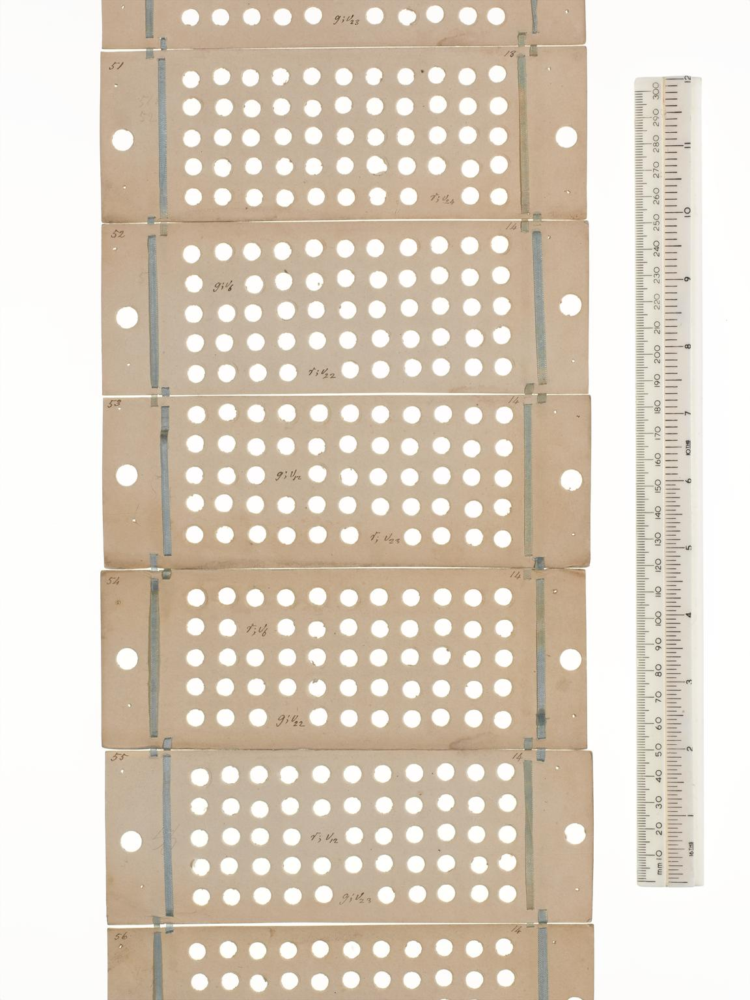
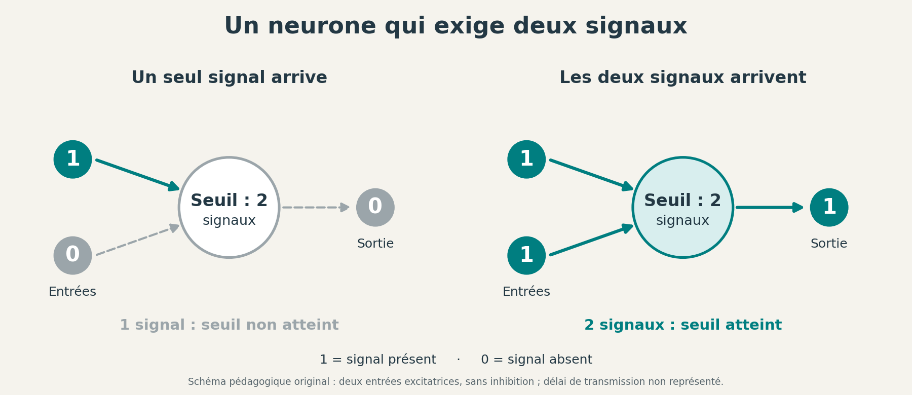
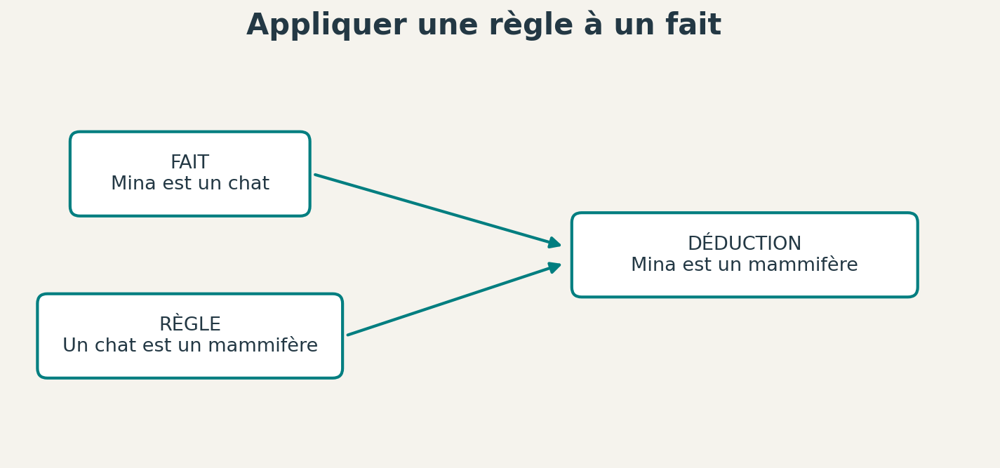
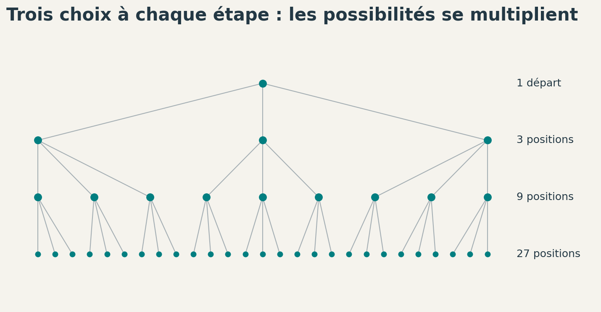
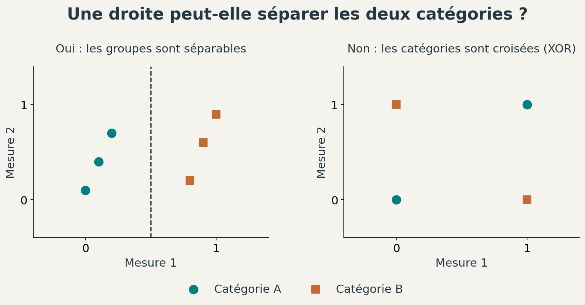
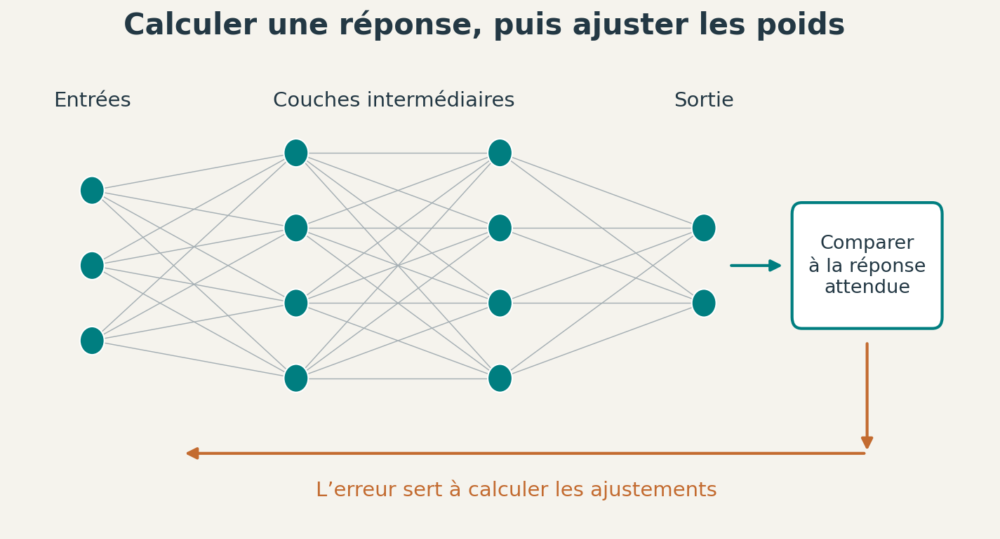
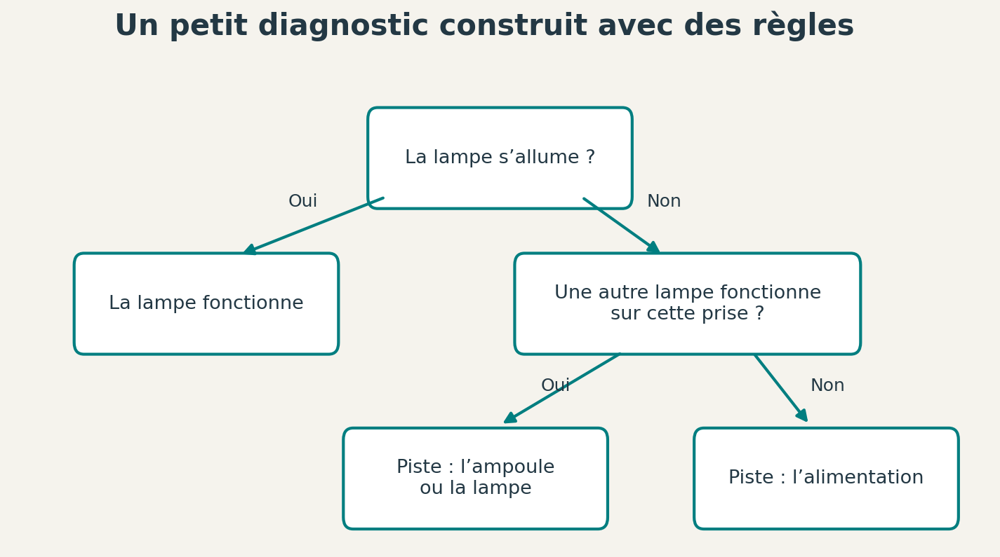
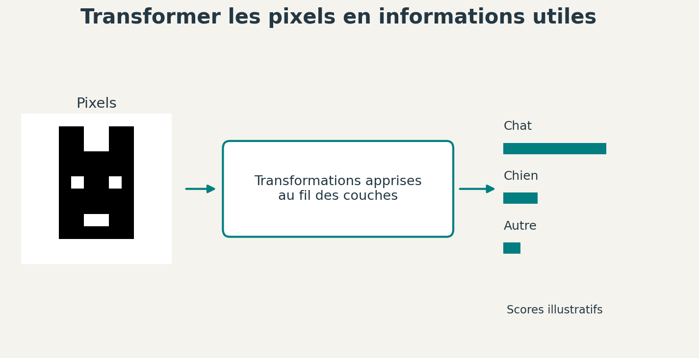
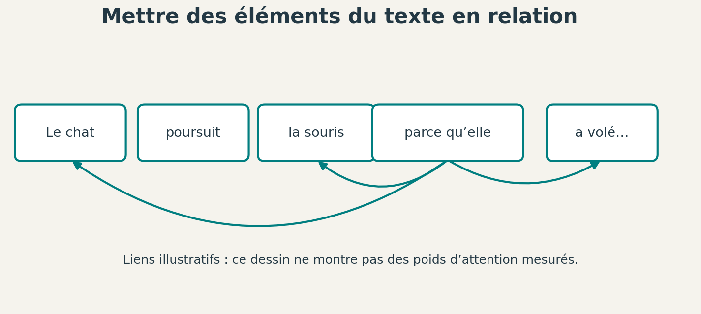
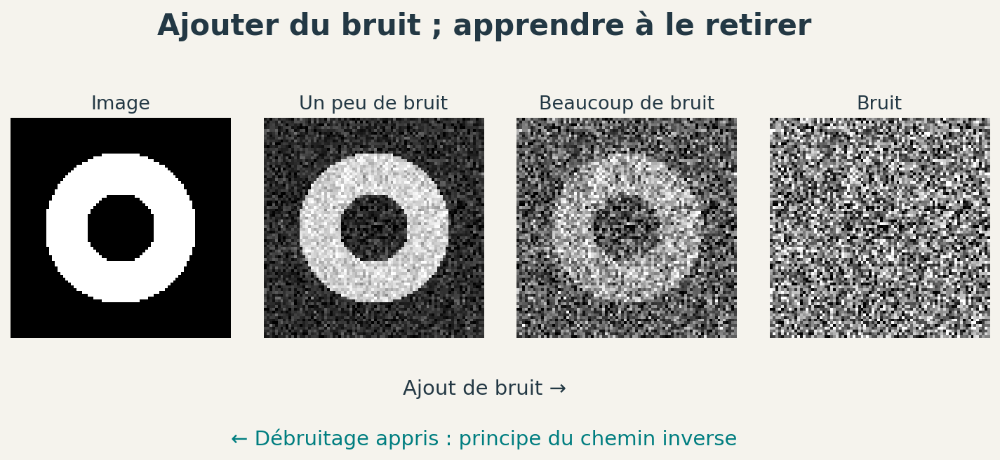

# Une histoire de l’IA, des premières idées à aujourd’hui

[Sommaire de la partie](README.md) · [Sommaire global](../../SOMMAIRE.md)

**TL;DR**

- L’IA n’est pas née avec ChatGPT. Dès les années 1950, des chercheurs explorent plusieurs pistes en parallèle : appliquer des règles, chercher des solutions ou apprendre à partir d’exemples.
- Les progrès des réseaux de neurones reposent aussi sur davantage de données, de puissance de calcul et de travail humain. Certaines idées ont attendu des décennies avant de devenir utilisables à grande échelle.
- Les succès alternent avec des déceptions : réussir une démonstration ou gagner à un jeu ne suffit pas à résoudre tous les problèmes. Les différentes méthodes continuent de cohabiter.
- Les outils actuels associent des modèles capables de générer du texte, des images ou du code à d’autres logiciels. Un agent peut ainsi utiliser des outils ; un modèle dont les poids sont disponibles peut fonctionner localement, si le matériel le permet.

Les machines auxquelles on demande d’écrire du code, de dessiner ou de répondre à nos questions ont une longue histoire. Avant elles, des chercheurs ont essayé de faire jouer des ordinateurs, de leur apprendre à reconnaître des formes ou de leur faire utiliser des règles de raisonnement.

Comment est-on passé de ces premiers programmes à un agent capable de modifier du code ? Et pourquoi certaines idées ont-elles attendu des décennies avant de trouver leur place dans nos logiciels ?

Il n’est pas nécessaire de connaître les réseaux de neurones ou de savoir entraîner un modèle pour suivre cette histoire.

## 1. Les origines de l’intelligence artificielle

Avant les premiers ordinateurs, on cherche déjà à confier des calculs à des machines. Le projet est alors très matériel : il faut concevoir les pièces, transmettre les mouvements et trouver comment donner les opérations à effectuer.

Au XIXe siècle, Charles Babbage et Ada Lovelace envisagent déjà une machine dont on pourrait changer les instructions.

### Une machine à laquelle on donne des instructions

Charles Babbage imagine une **machine analytique** capable d’exécuter différentes suites de calculs. Pour lui transmettre les instructions, pas de clavier : il prévoit d’utiliser des cartes perforées, c’est-à-dire des cartes avec des trous que le mécanisme doit lire.[^h1s1-babbage]

Figure: Modèle d’essai de la machine analytique. © The Board of Trustees of the Science Museum, [Science Museum Group](https://collection.sciencemuseumgroup.org.uk/objects/co62245/babbages-analytical-engine-1834-1871-trial-model), [CC BY-NC-SA 4.0](https://creativecommons.org/licenses/by-nc-sa/4.0/).

Regardez les roues et les axes de ce mécanisme. Les opérations doivent être réalisées par le mouvement de ces pièces. La photographie montre seulement une partie de la machine : l’ensemble ne sera pas achevé du vivant de Babbage.

Pour effectuer un autre calcul, on change les instructions. Pas besoin de reconstruire tous les engrenages à chaque fois, heureusement. 🙂 Les cartes permettent aussi de répéter une suite d’opérations. Si vous avez déjà écrit une boucle dans un programme, vous connaissez le principe.

Figure: Cartes pour la machine analytique. © The Board of Trustees of the Science Museum, [Science Museum Group](https://collection.sciencemuseumgroup.org.uk/objects/co62248/punched-cards-for-babbages-analytical-engine), [CC BY-NC-SA 4.0](https://creativecommons.org/licenses/by-nc-sa/4.0/).

En 1843, Ada Lovelace publie une traduction d’un texte décrivant cette machine, accompagnée de ses propres notes. Elle envisage des usages qui dépassent les calculs habituels, notamment la manipulation de notes de musique.[^h1s1-love]

Imaginons que nous décidions d’associer les nombres de 0 à 6 aux notes do, ré, mi, fa, sol, la et si. La suite `0, 2, 4` représente alors **do, mi, sol**. En ajoutant 1 à chaque nombre, nous obtenons `1, 3, 5`, soit **ré, fa, la**.

Nous avons transformé une suite de notes en effectuant des opérations sur des nombres. En représentant les notes par des nombres, une machine à calculer peut donc manipuler autre chose que des quantités.

Nous sommes encore dans les antécédents de l’informatique. Il faudra d’autres machines et d’autres travaux pour arriver à l’IA.

[^h1s1-babbage]: [Bodleian Libraries, Ada Lovelace and the Analytical Engine](https://blogs.bodleian.ox.ac.uk/adalovelace/2018/07/26/ada-lovelace-and-the-analytical-engine/).
[^h1s1-love]: [Science Museum, Charles Babbage’s Difference Engines and the Science Museum](https://www.sciencemuseum.org.uk/objects-and-stories/charles-babbages-difference-engines-and-science-museum).

### 1943 : des neurones sur le papier

En 1943, Warren McCulloch et Walter Pitts cherchent à décrire des réseaux de neurones avec des mathématiques. Leur modèle simplifie fortement le fonctionnement nerveux : un neurone reçoit des signaux et peut, à son tour, en transmettre un.[^h1s2-mp]

Regardons un exemple. Nous donnons deux entrées à notre neurone et nous fixons son **seuil d’activation** à deux. Il faut donc que les deux entrées lui transmettent un signal pour qu’il s’active.

Figure: Avec un seuil de deux, une seule entrée active ne suffit pas.

Les `0` et les `1` indiquent l’absence ou la présence d’un signal. Si vous avez utilisé des booléens, vous reconnaîtrez une opération **ET** : la première entrée **et** la deuxième doivent être actives pour obtenir une sortie active.

Le modèle prévoit aussi des entrées **inhibitrices** : lorsqu’elles sont actives, elles bloquent l’activation du neurone.

Ce neurone ne fait pas grand-chose tout seul. Nous sommes encore assez loin de lui demander de faire nos devoirs. 😅 Mais nous pouvons relier sa sortie à d’autres neurones et construire des réseaux qui réalisent plusieurs opérations logiques.

Dans ce modèle, les connexions sont fixées. Le réseau ne découvre pas lui-même comment les modifier à partir d’exemples.

[^h1s2-mp]: [McCulloch et Pitts, A Logical Calculus of the Ideas Immanent in Nervous Activity (1943 ; réédition de 1990)](https://www.cs.cmu.edu/~./epxing/Class/10715/reading/McCulloch.and.Pitts.pdf).

### 1950 : peut-on faire passer une machine pour un humain ?

Alan Turing publie en 1950 *Computing Machinery and Intelligence*. Il y examine la question de savoir si les machines peuvent penser, notamment à travers un jeu d’imitation.[^h1s3-turing]

Dans sa présentation courante, le **test de Turing** place une personne face à des interlocuteurs cachés. Elle échange avec eux par écrit et cherche à distinguer la machine de l’humain. Elle ne peut donc pas se fier à une voix ou à un visage.

Imaginez que vous discutiez dans deux fenêtres, sans savoir qui vous répond. Vous pouvez poser des questions et comparer les réponses. Toute la difficulté consiste à décider ce qui vous ferait reconnaître la machine.

Dans le texte original, Turing part d’un jeu où il faut distinguer un homme d’une femme, puis envisage de remplacer l’un des participants par une machine.

Turing s’intéresse aussi à l’apprentissage : il envisage une machine que l’on éduquerait plutôt que de programmer directement toutes les capacités d’un adulte. La question de faire apprendre les machines est donc présente dès cette période.

[^h1s3-turing]: [Alan Turing, Computing Machinery and Intelligence (1950)](https://www.csee.umbc.edu/courses/471/papers/turing.pdf).

### 1956 : le domaine prend un nom

En 1955, John McCarthy, Marvin Minsky, Nathaniel Rochester et Claude Shannon proposent de réunir des chercheurs durant l’été suivant, au Dartmouth College, aux États-Unis. Leur document emploie l’expression *artificial intelligence*, que nous traduisons par **intelligence artificielle**.[^h1s4-dartmouth]

Ils veulent étudier comment faire utiliser le langage à des machines, leur faire résoudre des problèmes et leur permettre de s’améliorer. Les réseaux de neurones figurent aussi dans les pistes proposées.

La rencontre de 1956 devient un événement fondateur du domaine. Les recherches n’ont pas toutes commencé cet été-là, mais elles sont réunies sous un nom et un projet commun.

Le programme est ambitieux : les auteurs espèrent obtenir des avancées en réunissant un petit groupe pendant l’été. Certains de ces problèmes leur résisteront pourtant pendant des décennies.

Il existe déjà plusieurs façons d’aborder ces questions. On peut chercher à représenter des neurones, mais aussi décrire des connaissances et des règles qu’un programme devra appliquer.

[^h1s4-dartmouth]: [McCarthy, Minsky, Rochester et Shannon, proposition du projet de Dartmouth (1955, pour la rencontre de 1956)](https://ojs.aaai.org/aimagazine/index.php/aimagazine/article/view/1904).

Nous avons rencontré des machines programmables, des neurones décrits par des mathématiques et une proposition pour étudier l’intelligence avec des ordinateurs. À partir des années 1950, ces idées vont donner lieu à des programmes qui jouent, cherchent des démonstrations et dialoguent.

## 2. Des règles pour raisonner

Un ordinateur peut exécuter des instructions. Pourrait-il aussi utiliser des connaissances pour trouver lui-même les étapes d’une solution ? Dans les années 1950 et 1960, cette question occupe une place importante dans les recherches sur l’IA.

### Décrire ce que le programme sait

En 1956, Allen Newell et Herbert Simon décrivent la *Logic Theory Machine*, associée au projet Logic Theorist. Le système est conçu pour chercher des démonstrations en logique symbolique.[^h2s1-logic]

Le mot **symbolique** signifie ici que le programme manipule des représentations explicites : des objets, des relations, des propositions. Donnons-lui un fait et une règle :

- le programme sait que **Mina est un chat** ;
- il dispose de la règle **si un animal est un chat, alors c’est un mammifère** ;
- il peut en déduire que **Mina est un mammifère**.

Nous lui avons donné un fait et une règle. Il les a combinés pour obtenir un nouveau fait. Nous pouvons ensuite ajouter d’autres règles et continuer les déductions.

Figure: À partir du fait et de la règle, le programme déduit que Mina est un mammifère.

La difficulté augmente lorsqu’il existe plusieurs règles applicables et de nombreuses étapes possibles. Le programme doit alors choisir les pistes à explorer. Le projet de Newell et Simon utilise des **heuristiques**, c’est-à-dire des méthodes pour guider cette recherche.

Une heuristique ressemble à un conseil pratique : « commence par les possibilités qui semblent les plus utiles ». Elle évite parfois beaucoup d’essais, mais ne garantit pas à elle seule de trouver la meilleure solution.

Le rapport de 1956 décrit le système et ses méthodes ; il faut distinguer cette description du détail de son exécution sur un ordinateur.

[^h2s1-logic]: [Newell et Simon, The Logic Theory Machine (1956)](https://www.rand.org/pubs/papers/P868.html).

### Les échecs : connaître les règles ne suffit pas

Claude Shannon étudie dès 1950 comment programmer un ordinateur pour jouer aux échecs. Le jeu fournit un terrain bien défini : on connaît les pièces, les coups autorisés et les conditions de fin de partie.[^h2s2-shannon]

Pour choisir un coup, on peut examiner les réponses possibles de l’adversaire, puis nos réponses à ces réponses. Le problème est que les possibilités se multiplient très vite.

Imaginons que chaque position n’offre que trois choix :

Figure: Trois choix à chaque étape donnent 3, puis 9, puis 27 possibilités au niveau suivant. Ce ne sont pas des nombres mesurés sur une partie d’échecs.

Chaque petit cercle en bas peut encore ouvrir de nouvelles branches. Vous voyez pourquoi « il suffit de tout essayer » risque de prendre un peu de temps. 🙂

Shannon propose de limiter la recherche et d’évaluer les positions obtenues. Le programme peut, par exemple, tenir compte des pièces disponibles et de leur disposition. Il cherche ainsi un coup intéressant sans calculer toute la partie à l’avance.

Les recherches sur les jeux vont continuer pendant des décennies. Elles réunissent des questions qui concernent aussi d’autres problèmes : représenter une situation, prévoir les conséquences d’une action et choisir avec des ressources limitées.

[^h2s2-shannon]: [Claude Shannon, Programming a Computer for Playing Chess (1950)](https://www.computerhistory.org/chess/doc-431614f453dde/).

### 1966 : discuter avec ELIZA

Au MIT, Joseph Weizenbaum développe ELIZA, qu’il décrit dans un article de 1966. Le programme utilise des règles pour analyser des fragments de phrases et préparer ses réponses. Son célèbre script DOCTOR reprend la forme d’un entretien où l’interlocuteur est invité à développer ce qu’il vient de dire.[^h2s3-eliza]

Pour imaginer ce fonctionnement, prenons un échange fictif, inspiré de ce principe :

> **Vous :** Je suis inquiet pour mon travail.  
> **Programme :** Depuis quand êtes-vous inquiet pour votre travail ?

Le programme peut repérer une forme de phrase, récupérer une partie du texte et la réutiliser dans un modèle de réponse. Il n’a pas besoin de connaître votre métier pour produire cette relance.

Essayez maintenant de remplacer « mon travail » par « mon grille-pain ». La même transformation reste possible, même si la conversation devient assez étrange. 😅

Cet exemple montre comment quelques règles peuvent donner une impression de dialogue. ELIZA est plus élaboré que notre unique transformation, mais il ne fonctionne pas comme les grands modèles de langage actuels : ses réponses reposent sur des scripts et des mécanismes de traitement du texte.

On peut donc faire apparaître des phrases dans une conversation par des moyens très différents. L’interface ressemble parfois à celle d’un outil récent, alors que le programme derrière elle n’a pas du tout la même organisation.

[^h2s3-eliza]: [Joseph Weizenbaum, ELIZA (1966)](https://cse.buffalo.edu/~rapaport/572/S02/weizenbaum.eliza.1966.pdf).

Les programmes symboliques obtiennent des résultats en s’appuyant sur des connaissances explicites et des règles. Cela permet de suivre certaines de leurs déductions, mais demande aussi de leur décrire le monde dans lequel ils doivent travailler.

Pendant que ces recherches avancent, d’autres équipes cherchent à faire ajuster le comportement des machines à partir d’exemples.

## 3. Apprendre à partir de données : les premières approches

À la fin des années 1950, les neurones du modèle de McCulloch et Pitts ont des connexions fixées à l’avance. Frank Rosenblatt étudie une autre possibilité : modifier certains réglages du système à partir des exemples qu’on lui présente.

L’objectif est de lui faire reconnaître des formes sans écrire à la main une règle pour chaque image possible.

### 1958 : le perceptron

Rosenblatt présente ses travaux sur le **perceptron** dans un article de 1958. Il s’intéresse à la manière dont un système peut apprendre à associer des entrées à des réponses.[^h3s1-rosenblatt]

Prenons une version élémentaire pour comprendre l’idée. Nous avons des nombres en entrée, par exemple des mesures réalisées sur une image. Chaque entrée est multipliée par un **poids**, qui règle son influence sur le résultat. Le programme combine ces valeurs et décide dans quelle catégorie ranger l’exemple.

Lorsqu’il se trompe pendant l’entraînement, une règle d’apprentissage modifie les poids. Nous recommençons avec d’autres exemples. Les poids sont donc des réglages que le programme ajuste, au lieu de nous demander de choisir chacun d’eux.

La différence avec notre neurone de 1943 se trouve notamment là : nous avons maintenant une méthode pour modifier une partie du système à partir de ses erreurs.

Pour le représenter, imaginons des objets que l’on mesure selon deux propriétés. Chaque objet devient un point sur une feuille. Le programme cherche une séparation entre deux catégories.

Figure: Deux jeux de points fictifs. Les couleurs et les formes indiquent les catégories ; les axes représentent deux mesures quelconques.

Sur le dessin de gauche, une droite suffit. Celui de droite est plus gênant : les deux points d’une catégorie occupent des coins opposés. Quelle que soit la droite choisie, elle ne séparera pas correctement les quatre points.

Vous pouvez essayer de tracer cette droite mentalement. Le problème ne vient pas d’un manque de patience à l’entraînement : la forme de séparation autorisée ne convient pas.

Cet exemple correspond au motif logique appelé **OU exclusif**, ou XOR. Il illustre une limite d’un seul classifieur linéaire. En ajoutant des transformations ou plusieurs couches, on peut construire d’autres séparations. Encore faut-il savoir régler l’ensemble.

[^h3s1-rosenblatt]: [Frank Rosenblatt, The Perceptron (1958)](https://homepages.math.uic.edu/~lreyzin/papers/rosenblatt58.pdf).

### Ce que veut dire « apprendre »

Le mot peut faire imaginer une machine qui comprend sa leçon comme nous. Dans notre exemple, l’apprentissage consiste plus précisément à ajuster des nombres pour diminuer les erreurs sur une tâche.

Imaginons un appareil qui doit distinguer de petits fruits à partir de leur masse et de leur diamètre. Nous préparons des exemples avec la bonne catégorie, puis nous comparons les réponses de l’appareil avec celles attendues.

Si nous vérifions uniquement les fruits utilisés pour régler le modèle, nous pouvons avoir une mauvaise surprise avec les suivants. Il faut donc garder des exemples à part, qui ne servent pas à ces réglages.

C’est la différence entre réussir sur ce qui a servi à l’apprentissage et réussir sur de nouvelles situations. Cette seconde capacité s’appelle la **généralisation**.

On peut aussi avoir choisi des exemples trop faciles. Si tous nos petits fruits sont des cerises et tous les gros des pommes, notre modèle peut sembler excellent. Ajoutons une petite pomme, et nous découvrons ce qu’il avait réellement appris à séparer.

Ce sont les choix de données, de représentation et d’évaluation qui donnent un sens au résultat. Un modèle n’apprend pas « tout » : nous lui fournissons une manière de traiter un problème, et nous vérifions ce qu’elle permet d’obtenir.

### 1986 : ajuster plusieurs couches

Les réseaux peuvent comporter plusieurs couches de calcul. Le résultat d’une couche devient l’entrée de la suivante. Cela permet de composer des transformations, mais complique l’apprentissage : lorsqu’une réponse est mauvaise, quels réglages faut-il modifier ?

En 1986, David Rumelhart, Geoffrey Hinton et Ronald Williams publient un article marquant sur la **rétropropagation de l’erreur**. La méthode calcule comment les réglages du réseau influencent l’erreur, en remontant les couches, puis permet de les ajuster.[^h3s3-backprop]

Figure: Chaque cercle représente une unité de calcul du réseau ; les connexions transmettent les résultats d’une couche à la suivante.

Suivez d’abord les flèches vers la droite : le réseau produit une réponse. Nous la comparons à la réponse attendue. Le calcul en sens inverse sert ensuite à déterminer comment modifier les poids.

Cette publication contribue à faire connaître l’intérêt de la méthode pour les réseaux à plusieurs couches. Elle ne signifie pas que toutes les difficultés sont résolues, ni que le principe du calcul des dérivées à travers une suite d’opérations vient d’être inventé.

Nous pouvons maintenant entraîner des réseaux plus élaborés. Le temps de calcul, les données disponibles et le choix de l’architecture restent cependant des contraintes importantes.

[^h3s3-backprop]: [Rumelhart, Hinton et Williams, Learning representations by back-propagating errors (1986)](https://www.nature.com/articles/323533a0).

Les approches fondées sur l’apprentissage ne remplacent pas d’un coup les systèmes de règles. Elles se développent en parallèle, avec leurs propres possibilités et leurs propres difficultés.

## 4. Promesses, systèmes experts et hivers de l’IA

Une démonstration réussie donne envie de passer à un problème plus grand. Pour les chercheurs comme pour les personnes qui financent leurs travaux, la tentation est compréhensible : si la machine réussit ici, pourquoi ne réussirait-elle pas ailleurs ?

Le passage est parfois beaucoup plus difficile qu’il n’en a l’air. Les années 1970 vont le rappeler assez brutalement à une partie de la recherche en IA.

### Quand le petit monde devient trop grand

Dans nos exemples, les objets et les règles étaient peu nombreux. Mina était un chat, les catégories étaient connues et les termes ne changeaient pas de sens au milieu du raisonnement.

Imaginons maintenant qu’un programme doive organiser les déplacements dans un entrepôt. Il connaît quelques allées et quelques caisses. Il trouve facilement un parcours. Puis nous ajoutons des centaines de caisses, des passages bloqués, plusieurs engins et des horaires à respecter.

Le programme doit examiner beaucoup plus de situations. Il faut aussi lui fournir des informations nouvelles : une caisse peut être fragile, un passage momentanément fermé, un engin indisponible. Les règles qui suffisaient à la démonstration ne décrivent plus toute la tâche.

Le programme rencontre donc deux difficultés : le nombre de possibilités à calculer et la quantité de connaissances à représenter. Ajouter de la puissance ne fournit pas automatiquement les règles manquantes.

En 1973, un rapport de James Lighthill, commandé pour examiner l’IA au Royaume-Uni, critique une partie de ses résultats et de ses perspectives. Le témoignage historique de l’université d’Édimbourg décrit la perte de confiance qui suit, ainsi que les réorganisations et les années difficiles pour la recherche.[^h4s1-edinburgh]

On parle d’**hiver de l’IA** pour ces périodes de recul de l’intérêt et des financements. Cela ne veut pas dire que tous les laboratoires ferment ni que tous les chercheurs s’arrêtent. À Édimbourg, des travaux et des enseignements se poursuivent, avant un nouvel essor des applications dans les années 1980.

[^h4s1-edinburgh]: [Jim Howe, Artificial Intelligence at Edinburgh University: a Perspective (2007)](https://www.inf.ed.ac.uk/about/AIhistory.html).

### Concentrer les connaissances sur un métier

Une autre piste consiste à limiter le domaine traité et à fournir au programme des connaissances très spécialisées. C’est le principe des **systèmes experts**.

MYCIN, développé à Stanford dans les années 1970, est un exemple connu de système destiné à conseiller sur certaines infections bactériennes et leurs traitements. John McCarthy s’en sert pour discuter les limites d’un programme spécialisé : son utilisation suppose que la personne qui l’interroge comprenne le contexte et les limites du système.[^h4s2-mycin]

Nous n’allons pas reproduire de règles médicales ici. Prenons plutôt un atelier fictif qui aide à identifier un problème de lampe. Le programme dispose d’une base de connaissances et pose des questions pour sélectionner les règles utiles.

Figure: Quelques règles de diagnostic pour une lampe : chaque réponse ouvre une nouvelle piste.

Le **moteur d’inférence** est la partie du programme qui applique les règles aux faits disponibles. La **base de connaissances** contient les informations et les règles du domaine. C’est donc bien quelque chose qu’il faut constituer et entretenir.

Si nous ajoutons un modèle de lampe avec un fonctionnement différent, quelqu’un doit vérifier quelles règles restent valables. Si deux règles se contredisent, il faut comprendre pourquoi. L’expertise n’a pas disparu : une partie de son travail a été déplacée vers la construction du système.

[^h4s2-mycin]: [John McCarthy, Some Expert Systems Need Common Sense](https://www-formal.stanford.edu/jmc/someneed/someneed.html).

### Des systèmes utilisés dans les entreprises

Au début des années 1980, le système R1, qui sera connu sous le nom XCON, aide à configurer des ordinateurs chez Digital Equipment Corporation. John McDermott décrit un programme qui examine les composants commandés, repère certains éléments manquants et prépare leur organisation.[^h4s3-r1]

Le cas est intéressant parce qu’il ne s’agit plus seulement de gagner une partie ou de réussir une démonstration. Le résultat doit servir aux personnes qui assemblent les machines.

Le rapport raconte aussi le travail nécessaire : apprendre les règles du domaine, consulter la documentation et échanger avec les spécialistes pour traiter des commandes plus complexes. Un système expert demande donc bien plus que de recopier quelques conditions dans un fichier.

Cela ressemble à ce qui se passe lorsque vous reprenez une application métier. Une règle qui tient en une phrase dans la documentation peut cacher des exceptions connues de la seule personne qui utilise le logiciel depuis quinze ans. Il vaut mieux lui parler avant de considérer le sujet comme terminé. 😅

Dans un exemple fictif de configuration, une carte peut être compatible avec un ordinateur mais exiger un câble absent de la commande. Une autre carte peut prendre la place nécessaire à ce câble. Il faut représenter les relations entre les composants, pas seulement conserver une liste de références.

[^h4s3-r1]: [John McDermott, R1: An Expert in the Computer Systems Domain (1980)](https://cdn.aaai.org/AAAI/1980/AAAI80-076.pdf).

### Pourquoi plusieurs « hivers » ?

Les récits de l’IA distinguent habituellement une première période de désillusion dans les années 1970, puis une autre à la fin des années 1980 et au début des années 1990. Les dates exactes varient selon les pays et les domaines ; il ne s’agit pas d’un interrupteur mondial que quelqu’un aurait éteint deux fois.

Les systèmes spécialisés ont montré leur utilité, mais leur coût de développement, leur maintenance et les limites de leur domaine peuvent rendre leur déploiement décevant. Une entreprise n’achète pas seulement une démonstration : elle doit pouvoir utiliser et faire évoluer le système.[^h4s4-histoire]

L’apprentissage statistique, les réseaux, la recherche de solutions et les systèmes de connaissances ne disparaissent pas tous en même temps. Certaines techniques deviennent même des composants ordinaires de logiciels, sans être présentées en permanence comme de l’IA.

Réussir à organiser quelques caisses ne garantit pas de savoir gérer tout un entrepôt. Mais il peut tout de même avoir appris quelque chose d’utile aux chercheurs.

[^h4s4-histoire]: [IBM, The History of Artificial Intelligence (mis à jour en 2026)](https://www.ibm.com/think/topics/history-of-artificial-intelligence).

Les promesses difficiles à tenir coexistent donc avec des applications spécialisées qui rendent de vrais services. La suite va aussi dépendre des progrès du matériel, des données et des méthodes d’apprentissage.

## 5. Le tournant du deep learning

À la fin du XXe siècle, l’IA prend des formes variées. Des programmes spécialisés obtiennent des résultats spectaculaires, tandis que les méthodes d’apprentissage progressent sur des tâches moins visibles.

Les années suivantes vont réunir trois ingrédients importants pour les réseaux de neurones : des méthodes plus efficaces, davantage de données et des moyens de calcul adaptés.

### 1997 : Deep Blue gagne contre Kasparov

En 1997, Deep Blue, développé par IBM, remporte un match contre Garry Kasparov, alors champion du monde d’échecs. C’est un événement très médiatisé.[^h5s1-blue]

Deep Blue s’appuie sur une recherche rapide de positions, une évaluation spécialisée et du matériel conçu pour les échecs. Nous retrouvons le problème étudié par Shannon : examiner les suites de coups et décider lesquelles méritent d’être poursuivies.

Le résultat ne signifie pas que Deep Blue peut discuter de n’importe quel sujet ou apprendre tout seul un nouveau métier. Son organisation est consacrée à un jeu précis.

Cela n’enlève rien à la performance. Les règles sont connues, l’adversaire est excellent et le résultat se constate sur l’échiquier. Mais pour raconter correctement l’histoire, il faut garder le nom de la tâche à côté du résultat : **gagner un match d’échecs**.

Ce succès ne repose pas sur les grands réseaux de langage que nous utiliserons plus tard. L’IA rassemble plusieurs familles de techniques, et une victoire célèbre ne marque pas nécessairement le triomphe de la méthode devenue populaire aujourd’hui.

[^h5s1-blue]: [IBM, Deep Blue](https://www.ibm.com/history/deep-blue).

### L’apprentissage ne se limite pas aux réseaux

Dans les années 1990 et 2000, d’autres méthodes d’apprentissage se développent et sont utilisées pour classer des données ou faire des prédictions. Les machines à vecteurs de support, notamment décrites par Corinna Cortes et Vladimir Vapnik en 1995, cherchent des séparations entre catégories. Les forêts aléatoires, présentées par Leo Breiman en 2001, combinent plusieurs arbres de décision.[^h5s2-svm][^h5s2-forets]

Un **arbre de décision** ressemble à une succession de questions. Pour classer nos fruits fictifs, on pourrait commencer par leur diamètre, puis examiner leur masse. Pendant l’apprentissage, l’algorithme choisit les séparations à partir des données. Une forêt combine les résultats de plusieurs arbres.

Vous voyez la différence avec le système expert de notre atelier : nous n’avons pas nécessairement écrit chaque question et chaque seuil à la main. Ils peuvent être déterminés pendant l’apprentissage.

Ces approches font partie de l’histoire de l’IA, même lorsqu’on ne les présente pas avec une interface de conversation. Reconnaître un message indésirable, prévoir une quantité ou classer un document n’exige pas automatiquement un grand modèle génératif.

Nous reviendrons sur le choix d’une méthode lorsque nous construirons nos propres expériences. Pour le moment, retenez que les réseaux de neurones progressent au milieu d’un domaine déjà très divers.

[^h5s2-svm]: [Cortes et Vapnik, Support-vector networks (1995)](https://link.springer.com/article/10.1007/BF00994018).
[^h5s2-forets]: [Leo Breiman, Random Forests (2001)](https://link.springer.com/article/10.1023/A:1010933404324).

### Des images et des personnes pour les classer

En 2009, une équipe autour de Fei-Fei Li présente **ImageNet**, une grande base d’images organisée en catégories. Son intérêt est de fournir des données pour entraîner et évaluer des systèmes de reconnaissance d’images.[^h5s3-imagenet]

Pour apprendre à reconnaître un chat, un réseau doit voir des exemples. Mais il faut d’abord rassembler les images, choisir les catégories et vérifier ce qu’elles contiennent. Le papier d’ImageNet décrit notamment le recours à des personnes chargées de vérifier des annotations via Amazon Mechanical Turk.

Les données ne se sont donc pas rangées toutes seules dans les bons dossiers. Derrière une base d’apprentissage se trouvent des choix et du travail humain.

Prenons trois photographies imaginaires d’un chat : de face, caché derrière un fauteuil, puis très petit au fond d’un jardin. Pour nous, ce sont trois chats. Pour un programme, les pixels sont très différents. Il faut que les exemples et les méthodes lui permettent de traiter cette diversité.

Si toutes les photos d’une catégorie ont le même arrière-plan, le programme peut aussi utiliser un indice qui ne correspond pas à ce qu’on voulait lui apprendre. Une étiquette correcte ne suffit donc pas à rendre un jeu d’exemples représentatif.

[^h5s3-imagenet]: [Deng et ses collègues, ImageNet: A Large-Scale Hierarchical Image Database (2009)](https://www.image-net.org/static_files/papers/imagenet_cvpr09.pdf).

### 2012 : le succès d’AlexNet

En 2012, Alex Krizhevsky, Ilya Sutskever et Geoffrey Hinton présentent un réseau qui obtient un résultat nettement meilleur que ses concurrents dans une épreuve de classification d’images liée à ImageNet. Ce réseau est connu sous le nom **AlexNet**.[^h5s4-alexnet]

Il utilise plusieurs couches de calcul et des GPU pour son entraînement. Un GPU, que l’on rencontre notamment sur une carte graphique, peut exécuter de nombreux calculs en parallèle. Ces capacités sont utiles pour les opérations répétées des réseaux.

Le **deep learning**, ou apprentissage profond, désigne des méthodes utilisant plusieurs couches de transformations apprises. Le mot « profond » concerne cette organisation ; il ne veut pas dire que la machine réfléchit profondément à la photo. 🙂

Figure: Vue pédagogique d’une classification d’image. Ce dessin ne reproduit pas l’architecture exacte d’AlexNet.

Sur le schéma, nous partons de valeurs de pixels. Les couches les transforment progressivement, puis le réseau produit des scores pour les catégories proposées. Pendant l’entraînement, ses réglages sont modifiés pour améliorer les réponses.

Le résultat d’AlexNet rend très visible l’intérêt de cette combinaison de données, de méthodes et de matériel. Il ne marque pas l’invention soudaine des réseaux à plusieurs couches : nous avons déjà rencontré des travaux sur leur apprentissage en 1986.

[^h5s4-alexnet]: [Krizhevsky, Sutskever et Hinton, ImageNet Classification with Deep Convolutional Neural Networks (2012)](https://papers.nips.cc/paper_files/paper/2012/hash/c399862d3b9d6b76c8436e924a68c45b-Abstract.html).

### 2016 : apprendre à jouer au go

En 2016, AlphaGo, développé par DeepMind, bat Lee Sedol dans un match de go. Le système combine des réseaux de neurones et une recherche dans les suites de coups possibles.[^h5s5-alphago]

Le go pose lui aussi un problème de choix parmi de nombreuses possibilités. Les réseaux aident à orienter la recherche et à évaluer les positions. Le programme associe donc des méthodes que nous avons déjà croisées, au lieu de se contenter d’une seule idée.

En 2017, AlphaGo Zero montre une autre façon d’entraîner un joueur : il progresse en jouant contre lui-même, sans partir d’un ensemble de parties humaines comme le faisaient les versions précédentes. Il reçoit néanmoins les règles du jeu et fonctionne dans un système conçu par des humains.[^h5s5-gozero]

On parle d’**apprentissage par renforcement** lorsque le système apprend à choisir des actions à partir de leurs conséquences et d’un signal de récompense. Dans un jeu, le résultat d’une partie peut contribuer à ce signal.

Si vous lisez que le programme a appris « tout seul », gardez donc en tête ce qui a été fourni : les règles, l’architecture, la procédure d’entraînement et les moyens de calcul. Il ne s’est pas installé spontanément devant un plateau de go.

[^h5s5-alphago]: [Google DeepMind, AlphaGo](https://deepmind.google/research/alphago/).
[^h5s5-gozero]: [Silver et ses collègues, Mastering the game of Go without human knowledge (2017)](https://www.nature.com/articles/nature24270).

Les réseaux deviennent capables de traiter des tâches de plus en plus variées, mais l’histoire ne se résume pas à augmenter leur taille. Les données, l’entraînement, le matériel et la façon de les associer à d’autres méthodes comptent aussi.

Les progrès sur le langage vont maintenant rapprocher ces outils d’un public beaucoup plus large.

## 6. Des transformers à l’IA générative

Reconnaître une image et produire une image sont deux tâches différentes. De même, classer un texte ne suffit pas à savoir rédiger une réponse.

Dans les années 2010 et 2020, les modèles génératifs prennent une place de plus en plus importante. Ils deviennent capables de produire du texte, des images ou du code à partir d’une demande.

### 2017 : les transformers

En 2017, une équipe de chercheurs publie *Attention Is All You Need*. L’article présente une architecture appelée **transformer**, étudiée notamment pour la traduction automatique.[^h6s1-attention]

L’un de ses mécanismes essentiels est l’**attention** : il permet de combiner des informations venant de différentes positions d’une séquence. Prenons cette phrase :

> Le chat poursuit la souris parce qu’elle a volé son fromage.

Pour interpréter « elle », le contexte est utile. Un mécanisme d’attention permet au calcul effectué à une position de tenir compte d’autres éléments de la phrase. Cela ne signifie pas qu’on lui a écrit une règle « elle désigne toujours la souris » : les paramètres qui organisent ces calculs sont appris.

Figure: Illustration du rôle du contexte. Les liens ne proviennent pas de l’analyse d’un modèle réel.

Les transformers permettent notamment de paralléliser une partie des calculs d’entraînement qui étaient séquentiels dans les réseaux récurrents. Leur architecture va être reprise et adaptée à de nombreuses tâches.

[^h6s1-attention]: [Vaswani et ses collègues, Attention Is All You Need (2017)](https://arxiv.org/abs/1706.03762).

### Prédire la suite d’un texte

Les modèles de langage attribuent des probabilités aux suites de texte. Dans un modèle qui génère de gauche à droite, on peut produire une réponse en choisissant un élément, en l’ajoutant au contexte, puis en recommençant.

Ces éléments sont appelés **tokens**. Selon le système utilisé, un token peut correspondre à un mot, un morceau de mot, un signe de ponctuation ou une autre unité de texte.

Prenons la phrase : « Pour ouvrir le fichier, cliquez sur… ». Plusieurs suites sont possibles. Le modèle calcule lesquelles sont plausibles dans ce contexte, puis la méthode de génération en sélectionne une. Le choix peut dépendre de réglages qui rendent les réponses plus ou moins variées.

En 2020, l’article sur GPT-3 montre qu’un grand modèle de langage peut accomplir différentes tâches à partir d’instructions et de quelques exemples placés dans son entrée, sans modifier ses paramètres pour chaque demande.[^h6s2-gpt3]

Par exemple, nous pouvons montrer le format d’une traduction, puis demander d’en produire une nouvelle. Ce travail à partir du contexte ne doit pas être confondu avec un nouvel entraînement du modèle.

Le programme ne consulte pas nécessairement une fiche vérifiée pour chaque phrase qu’il écrit. Il peut produire une suite convaincante qui contient une erreur. La fluidité du texte et son exactitude doivent donc être examinées séparément.

[^h6s2-gpt3]: [Brown et ses collègues, Language Models are Few-Shot Learners (2020)](https://arxiv.org/abs/2005.14165).

### 2022 : rendre ces modèles plus faciles à utiliser

Un modèle entraîné à poursuivre du texte ne répond pas forcément comme un assistant. Il peut continuer une question, changer de sujet ou produire un format inattendu.

Des étapes supplémentaires d’entraînement servent à orienter son comportement. L’article sur InstructGPT décrit notamment l’utilisation de démonstrations humaines, de comparaisons entre réponses et d’apprentissage à partir de ces préférences. On rencontre souvent le sigle **RLHF**, pour *Reinforcement Learning from Human Feedback*.[^h6s3-rlhf]

Le travail humain intervient donc à plusieurs moments. Certaines personnes écrivent des exemples ; d’autres comparent ou évaluent des réponses. Le choix de ce qui est considéré comme utile, acceptable ou correct influence le résultat.

Le 30 novembre 2022, OpenAI rend ChatGPT accessible sous la forme d’une conversation. Cette interface permet d’essayer le système en écrivant une demande, puis en poursuivant l’échange.[^h6s3-chatgpt]

Il devient plus facile d’explorer ses possibilités sans préparer soi-même un programme autour du modèle. On peut demander une reformulation, préciser un point ou proposer une correction. Cela contribue à faire connaître les modèles génératifs bien au-delà des équipes qui les développaient.

L’interface masque toutefois une partie du fonctionnement. Un utilisateur voit une zone de texte et une réponse ; il ne voit pas directement les données d’entraînement, les étapes d’adaptation ni les règles de l’application.

[^h6s3-rlhf]: [Ouyang et ses collègues, Training language models to follow instructions with human feedback (2022)](https://arxiv.org/abs/2203.02155).
[^h6s3-chatgpt]: [OpenAI, Introducing ChatGPT (30 novembre 2022)](https://openai.com/index/chatgpt/).

### Générer aussi des images

La génération d’images suit également plusieurs pistes. En 2014, les **GAN**, ou réseaux antagonistes génératifs, proposent d’entraîner deux modèles ensemble : l’un produit des exemples, l’autre cherche à distinguer ces productions des données utilisées pour l’entraînement.[^h6s4-gan]

Vous pouvez imaginer un dessinateur et un examinateur, à condition de garder en tête qu’il s’agit de calculs. Le générateur est ajusté pour produire des exemples qui trompent davantage l’autre modèle ; celui-ci est ajusté pour mieux les distinguer.

Les **modèles de diffusion** suivent une autre idée. Une famille de méthodes apprend à inverser progressivement un processus d’ajout de bruit. Les travaux de Ho, Jain et Abbeel en 2020 constituent un repère important de cette approche.[^h6s4-diffusion]

Figure: Illustration du bruit ajouté à une forme. La rangée ne représente pas les sorties d’un modèle entraîné ; elle sert à expliquer le principe.

Sur l’image, la forme devient de moins en moins visible quand on ajoute du bruit. Pendant l’apprentissage, le modèle est entraîné à estimer comment revenir vers des données moins bruitées. Lors de la génération, des méthodes utilisent cette capacité pour construire progressivement une image à partir de bruit.

Les versions guidées par du texte ajoutent des informations sur ce que l’on souhaite obtenir. On ne peut donc pas résumer toute la génération d’images à un modèle qui choisit le prochain mot.

[^h6s4-gan]: [Goodfellow et ses collègues, Generative Adversarial Networks (2014)](https://arxiv.org/abs/1406.2661).
[^h6s4-diffusion]: [Ho, Jain et Abbeel, Denoising Diffusion Probabilistic Models (2020)](https://arxiv.org/abs/2006.11239).

### Des données à grande échelle, avec leurs problèmes

Pour entraîner les modèles de langage, les équipes rassemblent de grandes quantités de textes. Les choix de collecte, de filtrage et de langues influencent ce que le modèle rencontre.

Une étude de 2021 consacrée au corpus C4 montre l’importance de documenter ces choix. Les auteurs examinent notamment les sources du texte et les effets de certains filtres, qui peuvent écarter des contenus de manière inégale.[^h6s5-c4]

Cela pose des questions qui ne sont pas seulement techniques. Qui a écrit les textes ? Dans quel contexte étaient-ils accessibles ? Les personnes concernées souhaitaient-elles participer à cet entraînement ? Quelles langues et quels points de vue sont moins présents ?

Un texte accessible sur le Web n’est pas, pour cette seule raison, un texte sans auteur ou sans conditions d’utilisation. Les grands modèles reposent sur des ressources et du travail qui viennent de nombreuses personnes.

À partir de 2023, des modèles comme GPT-4 prennent aussi en entrée plusieurs types de données, notamment du texte et des images. On parle de modèles **multimodaux**. Le rapport technique de GPT-4 indique cependant qu’il ne donne pas tous les détails de l’architecture et de l’entraînement.[^h6s5-gpt4]

Les outils deviennent faciles à essayer, mais leur fabrication peut rester difficile à examiner.

[^h6s5-c4]: [Dodge et ses collègues, Documenting Large Webtext Corpora (2021)](https://arxiv.org/abs/2104.08758).
[^h6s5-gpt4]: [OpenAI, GPT-4 Technical Report (2023)](https://arxiv.org/abs/2303.08774).

L’IA générative devient un outil avec lequel le public peut interagir directement. Mais un modèle capable de produire du texte n’est encore qu’une partie d’un agent qui consulte des fichiers, lance des outils et réalise une tâche en plusieurs étapes.

C’est cette évolution, ainsi que les possibilités de faire fonctionner des modèles soi-même, qui nous amène jusqu’aux usages actuels.

## 7. Où en sommes-nous aujourd’hui ?

Les modèles génératifs deviennent aussi des composants de logiciels : on les associe à une recherche documentaire, à un éditeur de code ou à des outils capables d’agir sur des fichiers.

En parallèle, des équipes distribuent les paramètres de certains modèles. Il devient possible de les exécuter et parfois de les adapter sur ses propres machines, selon leurs conditions d’utilisation et le matériel disponible.

### Du modèle qui répond à l’agent qui utilise des outils

Un modèle qui produit une commande n’a pas, pour autant, exécuté cette commande. Il faut un programme autour de lui pour lire sa proposition, lancer l’outil autorisé et lui transmettre le résultat.

Les travaux ReAct, publiés en 2022, étudient notamment l’association entre des étapes de raisonnement formulées par le modèle et des actions dans un environnement. Ils constituent un repère parmi les recherches qui conduisent aux agents fondés sur des modèles de langage.[^h7s1-react]

Voici un scénario fictif de consultation de documentation :

Figure: Boucle simplifiée d’un agent utilisant un outil. L’application exécute les appels ; le modèle propose les actions et produit la réponse.

Suivez la boucle : le modèle demande une recherche, l’application l’exécute, puis le résultat revient dans les informations disponibles. Le modèle peut alors répondre ou demander autre chose.

Cela change les possibilités du système. Il peut consulter une information récente ou examiner un fichier qui n’était pas présent dans son entraînement. Cela ajoute aussi de nouvelles causes d’erreur : le mauvais outil peut être choisi, ses résultats mal interprétés ou une action proposée hors du périmètre attendu.

Le mot **agent** ne veut donc pas dire « programme qui réussit tout seul ». Il décrit ici une organisation qui permet d’enchaîner des décisions et des appels d’outils. Les droits, les limites et les vérifications font partie de cette organisation.

[^h7s1-react]: [Yao et ses collègues, ReAct (2022)](https://arxiv.org/abs/2210.03629).

### Les MCP et les skills trouvent leur place

En novembre 2024, Anthropic présente le **Model Context Protocol**, ou **MCP**. Le protocole vise à faciliter les échanges entre des applications utilisant des modèles et des serveurs qui exposent des ressources ou des outils.[^h7s2-mcp]

Pour reprendre notre exemple, un serveur peut proposer un outil de recherche documentaire. Le protocole aide l’application à découvrir cet outil et à l’appeler. Il ne garantit pas que le modèle saura quand l’utiliser, ni que toutes les réponses obtenues seront correctes.

Les fichiers de consignes et les procédures réutilisables se développent également autour des agents. En 2025, Anthropic présente notamment les **Agent Skills**, des ensembles organisés de consignes, de ressources et éventuellement de scripts, chargés selon le travail à effectuer.[^h7s2-skills]

Les MCP et les skills permettent d’organiser l’accès aux outils et les informations fournies à un agent. Ils ne constituent pas un nouvel entraînement complet du modèle.

Une procédure de revue de code peut ainsi préciser ce qu’il faut examiner, tandis qu’un outil permet de lire les changements. Ce sont deux rôles différents, qui peuvent être combinés.

Les noms des fichiers, les fonctions disponibles et leur chargement varient selon les applications.

[^h7s2-mcp]: [Anthropic, Introducing the Model Context Protocol (25 novembre 2024)](https://www.anthropic.com/news/model-context-protocol).
[^h7s2-skills]: [Anthropic, Equipping agents for the real world with Agent Skills (2025)](https://www.anthropic.com/engineering/equipping-agents-for-the-real-world-with-agent-skills).

### Des modèles que l’on peut récupérer

En 2023, Meta présente LLaMA, puis Llama 2. Ces publications participent au développement d’un écosystème où les paramètres de modèles sont distribués, avec des conditions qui diffèrent selon les versions.[^h7s3-llama][^h7s3-llama2]

Les **poids** sont les nombres ajustés pendant l’entraînement. Les récupérer permet d’exécuter le modèle avec un logiciel compatible, si l’on dispose des ressources nécessaires. Cela donne plus de prise sur son fonctionnement que le seul accès à une interface distante.

Il faut cependant distinguer plusieurs choses :

| Ce qui est disponible | Ce que cela permet d’examiner ou de faire |
| --- | --- |
| Une interface ou une API | Envoyer des demandes au service proposé |
| Les poids du modèle | Exécuter le modèle dans un environnement compatible |
| Le code d’entraînement | Examiner la procédure et éventuellement la réutiliser |
| Les données et leur documentation | Étudier les exemples utilisés et leurs conditions de collecte |
Table: Ces éléments peuvent être publiés séparément. Leur disponibilité ne donne pas automatiquement les mêmes droits d’utilisation.

Le mot « ouvert » mérite donc qu’on regarde ce qui est effectivement fourni. Des poids téléchargeables ne signifient pas nécessairement que toutes les données sont accessibles ou que tous les usages sont autorisés.

Des méthodes comme **LoRA**, présentée en 2021, permettent aussi d’adapter un modèle en entraînant un ensemble limité de paramètres supplémentaires. On peut ainsi réduire les ressources nécessaires à certaines adaptations, par rapport à la modification de tous les poids.[^h7s3-lora]

Faire tourner un modèle existant, l’adapter et en entraîner un depuis zéro sont trois travaux différents. Avoir installé un programme de conversation ne veut pas dire que nous avons entraîné le modèle qui lui répond.

Le local peut nous donner davantage de maîtrise sur les données envoyées et sur la disponibilité de l’outil. Il ne règle pas, à lui seul, les questions sur l’origine des données d’entraînement ou les conditions de fabrication du matériel.

[^h7s3-llama]: [Touvron et ses collègues, LLaMA (2023)](https://arxiv.org/abs/2302.13971).
[^h7s3-llama2]: [Touvron et ses collègues, Llama 2 (2023)](https://arxiv.org/abs/2307.09288).
[^h7s3-lora]: [Hu et ses collègues, LoRA (2021)](https://arxiv.org/abs/2106.09685).

### 2025–2026 : davantage de calcul, davantage d’autonomie ?

En 2025, DeepSeek-R1 illustre l’importance prise par l’apprentissage par renforcement pour améliorer les performances de modèles de langage sur des tâches de raisonnement. Le rapport décrit aussi la diffusion de modèles adaptés et de versions plus petites issues de distillation.[^h7s4-r1model]

La **distillation** consiste à utiliser un modèle pour aider à entraîner un autre modèle, par exemple au moyen de réponses qu’il a produites. Ce n’est pas la même opération que réduire la précision des nombres stockés dans les poids.

Dans cette période, les systèmes peuvent consacrer davantage de calcul à une réponse, effectuer plusieurs étapes et utiliser des outils pour vérifier certains résultats. L’expérience ressemble moins à une simple complétion de phrase, même si la génération de texte reste un composant important.

Le rapport **AI Index 2026** de Stanford décrit des progrès sur différentes évaluations, mais aussi des capacités très inégales selon les tâches. Il souligne également la place de l’industrie, les questions de ressources et les difficultés à mesurer certains effets sociaux.[^h7s4-index]

Un score sur une épreuve ne résume donc pas tous les usages. Un système peut réussir une question difficile et échouer sur une manipulation qui nous semble banale. Et un agent performant sur un ensemble de tâches peut encore se tromper dans votre projet, avec vos fichiers et vos contraintes.

Le rapport AI Index 2026 rassemble surtout des observations sur l’année précédente et des données disponibles au moment de sa publication.

[^h7s4-r1model]: [DeepSeek-AI, DeepSeek-R1 (2025)](https://arxiv.org/abs/2501.12948).
[^h7s4-index]: [Stanford HAI, AI Index 2026](https://hai.stanford.edu/ai-index/2026-ai-index-report).

### Ce que cette histoire change pour nous

Les modèles dits **de fondation** sont entraînés sur de grandes quantités de données, puis adaptés à de nombreux usages. Un rapport de Stanford de 2021 examine les possibilités de cette organisation, mais aussi le risque de propager les mêmes défauts à de nombreuses applications et la concentration des moyens nécessaires.[^h7s5-foundation]

Pour un développeur, cette concentration a des conséquences concrètes. Une application peut dépendre d’un service dont les conditions, les prix ou les fonctionnalités changent. Pour une équipe, la question devient aussi celle du choix : peut-on changer de fournisseur, conserver ses données, exécuter une partie du travail ailleurs ?

Les logiciels libres et l’auto-hébergement offrent d’autres possibilités. Ils ont aussi leurs contraintes : du matériel à acheter, des mises à jour à gérer, des licences à examiner. À nous de choisir les dépendances que nous acceptons.

Si vous débutez en développement, une autre question est tout aussi importante : que voulez-vous apprendre vous-même ? Un programme terminé ne nous dit pas si vous savez expliquer le code, retrouver une erreur ou modifier son comportement.

Vous pouvez demander de l’aide pour comprendre un message d’erreur, puis essayer de résoudre le problème. Vous pouvez aussi confier toute la modification à un agent. Dans le second cas, il faut déjà savoir comment juger ce qu’il produit. Sinon, on risque de conserver une grosse réécriture là où une ligne aurait suffi, ou de laisser passer un bug parce que les tests produits semblent rassurants.

Les skills et les procédures peuvent aider à organiser ce travail. Ils ne suppriment pas le temps nécessaire pour comprendre, relire, tester et valider.

Vous n’êtes pas obligé de développer avec une IA. Vous pouvez vouloir comprendre le sujet, expérimenter chez vous ou chercher une aide limitée à une tâche pénible, comme préparer des cas de test. C’est à l’outil de trouver sa place dans vos besoins.

[^h7s5-foundation]: [Bommasani et ses collègues, On the Opportunities and Risks of Foundation Models (2021)](https://arxiv.org/abs/2108.07258).

Les agents actuels associent des modèles entraînés, des règles et des outils. Derrière une même fenêtre de conversation, plusieurs approches issues de cette histoire continuent donc de cohabiter.

## Conclusion

Les recherches sur les règles, les réseaux, l’apprentissage et la recherche de solutions se sont parfois opposées, mais elles se retrouvent aussi associées dans les mêmes systèmes.

Ces évolutions se sont étalées sur plusieurs décennies :

| Période | Évolutions |
| --- | --- |
| XIXe siècle | Babbage et Lovelace : programmer une machine et représenter autre chose que des quantités |
| 1943–1956 | Neurones simplifiés, Turing, Shannon et projet de Dartmouth |
| Années 1950–1960 | Démonstration automatique, perceptron et programmes de dialogue à règles |
| Années 1970–1980 | Difficultés de généralisation, systèmes experts et périodes de désillusion |
| Années 1980–2000 | Apprentissage de réseaux à plusieurs couches et développement de méthodes statistiques |
| Années 2000–2010 | Grandes bases de données, GPU, AlexNet et AlphaGo |
| Années 2010–2020 | Transformers, modèles génératifs et interfaces de conversation |
| Années 2020 | Modèles distribués, adaptations, agents et outils ; questions de contrôle et de dépendance |
Table: Les périodes se recouvrent : une méthode ne disparaît pas dès qu’une autre progresse.

Les résultats les plus visibles reposent sur des modèles, mais aussi sur des données, des personnes, du matériel et des logiciels qui les font fonctionner ensemble.
