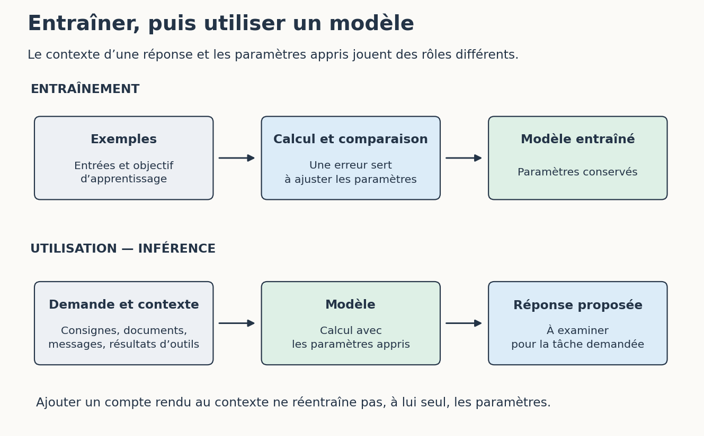

# 1. Quelques repères avant de choisir un parcours

[Sommaire de la partie](../README.md) · [Sources](.)

**TL;DR** — Un modèle apprend pendant son entraînement, puis utilise ses paramètres pour produire des réponses. Les documents qu’on lui fournit, les outils qu’on lui donne et les vérifications qu’on conserve changent ce que l’on peut en faire. Ces repères suffisent pour commencer aussi bien l’atelier de développement que celui des tâches de travail.

Vous pouvez demander à un assistant de corriger une fonction ou de préparer un compte rendu. L’écran ressemble souvent à une conversation. Derrière, plusieurs choses se passent : un modèle reçoit du contexte, produit une réponse et, parfois, demande à utiliser un outil. Prenons le temps de les distinguer avant de choisir notre parcours.

## Apprendre et utiliser un modèle

Imaginez que nous voulions reconnaître des chiffres manuscrits. Nous pouvons montrer à un programme des images accompagnées de la réponse attendue, comparer ses prédictions aux étiquettes et modifier ses paramètres pour réduire les erreurs. Les paramètres sont des nombres qui participent au calcul ; leur ensemble fait partie de ce que nous appelons un **modèle**.

Ce travail d’ajustement est l’**entraînement**. Il faut ensuite essayer le modèle sur des exemples qui n’ont pas servi à l’ajuster. S’il ne reconnaît que les images déjà rencontrées, il nous servira assez peu pour lire notre prochain dessin. Les ateliers de cette partie montreront ces calculs sur de petites images.

Lorsque nous utilisons ensuite le modèle pour obtenir une réponse, nous réalisons une **inférence**. Les paramètres appris participent au calcul de cette réponse. Une conversation ordinaire ne les réentraîne pas à chaque message : ajouter un document au contexte et modifier le modèle sont deux opérations différentes. Le service peut, par ailleurs, conserver des conversations ou proposer une mémoire ; cela dépend de ses fonctions et de ses conditions d’usage.

Figure: Entraîner le modèle et utiliser ses paramètres pour répondre

Les modèles de langage apprennent à partir de textes, et certains modèles utilisent également des images, du son ou d’autres données. Leur entraînement peut comprendre plusieurs étapes, dont des ajustements à partir d’exemples de réponses et de préférences humaines. Nous verrons ensuite comment fabriquer une version minuscule d’un modèle de langage. Elle nous permettra de manipuler le principe sans télécharger un centre de données dans le salon.

Pour les tâches de travail, retenez surtout cette conséquence : fournir les notes de votre réunion donne au modèle des informations à utiliser pour cette demande. Cela ne prouve ni qu’il les retrouvera la semaine suivante, ni qu’elles sont devenues une connaissance fiable enregistrée dans ses paramètres.

## Donner du contexte à la réponse

Un modèle de langage traite le texte sous forme de **tokens** : des unités qui peuvent correspondre à un mot, à une partie de mot ou à un signe. Lorsqu’il génère une réponse, il calcule progressivement la suite à partir de ce qui lui a été fourni et de ce qu’il a déjà produit. Ce mécanisme peut servir à rédiger, traduire, expliquer une erreur ou extraire des informations.

Le **contexte** est l’ensemble des éléments disponibles pour cette réponse : consignes, messages, passages de documents, résultats d’outils… Il a une taille limitée. Un assistant peut sélectionner ou résumer ce qu’il y place. Un fichier joint à une conversation n’implique donc pas que tous ses passages aient participé à chaque réponse, avec le même niveau de détail.

Reprenons un exemple fictif. Une note dit « atelier le 10 octobre », une autre « affiche datée du 17 octobre ». Si nous ne fournissons que la première, l’assistant n’aura pas cette contradiction sous les yeux. Si nous fournissons les deux, il peut la relever ; il peut aussi passer à côté. Nous devrons vérifier ce qu’il a retenu avant d’annoncer une date.

Une consigne utile précise le travail, les sources, le résultat attendu et les décisions à laisser ouvertes. « Prépare un point à partir de ces deux comptes rendus ; indique les dates contradictoires avec leur source » donne une tâche plus exploitable que « sois très rigoureux ».

Le même principe sert en développement. Pour corriger une fonction, il faut connaître son comportement attendu, le code concerné et les cas que l’on veut conserver. Ajouter tout le dépôt sans expliquer le problème peut produire beaucoup de lecture et peu de progrès.

## Retrouver ce qui justifie une réponse

Une réponse peut être très bien rédigée et contenir une information ajoutée sans fondement. Dans notre exemple fictif, « La journée est confirmée le 17 octobre » ferait disparaître le désaccord entre les deux documents. La phrase est facile à lire ; la décision, elle, manque toujours.

On parle souvent d’**hallucination** pour ces éléments inventés ou présentés sans appui suffisant. Le terme est commode, mais il ne dit pas à lui seul pourquoi l’erreur s’est produite. Le document était-il absent du contexte ? L’assistant a-t-il confondu deux versions ? A-t-il complété un champ vide ? Pour corriger le travail, il faut revenir aux entrées et à la sortie.

Une source citée nous aide à effectuer cette vérification. Ouvrons-la : existe-t-elle, dit-elle réellement ce que la réponse lui attribue, concerne-t-elle le bon cas ? Le simple fait d’ajouter une note de bas de page ne répond pas à ces questions.

Dans les deux parcours, nous chercherons des résultats que nous pouvons examiner : des tests et un changement de code, ou un tableau de demandes et un compte rendu relié à ses sources. Nous conserverons aussi les erreurs utiles. Un cas qui a échoué nous permet de voir si la correction tient lorsqu’on change la consigne ou l’outil.

Si vous apprenez encore la tâche, gardez un moment pour la faire vous-même. Relire du code exige de comprendre ce qu’il doit faire ; relire un compte rendu exige de savoir quelles décisions ont réellement été prises. L’assistant peut expliquer une étape ou proposer une piste. Votre capacité à repérer ce qu’il a oublié se construit aussi en travaillant sans lui.

## Du modèle aux outils de travail

Le modèle produit une demande ou une réponse. L’application qui l’entoure peut aussi lui donner des **outils** : lire un fichier, chercher dans une base, exécuter des tests ou préparer un événement d’agenda. C’est cette application qui exécute les appels autorisés et en renvoie les résultats au modèle.

Lorsque l’assistant enchaîne ces appels, observe leurs résultats et décide de la suite, nous parlons d’un **agent**. Une demande comme « prépare le point de l’équipe » peut l’amener à lire le tableau, ouvrir les notes, puis créer un document. Les accès disponibles déterminent aussi jusqu’où il peut aller. Un accès en lecture à un dossier et un droit d’envoi dans une messagerie ne rendent pas les mêmes actions possibles.

Un **pipeline** fixe davantage l’enchaînement : recevoir un lot, retirer les copies exactes, extraire les demandes, contrôler le résultat, préparer un point. Une étape peut utiliser un modèle ou un agent. D’autres se contentent d’appliquer une règle, par exemple comparer deux identifiants. Nous pouvons placer une attente au moment où une personne doit décider.

| Besoin | Exemple en développement | Exemple dans les tâches de travail |
| --- | --- | --- |
| Donner le contexte | Ticket et code de la fonction | Courriels et notes de réunion |
| Utiliser un outil | Lancer les tests | Lire le tableau de suivi |
| Appliquer une règle | Refuser une valeur négative | Écarter la seconde copie d’un message |
| Vérifier une proposition | Relire la modification | Comparer la synthèse aux documents |
| Prendre une décision | Accepter le changement | Confirmer une date avec l’équipe |
Table: Des gestes communs, appliqués à deux familles de tâches

Vous rencontrerez aussi **MCP**, un protocole qui permet à des applications de dialoguer avec des serveurs donnant accès à des outils et à des ressources. Il ne décide pas à votre place quels accès sont acceptables. Un **skill** rassemble une procédure et, selon l’outil, des ressources pour accomplir une tâche. Nous verrons comment adapter ces procédures à nos besoins, comme une recette que l’on modifie selon ce que l’on veut cuisiner.

Pour commencer, nous n’avons pas besoin de tout brancher. Un dossier délimité, une tâche compréhensible et un résultat que l’on sait relire donnent déjà de quoi essayer. Les accès supplémentaires viendront lorsqu’ils serviront à résoudre une difficulté précise.

Vous avez les repères nécessaires pour choisir la suite. Le parcours « tâches de travail » rejoint maintenant la partie **Travailler avec l’IA au-delà du code** : nous y préparerons une journée d’ateliers à partir de documents fictifs. Aucun exercice Python préalable n’est nécessaire.

Si vous voulez regarder les calculs d’un modèle ou suivre le parcours de développement depuis ses fondations, continuez avec le chapitre suivant. Nous allons préparer l’atelier, dessiner des chiffres et voir comment un programme apprend à les reconnaître.
