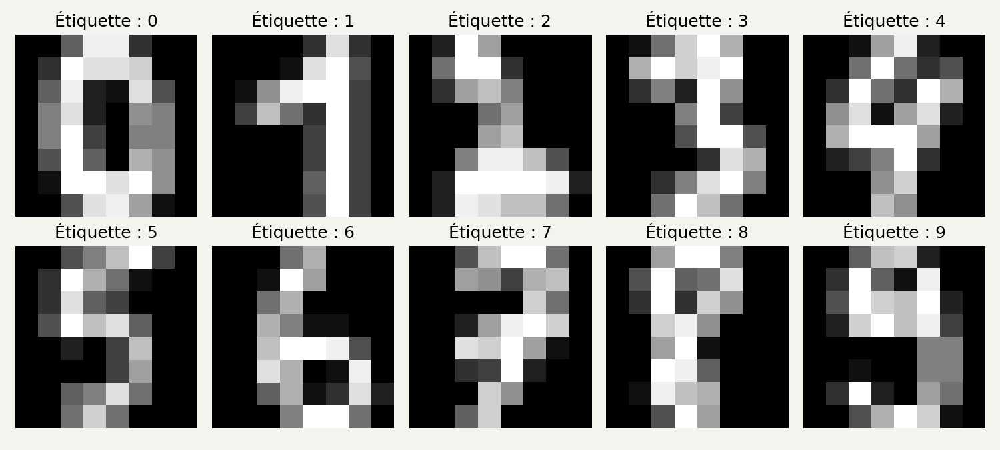

# 2. Installer notre petit atelier

[Sommaire de la partie](../README.md) · [Sources](.)

Notre programme devra choisir un chiffre entre zéro et neuf. Pour l’instant, il ne sait rien reconnaître. Commençons par lui fournir des images et par regarder ce qu’elles contiennent.

## Préparer Python et les fichiers

[Télécharger les fichiers de l’atelier](https://github.com/hloiseau/tutoriel-ia-ateliers/raw/b95165289276a45bc299d0826e3c540727e8e203/telechargements/annexes-atelier-ia-v1.zip).

Décompressez l’archive. Elle contient deux dossiers :

- `atelier-ia` : le code, les données du petit corpus et la grille de dessin ;
- `resultats-reference` : les modèles entraînés, les graphiques et les journaux de nos essais.

Ouvrez le dossier `atelier-ia` dans votre éditeur. Les commandes partiront de ce dossier. Le programme y créera `sorties` pour vos propres résultats ; ceux de référence restent à part.

Vous pouvez commencer en regardant ces fichiers :

| Fichier | Rôle |
| --- | --- |
| `01_observer.py` | Charger les images et les afficher |
| `commun.py` | Préparer les données et les trois groupes |
| `modele.py` | Calculer les réponses et les gradients |
| `03_entrainer.py` | Répéter les mises à jour et sauvegarder |
| `dessiner.html` | Dessiner un chiffre à fournir au modèle |

Les autres scripts seront utilisés au fil des manipulations.

Nous utiliserons **Python 3.12 en version 64 bits**. Les exécutions présentées ici ont été faites avec Python 3.12.14 sous Linux. Les commandes d’installation pour Windows et macOS suivent la documentation de Python ; elles n’ont pas été exécutées sur ces deux systèmes.[^p2-1-installer-windows][^p2-1-installer-mac]

Ouvrez un terminal dans `atelier-ia`. Sous Windows, utilisez ici l’**Invite de commandes** (`cmd`). Vérifiez que Python est disponible :

```bat
py -3.12 --version
```
Code: Windows, Invite de commandes

```bash
python3.12 --version
```
Code: Linux et macOS

Si la commande est introuvable, installez Python 3.12 depuis les distributions proposées par Python ou par votre système. Si votre commande `python3` affiche déjà Python 3.12, vous pouvez l’utiliser à la place de `python3.12`.

Créons un **environnement virtuel**. Il gardera les bibliothèques de cet atelier dans son propre dossier, `.venv`.[^p2-1-installer-venv]

Sous Windows, dans l’Invite de commandes :

```bat
py -3.12 -m venv .venv
.venv\Scripts\activate.bat
python -m pip install -r requirements.txt
```

Sous Linux ou macOS :

```bash
python3.12 -m venv .venv
source .venv/bin/activate
python -m pip install -r requirements.txt
```

L’installation utilise Internet. Ensuite, les expériences se déroulent localement : les données sont incluses dans scikit-learn, et aucun appel à une API d’IA n’est nécessaire.

Dans les commandes suivantes, `python` désigne celui de cet environnement activé. À chaque nouveau terminal, revenez dans `atelier-ia` et relancez la commande d’activation. Sous PowerShell, vous pouvez aussi appeler directement `.venv\Scripts\python.exe` à la place de `python`, sans activer l’environnement.

Le fichier `requirements.txt` fixe les versions utilisées :

```text
numpy==2.3.5
scikit-learn==1.8.0
matplotlib==3.10.8
threadpoolctl==3.6.0
```
Code: requirements.txt

NumPy effectuera les calculs sur les tableaux. scikit-learn fournira les images et leur découpage en groupes. Matplotlib écrira les graphiques dans des fichiers PNG. `threadpoolctl` limitera les multiplications matricielles de l’entraînement à un seul fil CPU.

Nous n’utiliserons pas de modèle de reconnaissance déjà entraîné : les paramètres partiront de valeurs initiales et seront ajustés par notre propre code.


[^p2-1-installer-windows]: [Python 3.12, installation sous Windows](https://docs.python.org/3.12/using/windows.html).

[^p2-1-installer-mac]: [Python 3.12, installation sur macOS](https://docs.python.org/3.12/using/mac.html).

[^p2-1-installer-venv]: [Python, environnements virtuels avec venv](https://docs.python.org/3.12/library/venv.html).

## Afficher les chiffres

Lancez :

```bash
python 01_observer.py
```

Voici la sortie obtenue :

```text
Images : 1797 ; pixels par image : 64
Entraînement : 1077 ; validation : 360 ; test : 360
Valeurs normalisées : 0.0 à 1.0
exemple.json : chiffre 3, provenant de l'entraînement
Image écrite : sorties/chiffres.png
```

Ouvrez `sorties/chiffres.png` dans votre visionneuse d’images.


Figure: Images issues des données d’E. Alpaydin et C. Kaynak, UCI, [CC BY 4.0](https://creativecommons.org/licenses/by/4.0/). Les nombres au-dessus sont leurs étiquettes.

Vous pouvez reconnaître la plupart des chiffres malgré le petit nombre de pixels. Le programme, lui, reçoit **64 nombres par image**. L’étiquette fournit la réponse attendue : pour une image de trois, elle vaut `3`.

Dans `commun.py`, ces deux lignes chargent les données et changent leur échelle :

```python
chiffres = load_digits()
X = chiffres.data.astype(np.float64) / 16.0
```

`load_digits()` fournit 1 797 images de 8 × 8 pixels. Les valeurs d’origine vont de 0 à 16. Nous les divisons par 16 pour obtenir des nombres entre 0 et 1 : le fond vaut zéro et les pixels les plus clairs valent un.[^p2-1-premieres-images-digits]

Ces images proviennent d’un jeu de chiffres manuscrits préparé par E. Alpaydin et C. Kaynak. Le jeu original utilise des images regroupées en blocs pour obtenir ces 64 mesures ; il est distribué par UCI sous licence CC BY 4.0.[^p2-1-premieres-images-uci]

Dans le code, `X` contient les images, et `y` leurs étiquettes. Les noms sont courts parce qu’ils reviennent souvent dans les formules. `X.shape` vaut `(1797, 64)` : 1 797 lignes d’images, avec 64 valeurs sur chaque ligne.

Pour afficher une de ces lignes sous forme de carré, nous utilisons :

```python
X[index].reshape(8, 8)
```

`reshape` réorganise les valeurs. Il ne devine rien et ne change pas l’image. Nous rangeons simplement les 64 nombres en huit lignes de huit.


[^p2-1-premieres-images-digits]: [scikit-learn 1.8, load_digits](https://scikit-learn.org/1.8/modules/generated/sklearn.datasets.load_digits.html).

[^p2-1-premieres-images-uci]: [E. Alpaydin et C. Kaynak, Optical Recognition of Handwritten Digits, UCI (1998), CC BY 4.0](https://doi.org/10.24432/C50P49).

## Mettre des images de côté

Avant l’entraînement, mettons de côté les images qui serviront à juger le modèle. Compter ses bonnes réponses sur les images qu’il vient d’apprendre nous dirait surtout s’il sait retrouver ses exercices.

Nous formons trois groupes :

| Groupe | Images | Usage |
| --- | ---: | --- |
| Entraînement | 1 077 | Calculer les modifications des paramètres |
| Validation | 360 | Comparer les réglages, observer l’apprentissage |
| Test | 360 | Faire le bilan une fois les choix arrêtés |
Table: Le découpage utilisé par les programmes de cet atelier.

Dans `commun.py`, `train_test_split` tire d’abord le test, puis sépare l’entraînement de la validation. `stratify` conserve approximativement la proportion de chaque chiffre dans les groupes. `random_state=42` permet de refaire le même tirage.[^p2-1-repartir-split]

Pourquoi ne pas prendre simplement les premières images ? Parce que leur ordre peut avoir une signification : une série de chiffres écrits par la même personne, par exemple. Un découpage mérite toujours qu’on regarde comment les données ont été produites.

Notre tirage sépare des **images**, pas des personnes. Un bon résultat ne prouvera donc pas que le modèle reconnaît aussi bien l’écriture d’une personne absente de l’entraînement. C’est justement ce que nos propres dessins vont mettre à l’épreuve.

La division par 16 reste la même pour les trois groupes : cette valeur vient du format des images. Si nous calculions une moyenne pour normaliser les données, il faudrait la calculer sur l’entraînement, puis la réutiliser ailleurs. Calculer ce réglage avec le test lui ferait déjà influencer le modèle.[^p2-1-repartir-fuite]


[^p2-1-repartir-split]: [scikit-learn, train_test_split](https://scikit-learn.org/1.8/modules/generated/sklearn.model_selection.train_test_split.html).

[^p2-1-repartir-fuite]: [scikit-learn, prétraitements et fuites de données](https://scikit-learn.org/1.8/common_pitfalls.html).

## Si la première commande ne fonctionne pas

Les erreurs les plus courantes à cette étape concernent l’environnement, pas les réseaux de neurones.

| Ce que vous voyez | Ce qu’il faut vérifier |
| --- | --- |
| `No module named numpy` ou `sklearn` | Réactivez `.venv`, puis relancez `python -m pip install -r requirements.txt`. |
| `can't open file ...01_observer.py` | Le terminal doit être dans le dossier qui contient les scripts. |
| `No module named venv` ou absence d’`ensurepip` | Installez le composant venv correspondant à votre Python avec les paquets de votre distribution. |
| Aucune fenêtre ne s’ouvre | C’est le fichier `sorties/chiffres.png` qu’il faut ouvrir. |
| Un script a été enregistré en `.py.txt` | Affichez les extensions dans l’explorateur et conservez uniquement `.py`. |

Pour vérifier quel Python travaille réellement :

```bash
python -c "import sys; print(sys.executable)"
```

Le chemin doit contenir le dossier `.venv` de l’atelier. Cela évite de chercher pendant vingt minutes pourquoi une bibliothèque est « installée » et « introuvable » en même temps. 🙂

Les images sont chargées, leurs réponses attendues sont connues et le test attend sagement à part. Aucun paramètre n’a encore bougé : il faut d’abord transformer les 64 pixels en dix scores.
