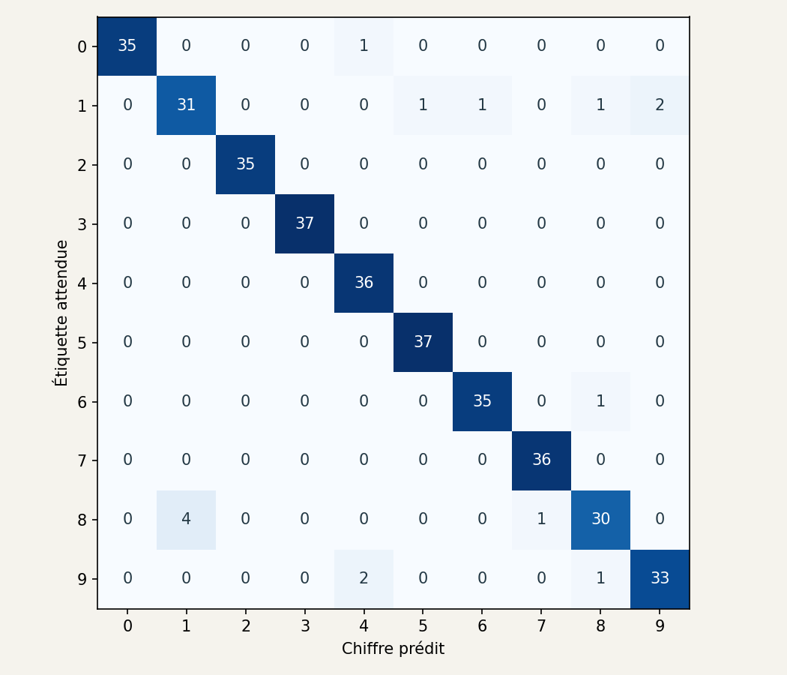
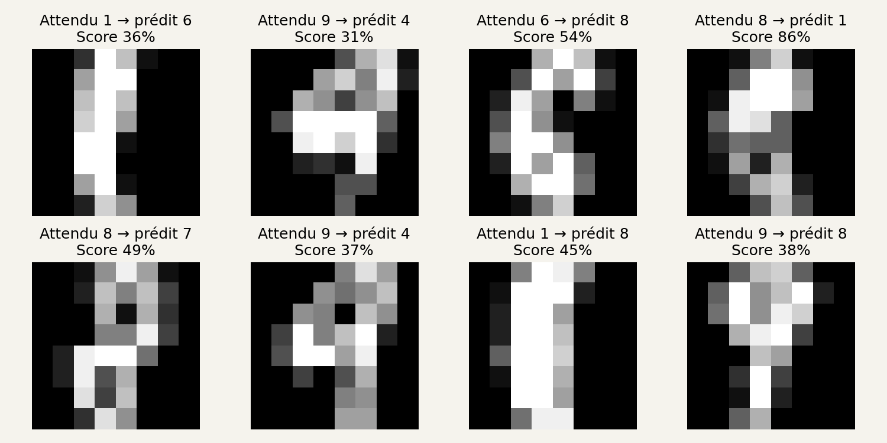

# 5. Lire les résultats sans se raconter d’histoires

[Sommaire de la partie](../README.md) · [Sources](.)

Notre courbe monte et 95 % des images de validation sont bien classées. Ouvrons maintenant les erreurs du test, puis déplaçons les chiffres d’un pixel. Nous verrons vite ce que ce résultat mesure vraiment.

## Faire le bilan sur le test

Pour le modèle linéaire, nous conservons nos 80 epochs et notre pas de 0,2. Nous pouvons maintenant ouvrir le jeu de test :

```bash
python 04_evaluer.py
```

```text
Test : 345/360 réponses correctes (95.8%)
```

Cela fait quinze erreurs. Le résultat porte sur les 360 images de ce découpage, pas sur tous les chiffres que quelqu’un pourrait écrire.

Ouvrez `sorties/lineaire-confusions.png` :


Figure: Chaque case compte des images du jeu de test.

C’est une **matrice de confusion**. Sur la diagonale, le chiffre prédit correspond à l’étiquette. En dehors, nous voyons les confusions. La ligne du huit indique notamment ce que deviennent les images étiquetées huit : reconnues, ou prises pour un autre chiffre.

Un score global pourrait cacher un modèle qui reconnaît très bien certaines classes et presque jamais une autre. Cette grille permet d’aller regarder lesquelles.

Le test doit rester un bilan. Si nous le consultons après chaque changement pour choisir le meilleur réglage, il devient un autre jeu de validation. Garder son nom « test » dans le code ne lui rendra pas son indépendance. 🙂

## Ouvrir les images qui posent problème

Ouvrez maintenant `sorties/lineaire-erreurs.png` :


Figure: Premières erreurs dans l’ordre du jeu de test. Données d’E. Alpaydin et C. Kaynak, UCI, [CC BY 4.0](https://creativecommons.org/licenses/by/4.0/).

Regardez d’abord un chiffre sans lire son étiquette. Êtes-vous certain de votre propre réponse ? Certaines images deviennent ambiguës avec seulement 64 pixels.

Regardez ensuite les scores. Une mauvaise réponse peut recevoir un score élevé. Le modèle répartit ses probabilités entre les dix classes disponibles ; il ne possède pas une onzième classe « je ne reconnais pas ce dessin ».

Une image complètement noire passera aussi dans les calculs. Si tous les pixels sont nuls, les scores du modèle linéaire se réduisent à ses biais. Il choisira quand même un chiffre.

Une règle pourrait refuser les scores trop faibles. Avant de l’adopter, il faudrait compter les erreurs qu’elle évite et les bonnes réponses qu’elle rejette. Un seuil choisi au hasard déplacerait simplement le problème.

## Déplacer les chiffres d’un pixel

Le script suivant prend la validation et décale chaque image d’un pixel vers la droite. Il remplit la colonne de gauche avec des zéros ; la colonne qui sort à droite est perdue.

```bash
python 06_decaler.py
```

```text
Validation d'origine : 95.0%
Décalée d'un pixel à droite : 41.4%
```

Ouvrez `sorties/decalage.png` :


Figure: En haut, les images d’origine ; en bas, les mêmes images déplacées. Données d’E. Alpaydin et C. Kaynak, UCI, [CC BY 4.0](https://creativecommons.org/licenses/by/4.0/).

Les poids sont restés identiques. Ce sont les entrées qui ont changé. Pour nous, beaucoup de ces chiffres restent reconnaissables. Pour le modèle, les zones claires ne tombent plus aux mêmes positions.

Le décalage n’est pas parfaitement neutre : sur une grille aussi petite, perdre une colonne peut retirer une partie du trait. Même avec cette limite, l’écart entre 95,0 % et 41,4 % montre combien ce modèle dépend de la présentation des images.

Une piste consiste à lui montrer des variations pendant l’entraînement : légers déplacements, par exemple. C’est une forme d’**augmentation de données**. On fabriquerait ces variantes à partir des seules images d’entraînement, puis on vérifierait leur effet sur la validation. Transformer aussi le test en exercices d’entraînement ferait disparaître la question que nous cherchons à mesurer.

Le modèle fait quinze erreurs sur le test et s’effondre lorsque les images glissent d’un pixel. Soumettons-lui maintenant une entrée qui vient vraiment de l’extérieur : notre propre dessin.
