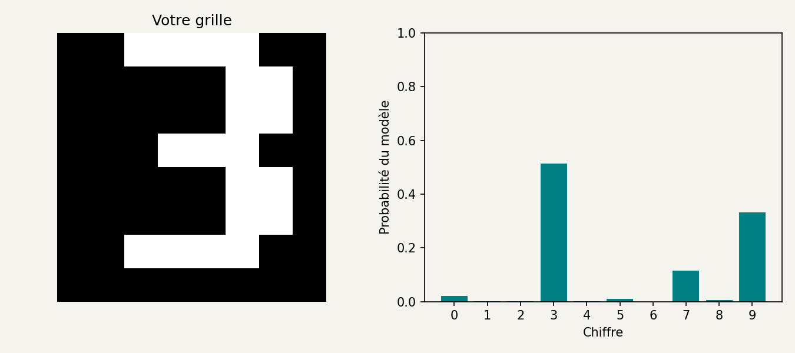

# 5. Faire reconnaître nos propres dessins

[Sommaire de la partie](../README.md) · [Sources](.)

Les images du jeu partagent un format et une manière d’occuper la grille. Notre propre écriture risque de bousculer ces habitudes. À nous de dessiner.

## Dessiner puis enregistrer

Ouvrez `dessiner.html` dans votre navigateur, en double-cliquant sur le fichier. La page fonctionne localement et ne transmet pas le dessin.

Vous voyez une grille noire de huit lignes et huit colonnes. Dessinez un chiffre avec la souris ou le doigt. Le menu « Intensité du trait » permet de peindre en blanc, en gris ou d’effacer avec du noir. Gardez une petite marge et essayez d’occuper une bonne partie de la hauteur.

Le clavier fonctionne aussi : cliquez sur la grille, déplacez la sélection avec les flèches et pressez la barre d’espace pour peindre la case. Le bouton « Effacer » remet toute la grille à zéro.

Cliquez sur « Enregistrer dessin.json ». Le navigateur propose de télécharger le fichier. Déplacez-le dans `atelier-ia`, à côté des scripts, puis lancez :

```bash
python 05_lire_dessin.py dessin.json
```

Si vous préférez commencer avec un dessin déjà fourni :

```bash
python 05_lire_dessin.py dessin-exemple.json
```

Le fichier fourni représente un trois dessiné case par case. Voici ses trois meilleurs scores :

```text
Chiffre 3 : 51.4%
Chiffre 9 : 33.1%
Chiffre 7 : 11.5%
```

Ouvrez `sorties/dessin-resultat.png` :


Figure: Prédiction sur le dessin fourni dans `dessin-exemple.json`, qui ne vient pas du jeu d’entraînement.

Le modèle choisit bien trois, mais il hésite beaucoup plus que sur notre premier exemple. Votre propre chiffre pourra produire une autre réponse, même si vous avez l’impression d’avoir dessiné la même chose.

Essayez d’enlever une case, d’adoucir un bord avec du gris ou de déplacer un trait. Enregistrez à nouveau, puis relancez la commande. Le fichier image du résultat est remplacé à chaque exécution ; conservez une copie si vous voulez comparer deux dessins côte à côte.

## Le dessin devient exactement 64 nombres

Ouvrez `dessin.json` avec votre éditeur. Il contient une clé `pixels`, suivie de huit listes de huit nombres. Le début ressemble à ceci :

```json
{
  "pixels": [
    [0, 0, 1, 1, 1, 1, 0, 0],
    [0, 0, 0, 0, 0, 1, 1, 0]
  ]
}
```
Code: Les deux premières lignes du dessin fourni. Le fichier complet en contient huit.

La page a déjà produit des valeurs entre zéro et un. Nous ne les divisons donc **pas une deuxième fois par 16**. Le programme vérifie la forme et la plage des nombres, puis prépare une ligne de 64 valeurs :

```python
proba = probabilites(pixels.reshape(1, 64), p)[0]
```

Le `1` signifie que le lot ne contient qu’une image. Les calculs sont les mêmes que lors de l’évaluation de plusieurs centaines d’images.

Si le programme annonce « Dessin invalide », vérifiez que vous avez bien enregistré le JSON et non la page HTML. Il faut huit lignes, huit valeurs par ligne, et des nombres finis entre zéro et un.

Le fichier `sorties/exemple.json`, créé au premier chapitre, fournit aussi un point de comparaison : il contient une image d’entraînement. Si cette image est bien reconnue mais que vos dessins posent problème, la différence vient peut-être de leur présentation plutôt que de la lecture du fichier.

## Réutiliser le modèle sans le réentraîner

Dans `03_entrainer.py`, la sauvegarde se fait avec :

```python
np.savez_compressed(SORTIES / f"{args.nom}.npz", **p)
```

Le format NPZ rassemble les tableaux NumPy dans une archive compressée. Les clés `W` et `b` deviennent les noms des tableaux du modèle linéaire.[^p2-5-sauvegarde-save]

Dans `05_lire_dessin.py`, nous les rechargeons :

```python
with np.load(chemin, allow_pickle=False) as archive:
    p = {k: archive[k] for k in archive.files}
```

Nous utilisons uniquement des tableaux de nombres, sans charger d’objets Python sérialisés. Le fichier `lineaire.npz` obtenu ici pèse environ 5,3 Kio. Nos 650 paramètres tiennent facilement dedans.

Fermez le terminal, ouvrez-en un autre, réactivez l’environnement et relancez la commande de lecture du dessin. Vous n’avez pas besoin de relancer l’entraînement.

Cette étape s’appelle l’**inférence** : nous utilisons les paramètres existants pour calculer une réponse. Montrer un nouveau dessin au programme ne modifie pas ces paramètres.

Si vous souhaitez ensuite lui faire apprendre vos dessins, il faudra aussi leur associer les bonnes étiquettes, les intégrer à un protocole d’entraînement et évaluer le résultat sur d’autres exemples. Accumuler seulement les dessins sur lesquels on vient de corriger une erreur ne fournit pas, à lui seul, un nouveau test indépendant.


[^p2-5-sauvegarde-save]: [NumPy, savez_compressed](https://numpy.org/doc/stable/reference/generated/numpy.savez_compressed.html).

Le fichier du modèle se recharge sans nouvel entraînement. Face à notre dessin, sa réponse dépend beaucoup de la manière dont nous avons occupé la grille. Ajoutons maintenant une couche au réseau et regardons si davantage de paramètres change ce comportement.
