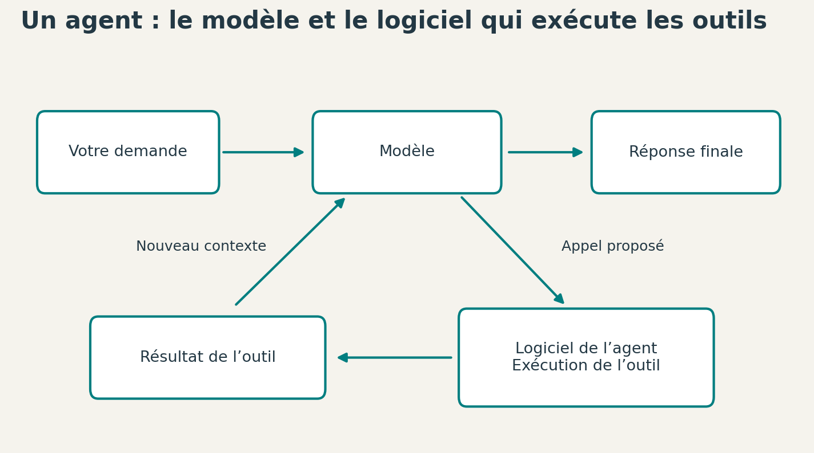

# 8. Du modèle aux outils qui l’entourent

[Sommaire de la partie](../README.md) · [Sources](.)

Le classifieur reçoit des pixels ; le bigramme reçoit des tokens. Aucun des deux ne sait ouvrir un fichier, consulter une documentation ou lancer un test. Ces actions viennent du logiciel qui entoure le modèle.

Donnons à notre application un premier outil, puis provoquons un appel qu’elle doit refuser.

## Exécuter un appel d’outil

Supposons qu’une application dispose d’un outil nommé `lire_fiche`. Il accepte un nom de fiche et renvoie un texte. Un appel peut s’écrire sous cette forme :

```json
{"outil": "lire_fiche", "arguments": {"nom": "validation"}}
```
Code: appel.json

Notre bigramme ne sait pas choisir cet outil. Pour essayer le code qui reçoit et exécute un appel, nous lui fournissons donc directement le fichier `appel.json`.

```bash
python 10_outil.py appel.json
```

```text
{
  "outil": "lire_fiche",
  "resultat": "La validation sert à comparer les réglages sans utiliser le jeu de test."
}
```

Ouvrez `10_outil.py`. Le programme vérifie le nom de l’outil, les arguments et le nom de la fiche. Il va ensuite chercher le texte dans un dictionnaire Python.

Aucune commande système ne se cache derrière cette lecture. La valeur reçue ne passe ni à `eval`, ni à un shell. Un appel d’outil est une donnée que l’application examine avant d’exécuter une fonction.

Copiez `appel.json` dans `appel-refuse.json`, puis remplacez `lire_fiche` par `effacer_fichiers`. Lancez :

```bash
python 10_outil.py appel-refuse.json
```

Le résultat doit être :

```text
Appel refusé : Outil non autorisé.
```

Le refus vient d’une condition exécutée par Python. Il ne dépend pas de la bonne volonté d’un modèle qui aurait lu « merci de ne rien effacer ».

## Qui choisit, qui exécute ?

Dans un agent fondé sur un modèle de langage, le modèle peut proposer un appel. L’application vérifie cet appel, exécute l’outil autorisé et ajoute son résultat au contexte. Le modèle reçoit alors de nouvelles informations et peut continuer.


Figure: L’application effectue les appels ; les résultats alimentent le contexte du modèle.

Nous venons de programmer la partie qui exécute un outil. Pour obtenir un agent complet, il faudrait notamment y associer un modèle capable de proposer les appels, lui décrire les outils et organiser la boucle.

Un **MCP** peut fournir un protocole commun pour présenter et utiliser des outils exposés par un serveur. Il ne remplace pas le modèle, ni les autorisations de l’application.[^p2-8-boucle-mcp]

Un **skill** peut rassembler une procédure, des consignes et des ressources : par exemple, quels fichiers examiner lors d’une revue ou comment interpréter les sorties d’une commande. Lire ce skill fournit des informations à l’agent ; cela n’entraîne pas automatiquement les poids du modèle.

Si une procédure prévoit de lancer les tests, il faut encore un outil pour les exécuter, des droits adaptés et une manière de juger le résultat. Une sortie de commande peut fournir une preuve utile, mais elle peut aussi être incomplète ou mal interprétée.


[^p2-8-boucle-mcp]: [Model Context Protocol, architecture](https://modelcontextprotocol.io/docs/learn/architecture).

## Changer les informations ou changer le modèle

Reprenons les opérations que nous avons réellement effectuées :

| Action | Ce qui change |
| --- | --- |
| Modifier les pixels de `dessin.json` | L’entrée de l’inférence |
| Réentraîner le classifieur | Les poids et les biais |
| Ajouter une phrase à `corpus.txt`, puis recompter | La table du modèle de bigrammes |
| Changer `--debut` | Le texte de départ, donc le contexte |
| Changer la température | La répartition utilisée pour choisir le caractère suivant |
| Lire une fiche avec un outil | Les informations que l’application peut fournir ensuite au modèle |

Le tableau montre pourquoi deux changements qui se ressemblent dans une interface peuvent agir à des endroits très différents. Ajouter une documentation enrichit les informations disponibles pour la réponse en cours ; adapter le modèle modifie ses poids. Une consigne plus prudente, elle, laisse intactes les données qui ont servi à l’entraînement.

Un agent peut aussi perdre l’accès à une information si son application la retire, la résume mal ou ne la charge pas au bon moment. Notre bigramme avait une limite extrêmement visible : un caractère de contexte. Les modèles actuels en utilisent beaucoup plus, mais la quantité d’informations accessible et la manière de les exploiter restent des contraintes.

Pour travailler sur du code, on peut vérifier des faits avec les fichiers du projet, une documentation ou une commande. Encore faut-il donner à l’agent les bons éléments, puis regarder si sa conclusion en découle réellement.

## Ce que ces expériences ont demandé

Les modèles de cet atelier sont petits. Le programme linéaire ajuste 650 paramètres ; le réseau en ajuste 2 410. Nous utilisons 1 797 images et un corpus de texte d’environ un millier de caractères.

Voici les mesures d’une exécution sous Linux avec Python 3.12.14. L’entraînement limite les bibliothèques de calcul à un seul fil CPU. Aucun GPU n’a été utilisé.

| Manipulation | Durée du processus | Pic mémoire du processus |
| --- | ---: | ---: |
| Observer les images | 2,34 s | 151 Mio |
| Entraîner le modèle linéaire et écrire sa courbe | 1,33 s | 148 Mio |
| Entraîner le réseau de 32 unités et écrire sa courbe | 1,51 s | 146 Mio |
| Évaluer le réseau et écrire les graphiques | 1,66 s | 166 Mio |
| Produire le texte avec les bigrammes | 0,92 s | 113 Mio |

Ces durées incluent le démarrage de Python, les imports et les sorties du script. Le calcul mesuré à l’intérieur de l’entraînement était d’environ 0,11 s pour le modèle linéaire et 0,21 s pour le réseau. Sur un calcul aussi court, le lancement du programme prend une grande part du temps.

Ce sont des mesures dans l’environnement d’exécution utilisé pour préparer les exemples, pas des performances garanties sur votre ordinateur. Le pic mémoire concerne le processus Python ; il n’inclut pas tout le système ni votre navigateur.

L’environnement Python installé représentait environ 429 Mio de fichiers, hors cache de téléchargement. Prévoir un peu de marge sur le disque évite de bloquer pendant l’installation. Pour les calculs, nous sommes très loin d’exiger une carte graphique de 24 Go.

Si votre machine est lente, vous pouvez réduire le nombre d’epochs avec `--epochs 20`. Cela change le résultat de l’entraînement, mais conserve toutes les étapes. Vous pouvez aussi examiner `resultats-reference` sans refaire un calcul. Pour utiliser un modèle fourni, copiez son fichier `.npz` dans le dossier `sorties` créé au lancement de `01_observer.py`.

## Ce que nous voulons déléguer

Si vous avez suivi les expériences, vous pouvez maintenant ouvrir un modèle, expliquer son entrée, identifier les paramètres modifiés et retrouver comment son résultat est mesuré. Cela ne demande pas d’en faire une religion : c’est du code que nous pouvons exécuter et discuter.

Pour apprendre, il peut être plus utile de modifier une boucle de dix lignes et de comprendre son effet que de demander à un agent de générer un projet entier. Le programme terminé n’est pas la seule chose que l’on cherche : il y a aussi ce que nous savons faire après l’avoir écrit.

L’aide d’une IA peut servir à expliquer un message d’erreur, proposer un cas de test ou trouver une documentation. Si elle modifie le modèle ou son évaluation, il faut cependant vérifier le résultat. Une fuite entre entraînement et test peut produire un joli score avec un protocole faux.

Vous pouvez aussi décider de faire ces expériences sans agent. Le matériel, les données et le code restent chez vous. Nous avons choisi des données identifiées et un petit corpus fourni avec le projet ; le fait de travailler localement ne dispense pas de regarder leur provenance.

Ce sont ces choix concrets qui déterminent la place de l’outil : ce que nous voulons apprendre, ce que nous voulons déléguer et ce que nous devons pouvoir vérifier.

Notre petit modèle tient dans un fichier que nous savons entraîner, sauvegarder, évaluer et recharger. Son joli score résiste mal à un décalage d’un pixel, et l’appel d’outil refusé nous a montré où l’application reprend la main.

Le code et les résultats restent assez petits pour être ouverts et modifiés. Nous pouvons maintenant changer d’échelle sans oublier où se trouvent les paramètres, les entrées et le programme qui agit autour du modèle.
