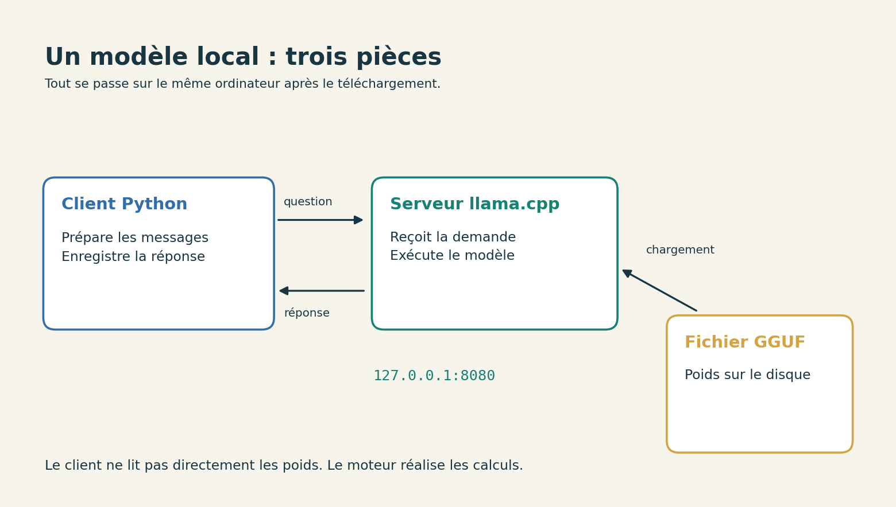

# 1. Choisir ce que l’on va télécharger

[Sommaire de la partie](../README.md) · [Sources](.)

**TL;DR :** il nous faut des poids, un logiciel capable de les lire et une tâche raisonnable. Le nom du modèle ne remplace ni sa fiche ni sa licence.

Avant de cliquer sur un fichier de plusieurs gigaoctets, faisons connaissance avec les trois pièces de notre installation.

## Le modèle, le moteur et notre programme

Dans la partie précédente, notre programme chargeait des nombres appris pendant l’entraînement. Le principe reste le même. Le modèle que nous allons utiliser possède beaucoup plus de paramètres et une architecture différente, mais ses poids ne sont pas un programme qui se lance tout seul.

Le **moteur d’inférence** réalise les calculs nécessaires à la production d’une réponse. Nous utiliserons llama.cpp. Notre **client** sera un petit script Python qui envoie des messages à ce moteur, lancé sous forme de serveur.


Figure: Les éléments de notre installation

Pourquoi passer par un serveur alors que tout est sur le même ordinateur ? Pour pouvoir changer le client sans recharger les poids à chaque question. Notre script, une interface web ou un autre programme peuvent demander un calcul au même processus. Le mot « serveur » décrit ici son rôle ; il ne signifie pas que nous avons acheté une machine supplémentaire.

Nous n’allons pas encore donner au modèle la possibilité de lancer des commandes ou de modifier des fichiers. Il recevra du texte et produira du texte. Les programmes qui organisent des appels d’outils ajoutent d’autres mécanismes autour de ce calcul.

## Lire la fiche avant le nom du fichier

Pour cet atelier, prenons **SmolLM2-360M-Instruct**, dans sa version GGUF Q8_0 publiée dans l’espace HuggingFaceTB. Il compte environ 360 millions de paramètres. Sa fiche le présente comme un modèle principalement anglophone et déclare une licence Apache 2.0.[^p3-smol]

Le fichier fait environ **386 Mo**. Voilà un téléchargement plus abordable que celui d’un très grand modèle. Ce choix sert à prendre en main l’inférence locale. Il ne signifie pas que ce petit modèle est un bon agent de développement ni qu’il sera à l’aise en français.

Si vous voulez essayer un autre modèle, sa fiche vous aidera à voir s’il correspond à votre usage : les langues qu’il traite, ce que sa licence permet et les limites signalées par ses auteurs.

Le suffixe **Instruct** indique une adaptation destinée à suivre des instructions. **GGUF** désigne le format de fichier utilisé ici. **Q8_0** désigne une forme de quantification : les nombres sont stockés avec une précision réduite selon ce format. Nous allons revenir sur ce que cela change en mémoire.

[^p3-smol]: HuggingFaceTB, [fiche de SmolLM2-360M-Instruct](https://huggingface.co/HuggingFaceTB/SmolLM2-360M-Instruct) et [version GGUF](https://huggingface.co/HuggingFaceTB/SmolLM2-360M-Instruct-GGUF). Taille et empreinte du fichier relevées le 14 septembre 2026 ; révision conservée dans `modele.json`.

## De quoi votre ordinateur a-t-il besoin ?

Nous allons utiliser Python 3.12 et sa bibliothèque standard. Les scripts de cet atelier ne nécessitent ni NumPy ni un abonnement à une API. Si vous avez suivi la partie précédente, vous pouvez conserver votre installation de Python.

[Téléchargez les fichiers de l’atelier](https://github.com/hloiseau/tutoriel-ia-ateliers/raw/b95165289276a45bc299d0826e3c540727e8e203/telechargements/annexes-modele-local-v1.zip), décompressez l’archive, puis ouvrez un terminal dans le dossier `atelier-local`.

Dans les commandes, `python` désigne votre Python 3.12. Selon votre installation, écrivez `python3` sous Linux ou macOS, ou `py -3.12` sous Windows. Vérifiez-le avant de poursuivre :

```bash
python --version
python inventaire.py
```
Code: Identifier l’environnement utilisé

Le second programme enregistre les informations dans `resultats/machine.json`. Il relève notamment le système, l’architecture et le nombre de processeurs logiques. S’il trouve `nvidia-smi`, il lui demande aussi le nom de la carte NVIDIA et sa mémoire. Ne pas trouver cette commande ne bloque pas le parcours sur CPU.

Gardez au moins quelques gigaoctets libres sur le disque pour le moteur, le modèle et les résultats. Pour la RAM, vérifiez la mémoire **disponible**, pas seulement la quantité installée : les autres applications en occupent déjà une partie. Le fichier du modèle approche 386 Mo, mais le programme aura besoin de mémoire supplémentaire.

Notre premier réglage utilisera deux fils CPU et un contexte limité à 2 048 tokens. Si la machine manque de mémoire ou devient peu réactive, arrêtez le serveur avant de modifier ses paramètres. Faire tourner un petit modèle lentement est suffisant pour comprendre la manipulation ; planter tout le bureau n’apporte pas grand-chose. 😅


