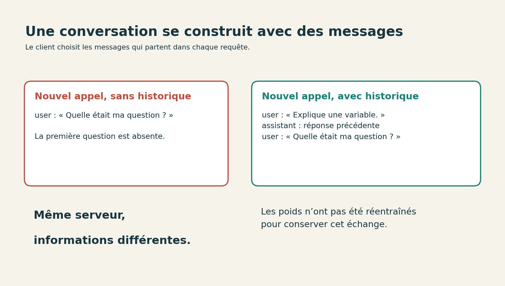

# 3. Envoyer une question et conserver la réponse

[Sommaire de la partie](../README.md) · [Sources](.)

**TL;DR :** notre client envoie une liste de messages et enregistre la réponse complète. Les questions restent courtes pour que nous puissions comprendre chaque essai.

Le serveur tourne ? Ouvrez un deuxième terminal dans `atelier-local`. Le premier continue son travail.

## Notre première requête

Ouvrez `questions/premiere.json`. Vous y trouverez deux messages :

```json
[
  {"role": "system", "content": "Answer briefly in English."},
  {"role": "user", "content": "Explain what a variable is in programming, in two sentences."}
]
```
Code: Les messages envoyés au modèle

Le premier donne une consigne générale ; le second contient notre question. Nous commençons en anglais parce que c’est la langue principale du modèle retenu.

Lancez :

```bash
python client.py
```

Le client affiche le texte reçu et écrit `resultats/reponse.json`. Ouvrez ce fichier : il contient la demande, la réponse brute et le temps écoulé autour de l’appel. Si le modèle vous surprend demain, vous aurez mieux qu’une phrase recopiée de mémoire pour comprendre pourquoi. 🙂

Lisez la réponse. Respecte-t-elle les deux phrases demandées ? Son explication d’une variable est-elle correcte ? Vérifiez les deux : un texte bien présenté peut toujours raconter n’importe quoi.

Si le client finit par signaler un délai dépassé, regardez le terminal du serveur avant de recommencer. Une expiration côté client n’implique pas forcément que le calcul côté serveur s’est arrêté.

## Ce que fait le client

Le cœur de `client.py` envoie du JSON à `http://127.0.0.1:8080/v1/chat/completions`. Le client utilise la bibliothèque standard de Python. Il n’a pas besoin d’un compte chez un fournisseur pour parler à notre serveur.

Nous fixons trois choix : une température à zéro, une sortie limitée à 96 tokens et une réponse reçue en une seule fois. La température à zéro rend la sélection plus déterministe. Elle agit sur le choix des tokens, donc une réponse fausse reste fausse ; des différences de moteur ou de calcul peuvent aussi produire des écarts entre exécutions.

Regardez `raison_arret` dans le fichier enregistré. Si elle vaut `length`, la limite de sortie a été atteinte. Une phrase interrompue n’est pas forcément un refus de répondre : nous avons peut-être simplement coupé le robinet trop tôt.

La limite compte des **tokens**, pas des mots. Le modèle possède son propre découpage du texte. Un mot peut occuper plusieurs tokens, et les messages comportent aussi des éléments de mise en forme utilisés par le modèle.

Pour allonger la réponse, vous pouvez modifier la valeur par défaut `max_tokens=96` dans `client.py`, par exemple en `128`. Gardez la même valeur entre deux mesures que vous voulez comparer.

## Une réponse présente, une réponse absente

Essayons maintenant une question dont nous connaissons la réponse, sans dépendre des souvenirs du modèle :

```bash
python client.py --fichier questions/document.json --sortie resultats/document.json
python client.py --fichier questions/inconnue.json --sortie resultats/inconnue.json
```

Les deux fichiers parlent d’une bibliothèque fictive. Le document indique qu’elle ouvre le mardi à 10 heures et ferme à 17 heures. Le premier demande l’heure d’ouverture du mardi. Le second demande celle du dimanche, qui n’est pas fournie.

Pour le mardi, nous attendons **10 heures**. Pour le dimanche, nous attendons que le modèle dise qu’il ne sait pas. La consigne lui demande explicitement de se limiter au document.

S’il invente un horaire du dimanche, conservez l’erreur. Compléter le document après coup rendrait le cas beaucoup moins intéressant : nous voulons savoir comment il réagit lorsqu’une information manque.

Ces deux cas ciblent désormais un comportement chacun : retrouver une réponse présente et s’abstenir lorsque l’information manque. Ils ne résument pas les capacités du modèle ; ils donnent en revanche deux observations que nous pourrons rejouer au prochain changement.

## Pourquoi le modèle ne se souvient pas du premier essai

Copiez `questions/premiere.json` vers `questions/historique-absent.json`. Dans cette copie, gardez seulement un message `user` avec la question : « Quelle était ma question précédente ? », puis lancez :

```bash
python client.py --fichier questions/historique-absent.json --sortie resultats/historique-absent.json
```

Ouvrez `resultats/historique-absent.json` et regardez la partie `requete` : elle contient la nouvelle question, sans la précédente. Le modèle peut tout de même improviser une réponse, mais notre trace montre qu’il n’a reçu aucun historique. Le serveur traite uniquement les messages présents dans le fichier envoyé par le client.


Figure: L’historique est constitué par le programme qui prépare la demande

Pour poursuivre réellement l’échange, il faut envoyer les messages précédents et la nouvelle question. Les interfaces de discussion s’en chargent généralement pour nous, avec leurs propres choix de conservation, de résumé ou de suppression.

Le **cache de calcul** joue un autre rôle. Le moteur peut réutiliser des calculs pour accélérer le traitement d’un texte déjà rencontré, mais le cache n’ajoute pas à la requête les anciens messages. L’historique dépend toujours du programme qui prépare la liste envoyée.

Chaque ajout prend de la place dans le contexte et peut ramener des instructions anciennes, des détails devenus inutiles ou des contradictions. Un bon historique contient les éléments nécessaires à la suite de l’échange, pas forcément toutes les archives disponibles.


