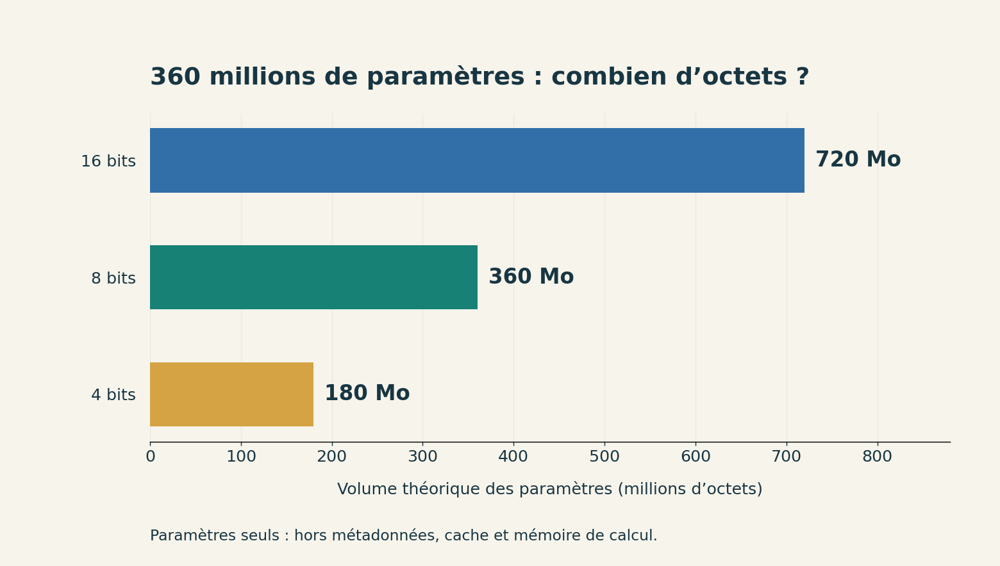
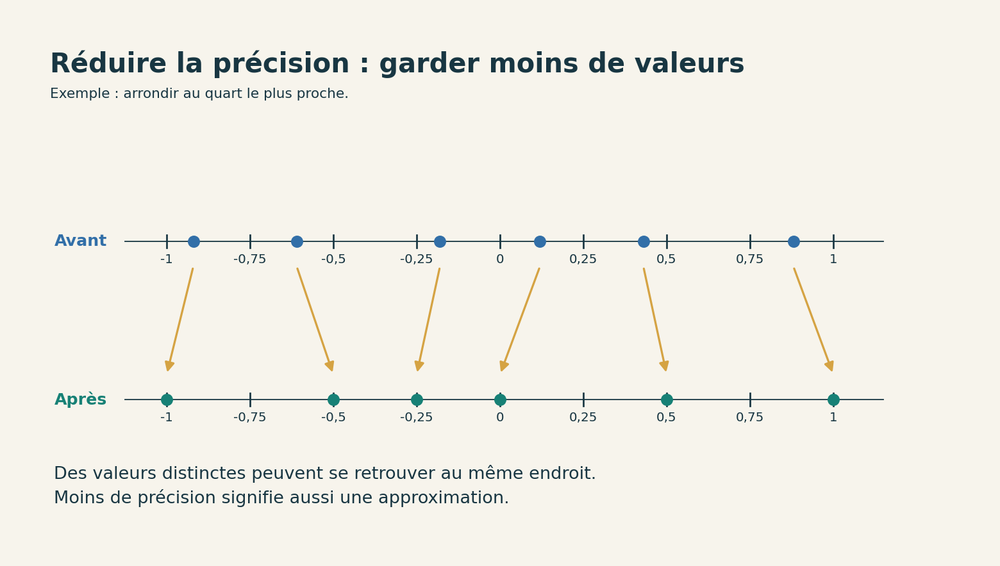

# Faire tourner un modèle chez soi

[Sommaire de la partie](README.md) · [Sommaire global](../../SOMMAIRE.md)

Un modèle de langage semble parfois se confondre avec la page web dans laquelle on lui écrit. Nous allons séparer les pièces : un fichier de poids sur le disque, un moteur qui effectue les calculs et un petit programme qui lui envoie nos questions.

À la fin de l’atelier, vous saurez démarrer ce modèle sur votre ordinateur, conserver ses réponses et arrêter le serveur. Il devrait déjà avoir perdu un peu de son mystère. 🙂

Nous commencerons sur CPU, avec un petit modèle et des réponses courtes. Si vous avez une carte graphique, vous pourrez ensuite reprendre la même expérience et mesurer ce qu’elle change ; aucun achat de matériel n’est nécessaire pour suivre le parcours principal.

**TL;DR**

- Télécharger les poids permet de réutiliser un entraînement déjà effectué.
- Nous installerons un moteur, chargerons un modèle, puis l’interrogerons depuis un petit programme Python.
- Nous mesurerons ce qui se passe sur notre machine : la taille du fichier ne suffit pas à prévoir la mémoire occupée pendant une réponse.
- Nous lirons les réponses aussi attentivement que le chronomètre : la vitesse et la qualité répondent à deux questions différentes.
- Faire les calculs chez soi permet de garder la main sur une partie du système. La provenance du modèle et les droits sur ses données restent des questions à examiner.

## 1. Choisir ce que l’on va télécharger

**TL;DR :** il nous faut des poids, un logiciel capable de les lire et une tâche raisonnable. La fiche du modèle nous renseignera sur ses langues, sa licence et ses limites.

Avant de cliquer sur un fichier de plusieurs gigaoctets, faisons connaissance avec les trois pièces de notre installation.

### Le modèle, le moteur et notre programme

Dans la partie précédente, notre programme chargeait les nombres appris pendant l’entraînement. Nous allons retrouver ce principe à une autre échelle : le modèle possède beaucoup plus de paramètres et une architecture différente, tandis que ses poids restent des données à charger.

Le **moteur d’inférence** réalise les calculs nécessaires à la production d’une réponse. Nous utiliserons llama.cpp. Notre **client** sera un petit script Python qui envoie des messages à ce moteur, lancé sous forme de serveur.


Figure: Les éléments de notre installation

Pourquoi passer par un serveur alors que tout tient sur le même ordinateur ? Parce qu’il garde le modèle chargé pendant que différents clients lui demandent des calculs. Notre script, une interface web ou un autre programme pourront ainsi l’interroger. Ici, « serveur » désigne le rôle du processus lancé sur notre machine.

Pour le moment, le modèle recevra du texte et produira du texte. Lancer des commandes ou modifier des fichiers demandera plus tard un programme capable d’organiser et de contrôler ces actions autour de lui.

### Lire la fiche avant le nom du fichier

Pour cet atelier, prenons **SmolLM2-360M-Instruct**, dans sa version GGUF Q8_0 publiée dans l’espace HuggingFaceTB. Il compte environ 360 millions de paramètres. Sa fiche le présente comme un modèle principalement anglophone et déclare une licence Apache 2.0.[^p3-smol]

Le fichier fait environ **386 Mo**, une taille raisonnable pour prendre en main l’inférence locale. La fiche annonce toutefois un modèle principalement anglophone. Quant au travail de développement, nos cinq courtes questions ne permettront pas de juger s’il sait lire un projet, utiliser des outils et tenir une session entière.

Si vous voulez essayer un autre modèle, sa fiche vous aidera à voir s’il correspond à votre usage : les langues qu’il traite, ce que sa licence permet et les limites signalées par ses auteurs.

Le suffixe **Instruct** indique une adaptation destinée à suivre des instructions. **GGUF** désigne le format de fichier utilisé ici. **Q8_0** désigne une forme de quantification : les nombres sont stockés avec une précision réduite selon ce format. Nous en observerons les conséquences sur le volume des paramètres au chapitre 4.

[^p3-smol]: HuggingFaceTB, [fiche de SmolLM2-360M-Instruct](https://huggingface.co/HuggingFaceTB/SmolLM2-360M-Instruct) et [version GGUF](https://huggingface.co/HuggingFaceTB/SmolLM2-360M-Instruct-GGUF). Taille et empreinte du fichier relevées le 14 septembre 2026 ; révision conservée dans `modele.json`.

### De quoi votre ordinateur a-t-il besoin ?

L’atelier utilise Python 3.12 et sa bibliothèque standard. Si vous avez suivi la partie précédente, conservez votre installation : nous n’ajouterons ni NumPy ni dépendance vers une API payante.

[Téléchargez les fichiers de l’atelier](https://github.com/hloiseau/tutoriel-ia-ateliers/raw/b95165289276a45bc299d0826e3c540727e8e203/telechargements/annexes-modele-local-v1.zip), décompressez l’archive, puis ouvrez un terminal dans le dossier `atelier-local`.

Dans les commandes, `python` désigne votre Python 3.12. Selon votre installation, écrivez `python3` sous Linux ou macOS, ou `py -3.12` sous Windows. Vérifiez-le avant de poursuivre :

```bash
python --version
python inventaire.py
```
Code: Identifier l’environnement utilisé

Le second programme enregistre les informations dans `resultats/machine.json`. Il relève notamment le système, l’architecture et le nombre de processeurs logiques. S’il trouve `nvidia-smi`, il lui demande aussi le nom de la carte NVIDIA et sa mémoire. Le parcours sur CPU continue normalement lorsque cette commande est absente.

Gardez au moins quelques gigaoctets libres sur le disque pour le moteur, le modèle et les résultats. Pour la RAM, vérifiez la mémoire **disponible**, pas seulement la quantité installée : les autres applications en occupent déjà une partie. Le fichier du modèle approche 386 Mo, mais le programme aura besoin de mémoire supplémentaire.

Notre premier réglage utilisera deux fils CPU et un contexte limité à 2 048 tokens. Si la machine manque de mémoire ou devient peu réactive, arrêtez le serveur avant de modifier ses paramètres. Faire tourner un petit modèle lentement est suffisant pour comprendre la manipulation ; planter tout le bureau n’apporte pas grand-chose. 😅


## 2. Installer le moteur et lancer le modèle

**TL;DR :** téléchargez le binaire correspondant à votre système, conservez ses bibliothèques, puis chargez le fichier GGUF. Le premier terminal restera occupé par le serveur.

### Choisir la bonne archive de llama.cpp

Ouvrez la [version b10809 de llama.cpp](https://github.com/ggml-org/llama.cpp/releases/tag/b10809). Nous fixons cette version pour pouvoir retrouver les mêmes fichiers. Les versions suivantes pourront changer leurs noms ou leurs options.[^p3-release]

Dans les fichiers proposés, choisissez celui correspondant à votre machine :

| Machine | Archive pour commencer sur CPU |
| --- | --- |
| Windows, processeur Intel ou AMD 64 bits | `llama-b10809-bin-win-cpu-x64.zip` |
| Windows sur ARM 64 bits | `llama-b10809-bin-win-cpu-arm64.zip` |
| Ubuntu sur Intel ou AMD 64 bits | `llama-b10809-bin-ubuntu-x64.tar.gz` |
| Ubuntu sur ARM 64 bits | `llama-b10809-bin-ubuntu-arm64.tar.gz` |
| Mac avec puce Apple | `llama-b10809-bin-macos-arm64.tar.gz` |
| Mac Intel | `llama-b10809-bin-macos-x64.tar.gz` |
Table: Archives présentes dans la version retenue

Décompressez l’archive dans un dossier `moteur`, à côté des scripts Python. Cherchez `llama-server`, ou `llama-server.exe` sous Windows. Selon l’archive, il peut se trouver dans un sous-dossier : gardez ce chemin pour la suite. **Conservez les bibliothèques livrées avec lui**, au lieu de déplacer seulement l’exécutable.

Sous Linux, rendez les bibliothèques de ce dossier accessibles au programme dans le terminal courant :

```bash
export LD_LIBRARY_PATH="$PWD/moteur${LD_LIBRARY_PATH:+:$LD_LIBRARY_PATH}"
```

Adaptez `moteur` au dossier qui contient réellement les fichiers `.so`. Conservez ensuite ce terminal pour lancer le serveur. Cette commande n’installe rien dans les dossiers du système.

Sous Linux ou macOS, vérifiez la version avec le chemin trouvé :

```bash
./moteur/llama-server --version
```

Sous Windows, dans PowerShell :

```powershell
.\moteur\llama-server.exe --version
```

Si l’exécutable est dans `moteur/bin`, ajoutez simplement `bin` au chemin. Les commandes suivantes supposent qu’il est directement dans `moteur`.

Si une erreur mentionne une bibliothèque système manquante, le moteur n’a pas encore démarré et le modèle n’est pas en cause. Les binaires Ubuntu peuvent aussi rencontrer des incompatibilités sur une autre distribution Linux. Suivez alors les [instructions de compilation du projet](https://github.com/ggml-org/llama.cpp/blob/master/docs/build.md) pour votre système, puis reprenez à `--version`. Télécharger au hasard une bibliothèque isolée ne ferait que masquer le diagnostic.

[^p3-release]: ggml-org, [fichiers de la version b10809](https://github.com/ggml-org/llama.cpp/releases/tag/b10809) et [installation de llama.cpp](https://github.com/ggml-org/llama.cpp/blob/master/docs/install.md).

### Télécharger les poids et retrouver le même fichier

Toujours dans `atelier-local`, lancez :

```bash
python telecharger.py
```

Le programme lit `modele.json`, télécharge le fichier retenu dans `modeles/` et vérifie sa taille ainsi que son empreinte SHA-256. Le téléchargement est lié à une révision précise du dépôt ; un futur changement de sa branche principale ne changera pas silencieusement notre fichier.

Pendant le transfert, le fichier porte une extension `.part`. Il ne prend son nom définitif qu’après vérification. Si la connexion coupe, relancez la commande : ce petit script recommence le transfert, il ne sait pas le reprendre au milieu.

Ouvrez `modele.json`. Son nom de dépôt, sa révision, sa taille et son empreinte répondent à une question très pratique : « Avons-nous réellement testé le même fichier ? » Des noms proches peuvent cacher deux versions différentes.

L’empreinte détecte un fichier différent de celui attendu. La confiance envers son auteur et la provenance des données d’entraînement demandent d’autres informations, à commencer par la fiche et les documents publiés avec le modèle.

### Le premier démarrage

Lancez cette commande sur une seule ligne, en adaptant le chemin du moteur :

```bash
./moteur/llama-server -m modeles/smollm2-360m-instruct-q8_0.gguf --host 127.0.0.1 --port 8080 -c 2048 -t 2 -ngl 0 --device none --parallel 1 --alias atelier-local --cors-origins http://127.0.0.1:8080
```
Code: Démarrer le serveur sur CPU sous Linux ou macOS

Sous Windows, la commande devient :

```powershell
.\moteur\llama-server.exe -m modeles/smollm2-360m-instruct-q8_0.gguf --host 127.0.0.1 --port 8080 -c 2048 -t 2 -ngl 0 --device none --parallel 1 --alias atelier-local --cors-origins http://127.0.0.1:8080
```

Le chemin après `-m` désigne les poids. Nous demandons un contexte de 2 048 tokens, deux fils CPU, aucune couche sur le GPU et une seule requête traitée à la fois. L’alias `atelier-local` sera le nom utilisé par notre client.[^p3-serveur]

Des messages apparaissent dans le terminal. Laissez-le ouvert : le serveur y restera jusqu’à son arrêt. Attendez la fin du chargement, puis ouvrez `http://127.0.0.1:8080/health` dans votre navigateur. Tant que le modèle se charge, la route peut signaler qu’il est indisponible ; l’état `ok` annonce que nous pouvons envoyer notre première question.

L’adresse `127.0.0.1` désigne cette machine. Nous n’ouvrons pas le service aux autres ordinateurs du réseau. L’option `--cors-origins` limite également les origines autorisées pour les appels depuis un navigateur à celle de notre service local. Pour arrêter le serveur, revenez dans son terminal et appuyez sur `Ctrl+C`.

[^p3-serveur]: ggml-org, [documentation du serveur llama.cpp](https://github.com/ggml-org/llama.cpp/blob/master/tools/server/README.md), options de lancement et route `/health`.

### Quand le serveur ne démarre pas

Avant de changer cinq options, regardez le premier message d’erreur utile.

| Ce que vous observez | Ce qu’il faut vérifier |
| --- | --- |
| Le terminal ne trouve pas `llama-server` | Le chemin de l’exécutable ; sous PowerShell, le préfixe `.\` pour un programme dans le dossier courant |
| Linux signale `libllama-server-impl.so` introuvable | La variable `LD_LIBRARY_PATH` doit désigner le dossier des bibliothèques dans le terminal où vous lancez le moteur |
| Le moteur ne trouve pas le modèle | Le dossier depuis lequel vous lancez la commande et la présence du fichier dans `modeles/` |
| Le port est déjà utilisé | Un premier serveur fonctionne peut-être encore ; arrêtez votre ancien processus avant de relancer |
| Le navigateur ne reçoit rien | Le processus est-il toujours vivant ? L’adresse et le port correspondent-ils à la commande ? |
| Le processus est arrêté pendant le chargement | Les derniers messages du moteur et la mémoire disponible ; vérifiez aussi que l’empreinte du fichier est correcte |
| Une option est inconnue | La version affichée et l’aide de **votre** exécutable avec `--help` |
Table: Quelques points de contrôle avant de réinstaller tout l’atelier

Si vous changez le port, il faudra aussi changer `BASE` dans `client.py`. Pour le premier essai, conserver `8080` évite cette manipulation supplémentaire.

Les droits d’administrateur ne corrigent ni un chemin erroné ni un manque de mémoire. Gardez les permissions normales et revenez au premier message utile.

Sous Linux x86-64, si le moteur signale `no backends are loaded` alors que les bibliothèques sont présentes, vous pouvez lui indiquer explicitement la variante CPU générique fournie dans l’archive :

```bash
export GGML_BACKEND_PATH="$PWD/moteur/libggml-cpu-x64.so"
```

Adaptez là aussi le dossier. Ce réglage vise l’archive Linux x86-64 ; ne recopiez pas ce nom sur une autre architecture. Il force une variante générique, qui peut être moins rapide que celle sélectionnée automatiquement pour votre processeur. Notez-le dans les paramètres de l’expérience si vous l’utilisez.


## 3. Envoyer une question et conserver la réponse

**TL;DR :** notre client envoie une liste de messages et enregistre la réponse complète. Les questions restent courtes pour que nous puissions comprendre chaque essai.

Le serveur tourne ? Ouvrez un deuxième terminal dans `atelier-local`. Le premier continue son travail.

### Notre première requête

Ouvrez `questions/premiere.json`. Vous y trouverez deux messages :

```json
[
  {"role": "system", "content": "Answer briefly in English."},
  {"role": "user", "content": "Explain what a variable is in programming, in two sentences."}
]
```
Code: Les messages envoyés au modèle

Le premier donne une consigne générale ; le second contient notre question. Nous commençons en anglais parce que c’est la langue principale du modèle retenu.

Lancez :

```bash
python client.py
```

Le client affiche le texte reçu et écrit `resultats/reponse.json`. Ouvrez ce fichier : il contient la demande, la réponse brute et le temps écoulé autour de l’appel. Si le modèle vous surprend demain, vous aurez mieux qu’une phrase recopiée de mémoire pour comprendre pourquoi. 🙂

Lisez la réponse. Respecte-t-elle les deux phrases demandées ? Son explication d’une variable est-elle correcte ? Vérifiez les deux : un texte bien présenté peut toujours raconter n’importe quoi.

Si le client finit par signaler un délai dépassé, regardez le terminal du serveur avant de recommencer. Une expiration côté client n’implique pas forcément que le calcul côté serveur s’est arrêté.

### Ce que fait le client

Le cœur de `client.py` envoie du JSON à `http://127.0.0.1:8080/v1/chat/completions`. Le client utilise la bibliothèque standard de Python. Il n’a pas besoin d’un compte chez un fournisseur pour parler à notre serveur.

Nous fixons trois choix : une température à zéro, une sortie limitée à 96 tokens et une réponse reçue en une seule fois. La température à zéro rend la sélection plus déterministe. Elle agit sur le choix des tokens, donc une réponse fausse reste fausse ; des différences de moteur ou de calcul peuvent aussi produire des écarts entre exécutions.

Regardez `raison_arret` dans le fichier enregistré. Si elle vaut `length`, la limite de sortie a été atteinte. Une phrase interrompue n’est pas forcément un refus de répondre : nous avons peut-être simplement coupé le robinet trop tôt.

La limite compte des **tokens**, pas des mots. Le modèle possède son propre découpage du texte. Un mot peut occuper plusieurs tokens, et les messages comportent aussi des éléments de mise en forme utilisés par le modèle.

Pour allonger la réponse, vous pouvez modifier la valeur par défaut `max_tokens=96` dans `client.py`, par exemple en `128`. Gardez la même valeur entre deux mesures que vous voulez comparer.

### Une réponse présente, une réponse absente

Essayons maintenant une question dont nous connaissons la réponse, sans dépendre des souvenirs du modèle :

```bash
python client.py --fichier questions/document.json --sortie resultats/document.json
python client.py --fichier questions/inconnue.json --sortie resultats/inconnue.json
```

Les deux fichiers parlent d’une bibliothèque fictive. Le document indique qu’elle ouvre le mardi à 10 heures et ferme à 17 heures. Le premier demande l’heure d’ouverture du mardi. Le second demande celle du dimanche, qui n’est pas fournie.

Pour le mardi, nous attendons **10 heures**. Pour le dimanche, nous attendons que le modèle dise qu’il ne sait pas. La consigne lui demande explicitement de se limiter au document.

S’il invente un horaire du dimanche, conservez l’erreur. Compléter le document après coup rendrait le cas beaucoup moins intéressant : nous voulons savoir comment il réagit lorsqu’une information manque.

Ces deux cas ciblent désormais un comportement chacun : retrouver une réponse présente et s’abstenir lorsque l’information manque. Ils ne résument pas les capacités du modèle ; ils donnent en revanche deux observations que nous pourrons rejouer au prochain changement.

### Pourquoi le modèle ne se souvient pas du premier essai

Copiez `questions/premiere.json` vers `questions/historique-absent.json`. Dans cette copie, gardez seulement un message `user` avec la question : « Quelle était ma question précédente ? », puis lancez :

```bash
python client.py --fichier questions/historique-absent.json --sortie resultats/historique-absent.json
```

Ouvrez `resultats/historique-absent.json` et regardez la partie `requete` : elle contient la nouvelle question, sans la précédente. Le modèle peut tout de même improviser une réponse, mais notre trace montre qu’il n’a reçu aucun historique. Le serveur traite uniquement les messages présents dans le fichier envoyé par le client.


Figure: L’historique est constitué par le programme qui prépare la demande

Pour poursuivre réellement l’échange, il faut envoyer les messages précédents et la nouvelle question. Les interfaces de discussion s’en chargent généralement pour nous, avec leurs propres choix de conservation, de résumé ou de suppression.

Le **cache de calcul** joue un autre rôle. Le moteur peut réutiliser des calculs pour accélérer le traitement d’un texte déjà rencontré, mais le cache n’ajoute pas à la requête les anciens messages. L’historique dépend toujours du programme qui prépare la liste envoyée.

Chaque ajout prend de la place dans le contexte et peut ramener des instructions anciennes, des détails devenus inutiles ou des contradictions. Un bon historique contient les éléments nécessaires à la suite de l’échange, pas forcément toutes les archives disponibles.


## 4. Mesurer sans mélanger les résultats

**TL;DR :** conservez les réglages, répétez les appels et séparez la vitesse de la qualité. Les chiffres qui nous intéressent sont ceux de notre installation.

### Le fichier, la RAM et la mémoire du GPU

Le fichier téléchargé occupe environ 386 Mo. Une fois le serveur lancé, surveiller ce seul nombre nous ferait manquer les zones de calcul et le cache utilisés pendant les réponses.

Pour un calcul grossier, 360 millions de paramètres stockés chacun sur 16 bits représentent 720 millions d’octets. Sur 8 bits, ce serait 360 millions ; sur 4 bits, 180 millions. Ces nombres décrivent **les paramètres seuls**, en supposant ce nombre rond et une même précision partout.


Figure: Volume théorique des paramètres seuls, en Mo décimaux

Pour voir l’effet d’une précision réduite, prenons quelques nombres et arrondissons-les au quart le plus proche. Les déplacements sont visibles : nous gagnons une représentation plus grossière, mais nous perdons une partie de l’information.


Figure: Une quantification uniforme au quart, pour observer les arrondis

Les formats de quantification des modèles emploient des méthodes plus élaborées, notamment des paramètres par blocs de valeurs. Cet arrondi montre seulement le principe de l’approximation ; le format Q8_0 effectue d’autres calculs.

Notre fichier Q8_0 fait environ 386 Mo. Il contient les éléments nécessaires à son interprétation, tandis que le stockage quantifié possède ses propres informations. Le fichier final dépasse donc le calcul rond d’un octet par paramètre.

Pendant l’exécution, le moteur a également besoin de zones de calcul et d’un cache pour certaines représentations des tokens. La taille de ce cache dépend notamment de l’architecture, du contexte et de la précision utilisée. Charger plusieurs requêtes en parallèle peut encore changer la consommation.

Enfin, le moteur peut garder des données en RAM, en placer en mémoire vidéo ou les répartir entre les deux. Relevez ces mémoires séparément : 64 Go de RAM ajoutés à une carte de 8 Go ne donnent pas une carte de 72 Go.

Ouvrez l’outil de surveillance de votre système et relevez la mémoire du processus avant puis pendant une réponse. Notez ce que vous lisez : mémoire résidente du processus, mémoire totale utilisée ou mémoire vidéo ne désignent pas la même mesure. Sans le nom de la mesure, deux nombres risquent de ne pas être comparables.

### Répéter la même demande

Lancez :

```bash
python mesurer.py --nom cpu-contexte2048
```

Le programme effectue un appel d’échauffement, puis trois appels mesurés. Il conserve les quatre réponses dans `resultats/cpu-contexte2048/` et produit `mesures.csv`. Un dossier existant n’est pas écrasé : donnez un nouveau nom pour une autre série.

Le premier appel sert d’échauffement et reste à part des trois suivants. L’état du système, les autres programmes ou la température de la machine peuvent tout de même faire varier les durées.

Nous désactivons la réutilisation du préfixe entre requêtes avec `cache_prompt: false` dans les appels. Sans ce choix, répéter exactement la même demande pourrait surtout mesurer le bénéfice d’un cache déjà rempli. La réponse brute est conservée pour retrouver les informations que le serveur expose.[^p3-cache]

À côté du CSV, créez `reglages.txt` et copiez votre commande de lancement, la version du moteur et le nom du fichier GGUF. Ajoutez toute activité importante sur la machine pendant l’essai. La semaine suivante, ces quelques lignes éviteront de comparer deux nombres dont les conditions ont disparu.

[^p3-cache]: ggml-org, [paramètre `cache_prompt` et réutilisation du cache](https://github.com/ggml-org/llama.cpp/blob/master/tools/server/README.md).

### Que mesure notre chronomètre ?

La durée commence juste avant l’envoi de la requête et s’arrête après la réception de sa réponse complète. Elle inclut donc le traitement de l’entrée, la génération et les échanges avec le serveur local. Elle n’inclut pas le téléchargement ni le démarrage du moteur.

Quand le serveur fournit le nombre de tokens produits, le script le divise par cette durée. La colonne s’appelle `tokens_sortie_par_seconde_globale` parce qu’elle couvre l’appel complet. Certains journaux affichent à la place le débit du seul décodage ; comparez des colonnes qui portent bien sur la même étape.

Prenons un calcul indépendant de notre machine : si un appel produit 60 tokens en 3 secondes, ce rapport vaut 20 tokens par seconde. Cela ne nous apprend pas combien de temps s’est écoulé avant le premier token. Deux installations peuvent avoir le même rapport global et donner une impression différente dans une interface qui affiche progressivement le texte.

Regardez aussi la longueur et la raison d’arrêt. Une réponse plus courte peut arriver plus vite sans que le moteur calcule plus vite. Une réponse vide serait même redoutablement efficace au chronomètre… et assez peu utile. 😅

Le programme affiche la médiane des trois durées. Cette petite série permet de repérer un écart grossier sur notre installation. Gardez aussi les valeurs individuelles : une seule durée bien choisie pourrait raconter à peu près n’importe quoi.

### Changer une seule chose

Arrêtez le serveur avec `Ctrl+C`, puis relancez exactement la même commande en remplaçant `-t 2` par `-t 4`, si votre machine dispose d’au moins quatre processeurs logiques. Ne modifiez pas le modèle, le contexte ou la question en même temps.

Lancez ensuite :

```bash
python mesurer.py --nom cpu-quatre-fils
```

Comparez les médianes, puis les réponses et l’activité de la machine. Doubler le nombre de fils ne divise pas forcément la durée par deux : les échanges de mémoire et le travail déjà présent sur le système interviennent aussi.

Vous pouvez refaire l’expérience avec un contexte maximal de 1 024 tokens au lieu de 2 048, en gardant notre courte question. Relevez surtout les allocations annoncées par le moteur et la mémoire observée. Ici, nous changeons la capacité réservée. Ajouter davantage de texte dans la requête étudierait un autre effet.

Pour étudier une entrée plus longue, créez un autre fichier de messages et conservez-le. N’attribuez pas au seul réglage du contexte un changement qui vient aussi d’une nouvelle question.


## 5. Décider si le résultat nous sert

**TL;DR :** le serveur fonctionne ; il reste à voir ce que ses réponses valent pour nos usages. Cinq cas courts nous aideront à séparer ces deux constats.

### Une petite grille qui vous appartient

Complétez nos premiers essais avec deux autres demandes :

```bash
python client.py --fichier questions/format.json --sortie resultats/format.json
python client.py --fichier questions/francais.json --sortie resultats/francais.json
```

Le premier demande un objet JSON très précis. Le second reprend l’explication d’une variable, en français. Ouvrez les réponses : le serveur a-t-il renvoyé du texte, le modèle a-t-il suivi la forme demandée, et le contenu tient-il debout ? Pour ne pas mélanger ces questions, rassemblez vos observations dans un fichier `evaluation.md` :

| Cas | Vérification | Votre observation |
| --- | --- | --- |
| Variable en anglais | Explication juste, deux phrases | À relever |
| Horaire présent | Mardi à 10 heures | À relever |
| Horaire absent | Pas d’horaire inventé pour dimanche | À relever |
| JSON demandé | Objet valide avec la seule clé `colors` et la liste attendue | À relever |
| Variable en français | Explication juste, français compréhensible, deux phrases | À relever |
Table: Cinq cas à examiner séparément

Pour vérifier le JSON, commencez par copier **le texte produit**, sans le corriger, dans `resultats/format-produit.json`, puis lancez :

```bash
python -m json.tool resultats/format-produit.json
```

Cette commande contrôle la syntaxe JSON. Elle ne vérifie pas que les clés et les valeurs répondent à la demande : ouvrez aussi le résultat et comparez-le à l’attendu.

Si vous retirez vous-même des balises Markdown ou réparez une virgule, notez cette intervention. Le résultat brut et le résultat obtenu après votre correction ne racontent pas la même histoire.

Dans l’exécution de référence sous Linux, le modèle a trouvé 10 heures pour le mardi et répondu « I do not know. » pour le dimanche. Le JSON demandé était valide et contenait la bonne liste. L’explication anglaise tenait toutefois en une phrase au lieu des deux demandées. En français, le texte était maladroit et s’est interrompu après avoir atteint la limite de 96 tokens.

Sur cinq demandes très courtes, le même modèle respecte donc certaines consignes et en manque d’autres. Les réponses brutes sont dans `resultats-reference` dans l’archive. Comparez-les aux vôtres et conservez vos propres observations si elles diffèrent : ce sont elles qui décrivent votre installation.

### Partir du travail à faire

Une erreur sur l’horaire du dimanche n’a pas les mêmes conséquences selon le rôle prévu. Un outil qui renseigne automatiquement des lecteurs diffuserait une fausse information. Pour produire des variantes de formulation que vous relisez, ce seul test tranche beaucoup moins de choses.

Écrivez une tâche que vous faites réellement, puis trois exemples dont vous savez juger le résultat. Ajoutez au moins un cas où il faut s’abstenir ou demander une précision. Commencez avec des données inventées ou publiques.

Vous pourrez comparer un autre modèle sur ces mêmes exemples. Gardez les questions identiques pour attribuer plus facilement un changement au modèle. Une taille supérieure, une autre langue d’entraînement ou une autre adaptation peuvent aider ; votre tâche dira si le résultat mérite le temps et les ressources supplémentaires.

Si aucun résultat n’est exploitable sans tout refaire, vous avez aussi obtenu une information utile. Vous n’avez aucune obligation de trouver un usage à un outil parce que vous avez réussi à l’installer.

### Ce que « local » change vraiment

Avec notre client et un modèle déjà téléchargé, les demandes vont vers `127.0.0.1`. Vous pouvez couper la connexion réseau après l’installation et rejouer les appels : le calcul continuera sans API distante.

Cela vous donne la possibilité de conserver le fichier choisi, de décider quand le processus tourne et de garder vos demandes sur cette machine. En revanche, les réponses enregistrées restent des fichiers : sauvegardes automatiques, synchronisation de dossiers et autres utilisateurs de l’ordinateur peuvent encore compter dans votre organisation.

Les poids, eux, ont été produits ailleurs, à partir de données et de travail humain. La fiche et la licence nous renseignent sur le modèle sans rendre nécessairement l’ensemble de son entraînement reproductible ni ses données consultables.

Pour un projet professionnel, examinez séparément ce que vous avez le droit de charger dans l’outil, ce que la licence du modèle autorise et ce que votre organisation accepte. Les documents fictifs de l’atelier suffisent pour apprendre les mécanismes ; inutile d’y copier des données de l’entreprise avant d’avoir répondu à ces questions.


## 6. Essayer une carte graphique, si vous en avez une

**TL;DR :** la carte graphique est une variante de l’expérience. Nous conserverons le modèle et les questions pour comparer ce qu’elle change réellement.

Si vous avez suivi le parcours sur CPU, vous avez déjà réalisé l’objectif principal. Les manipulations de ce chapitre demandent un moteur compilé pour votre GPU.

### Vérifier que le moteur voit la carte

Pour utiliser une carte NVIDIA, il faut un pilote compatible et un moteur construit avec le support correspondant. Un exécutable prévu uniquement pour le CPU continuera d’ignorer la carte. Les autres fabricants et les puces Apple utilisent d’autres voies.

Sur une machine NVIDIA, commencez par :

```bash
nvidia-smi
```

Cette commande affiche notamment le pilote, la carte et sa mémoire. La version CUDA indiquée décrit la compatibilité du pilote ; vérifiez séparément la présence du kit de développement si vous voulez compiler le moteur.

Pour Windows, la version b10809 propose des archives CUDA et des archives `cudart` correspondantes. Gardez la même variante entre le moteur et ses bibliothèques. Pour une compilation NVIDIA, la [documentation de construction de llama.cpp](https://github.com/ggml-org/llama.cpp/blob/master/docs/build.md) détaille les prérequis et l’option `GGML_CUDA`.[^p3-gpu]

Une fois votre moteur préparé, demandez-lui :

```bash
./moteur/llama-server --list-devices
```

Sous Windows, utilisez le chemin `.\moteur\llama-server.exe`. Si aucune carte utilisable n’apparaît, revenez au choix du binaire et aux messages du moteur. Changer le nom du modèle ne corrigera pas l’absence du support GPU.

[^p3-gpu]: ggml-org, [construction pour les différents moteurs de calcul](https://github.com/ggml-org/llama.cpp/blob/master/docs/build.md), notamment CUDA, Metal et Vulkan.

### Rejouer notre série sur GPU

Arrêtez le serveur CPU. Dans sa commande, retirez `--device none` et remplacez `-ngl 0` par `-ngl all`. Conservez le fichier GGUF, la taille de contexte, le nombre de requêtes simultanées et les autres paramètres.

Regardez les messages de démarrage : le moteur doit indiquer le placement des couches sur le GPU. C’est ce journal, puis l’activité de la carte, qui nous dira si l’option a produit l’effet attendu.

Relancez la série :

```bash
python mesurer.py --nom gpu-contexte2048
```

Notez la commande exacte et la mémoire vidéo observée. Comparez les durées aux essais CPU et relisez les réponses. Avec ce modèle de 360 millions de paramètres et ces courtes requêtes, les résultats décriront cette expérience précise. Un modèle plus grand ou un contexte plus long changeraient le travail demandé à la carte.

Une RTX 3090 Ti avec 24 Go de mémoire vidéo permet d’envisager des expériences plus grandes que celle-ci. Avant de choisir la suivante, comptez le modèle, sa précision, le contexte et la mémoire déjà occupée : la capacité de la carte ne suffit pas à désigner un modèle universellement adapté.

Avant de télécharger plus gros, choisissez ce que vous voulez améliorer dans votre grille d’évaluation. Sinon, il est assez facile de passer la soirée à remplir un disque sans avoir avancé sur son besoin.

### Conserver une expérience que l’on peut refaire

À la fin, votre dossier de résultats devrait permettre de retrouver :

- la machine et le système utilisés ;
- la version du moteur et sa commande ;
- le fichier de poids identifié dans `modele.json` ;
- les questions envoyées et les réponses brutes ;
- les mesures, leur définition et votre lecture des réponses.

Vous n’avez pas besoin de publier toutes les traces de votre ordinateur. Regardez leur contenu avant de les partager et gardez uniquement ce qui explique l’expérience.

Pour libérer de la place, vous pouvez arrêter le serveur puis supprimer le fichier de poids téléchargé. Gardez `modele.json` et vos résultats si vous souhaitez retrouver l’expérience plus tard. Relancer `telecharger.py` permettra de récupérer de nouveau le fichier tant qu’il reste disponible à cette adresse.

Nous avons maintenant un modèle que nous pouvons démarrer, interroger, mesurer et arrêter. Gardez-le pour une tâche précise, comparez-en un autre sur les mêmes cas ou récupérez l’espace disque : les trois décisions sont parfaitement valables.


## Conclusion

Nous pouvons désormais suivre le trajet d’une question : un fichier contient les messages, un programme les envoie à notre serveur, le moteur exécute le modèle et une réponse revient. Le fichier de résultat garde la requête, le texte reçu et les mesures utiles pour la comparaison suivante.

Si votre petit modèle s’est trompé, gardez cet exemple. C’est beaucoup plus intéressant qu’une capture choisie parce qu’il avait répondu parfaitement. Vous pourrez lui soumettre le même problème après un changement de modèle et vérifier si vous avez réellement gagné quelque chose.

Vous pouvez aussi arrêter là et conserver un outil très simple. Un modèle local peut rendre un service sans être entouré de quinze services. Et si aucun de vos usages ne justifie de le laisser tourner, `Ctrl+C` reste une excellente commande. 🙂

Travailler sur un projet ajoute une autre couche : l’interface doit montrer au modèle les bons fichiers, organiser les modifications et contrôler les outils qu’il demande. Nos essais prouvent que ce petit modèle répond à de courtes requêtes sur CPU. Ils ne mesurent ni la qualité ni les délais d’une session complète d’agent de code.

La partie suivante utilisera donc un assistant de développement avec un modèle hébergé pour le parcours principal. L’expérience locale proposée en annexe restera facultative et devra être évaluée séparément. Nous aurons un petit programme à comprendre, un ticket à clarifier et un comportement à corriger. Le modèle pourra nous aider ; les tests et la lecture du diff décideront si sa proposition mérite d’être gardée. 🙂
