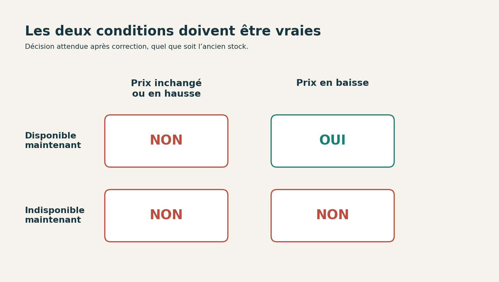

# 5. Faire le changement et lire le diff

[Sommaire de la partie](../README.md) · [Sources](.)

[Précédent : Faire apparaître le bug dans un test](../03-tests/LECTURE.md) · [Suivant : Vérifier au-delà de la dernière ligne verte](../05-verifier/LECTURE.md)

**TL;DR** — Les tests rouges fixent le comportement attendu. Nous allons laisser l’agent corriger la fonction, puis confronter son diff au ticket et à ces tests.

## Une demande de modification précise

Les tests reproduisent le problème ; la fonction est encore dans son état initial. Dans la même session, demandez maintenant :

```text
Applique le comportement décrit dans TICKET.md.
Conserve les interfaces existantes et limite la modification
au code nécessaire.
Ne change pas les réponses attendues des tests pour les faire passer.
Lance la suite avec python -m unittest discover -v.
Montre le diff et explique la condition modifiée.
Ne crée pas de commit et ne publie rien.
```
Code: Confier la correction en gardant un résultat relisible

La demande décrit le comportement sans souffler la ligne de correction. Regardez la solution proposée et les fichiers touchés. Si vous faites l’exercice à la main, essayez votre modification avant de lire la section suivante.

Cela reste une consigne au modèle. Pour limiter effectivement son accès aux fichiers, au réseau ou à la publication, utilisez aussi les permissions de votre outil. Une phrase dans un prompt n’a pas le même rôle qu’un droit technique refusant l’opération.

Si l’agent propose une classe de notification, une nouvelle dépendance ou un système de règles pour cette fonction, demandez-lui quel cas du ticket le justifie. En l’absence de réponse concrète, revenez à une modification plus petite. Le temps déjà passé à générer du code ne lui donne aucune valeur particulière.

## Relire les opérateurs

Comparez maintenant sa proposition à la fonction initiale :

```python
def notifier(ancien: Etat, nouveau: Etat) -> bool:
    return nouveau.disponible and (
        nouveau.prix_centimes < ancien.prix_centimes or not ancien.disponible
    )
```

Lisez-la à voix haute : le produit doit être disponible maintenant ; ensuite, une baisse de prix **ou** une ancienne indisponibilité suffit.

Le second terme du `or` explique notre problème. Pour un retour en stock, `not ancien.disponible` vaut vrai. Le prix peut être identique ou même plus élevé : l’expression entre parenthèses sera tout de même vraie.

Le ticket exige les deux conditions : une disponibilité actuelle **et** une baisse stricte. Notre correction de référence est :

```python
def notifier(ancien: Etat, nouveau: Etat) -> bool:
    return nouveau.disponible and (
        nouveau.prix_centimes < ancien.prix_centimes
    )
```
Code: La fonction après correction

Une expression sur une ligne peut être tout aussi correcte. Ce que nous cherchons dans la proposition, c’est la disponibilité actuelle et la baisse stricte, sans condition supplémentaire.

Résistez à la tentation d’ajouter `ancien.disponible` dans la nouvelle condition. Une vraie baisse au moment du retour en stock serait alors ignorée, contrairement à la règle décidée.


Figure: La règle complète tient dans ces quatre combinaisons

## Lire ce qui a vraiment changé

Ouvrez la comparaison des fichiers dans votre éditeur. Dans VS Code, ouvrez la version originale `01-depart/suivi.py` et copiez tout son contenu. Revenez dans `mon-suivi/suivi.py`, ouvrez la palette de commandes et lancez **File: Compare Active File with Clipboard**[^p4-diff-vscode]. Les libellés peuvent être traduits dans votre installation.

Notre correction de référence montre :

```diff
-        nouveau.prix_centimes < ancien.prix_centimes or not ancien.disponible
+        nouveau.prix_centimes < ancien.prix_centimes
```
Code: La règle retirée par notre correction

Si Git est installé, vous pouvez faire la même comparaison depuis un terminal, sans créer de dépôt :

```bash
git diff --no-index "/chemin/vers/atelier-developpement/01-depart/suivi.py" "/chemin/vers/mon-suivi/suivi.py"
```

Remplacez les deux chemins par ceux de vos fichiers. Cette commande ne suppose pas que les dossiers sont voisins. Avec `--no-index`, le code de sortie 1 signifie que les fichiers diffèrent[^p4-diff].

Cette première comparaison ne porte que sur `suivi.py`. Reprenez ensuite la liste des fichiers touchés affichée par l’assistant. Comparez chaque fichier qui existait déjà à son original dans `01-depart`, puis lisez entièrement le nouveau `test_ticket.py`.

Le test ajouté est attendu. Changer les données de `retour-stock.json`, supprimer un test ou modifier une validation sortirait en revanche du correctif demandé. Si vous trouvez l’un de ces changements, demandez sa raison puis retirez-le s’il ne sert aucun cas du ticket.

[^p4-diff-vscode]: Microsoft, [comparaison des fichiers dans VS Code](https://code.visualstudio.com/docs/editing/codebasics#_compare-files).
[^p4-diff]: Git, [comparaison avec git diff --no-index](https://git-scm.com/docs/git-diff).


---

[Précédent : Faire apparaître le bug dans un test](../03-tests/LECTURE.md) · [Suivant : Vérifier au-delà de la dernière ligne verte](../05-verifier/LECTURE.md)
