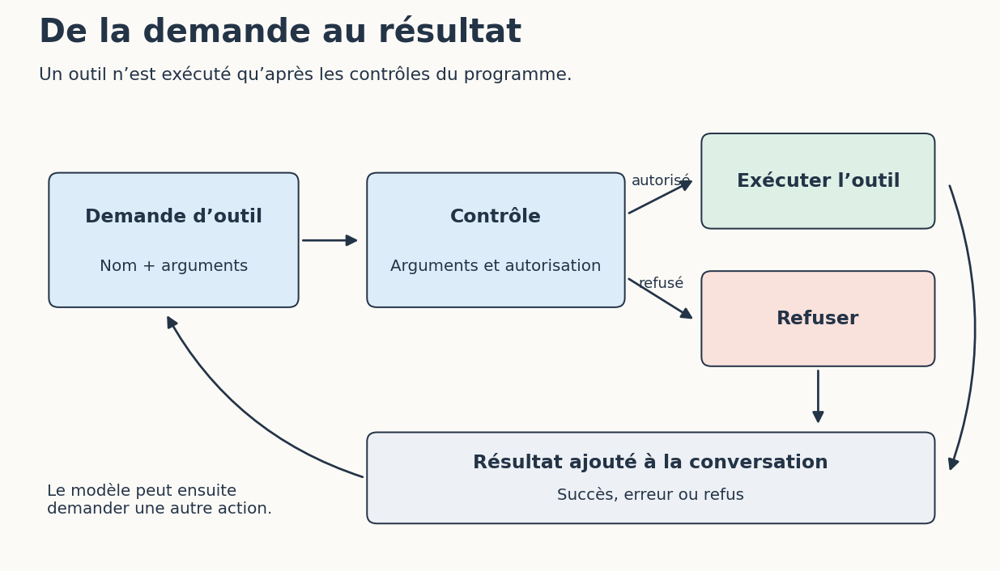

# 1. Suivre une demande jusqu’à l’outil

[Sommaire de la partie](../README.md) · [Sources](.)

[Suivant : Donner le contexte utile à l’étape en cours](../02-contexte/LECTURE.md)

**TL;DR** — Une demande d’outil, son autorisation et son résultat sont trois étapes distinctes. Nous allons les retrouver dans un journal avant de les chercher dans notre assistant.

## Ouvrir le banc d’essai

Récupérez le dossier [ateliers/05-agents du dépôt](https://github.com/hloiseau/tutoriel-ia-ateliers/tree/main/ateliers/05-agents), ou téléchargez [l’archive de cet atelier](https://github.com/hloiseau/tutoriel-ia-ateliers/raw/main/telechargements/atelier-agents.zip). Décompressez-la dans un dossier de travail. Pour la suite, votre terminal doit être ouvert dans le dossier qui contient `banc.py`.

Le dossier `projet` contient la fonction initiale de suivi de prix et son ticket. Les fichiers de `cas` décrivent les appels que nous allons rejouer. Nous ne toucherons pas à votre correction de la partie 4.

Lancez :

```bash
python banc.py lecture --journal sorties/lecture.jsonl
```

Si nécessaire, remplacez `python` par `python3` ou par la commande qui vous servait déjà. Le programme affiche :

```text
1. lire_fichier : ok
2. lire_fichier : ok
Arrêt : fin_du_script (2 appels)
Journal : sorties/lecture.jsonl
```
Code: Deux demandes de lecture réellement exécutées par le banc

Le terminal résume le parcours ; le détail se trouve dans `sorties/lecture.jsonl`. Chaque ligne est un objet JSON qui conserve la demande, son résultat et le temps passé dans la fonction Python, sous la clé `secondes_outil`. Cette durée ne mesure aucune inférence de modèle.

Pour refaire l’essai, donnez un autre nom au journal. Le programme refuse d’écraser le premier, afin que vous puissiez comparer les traces.

## Qui a fait quoi ?

Ouvrez maintenant `cas/lecture.json`. Sa première demande est :

```json
{"outil": "lire_fichier", "arguments": {"chemin": "TICKET.md"}}
```

Dans notre banc, le fichier JSON choisit l’appel. Dans une session d’agent, la demande vient généralement d’une réponse du modèle. Le logiciel reçoit le nom de l’outil et ses arguments, applique ses contrôles, puis exécute la fonction ou renvoie un refus. Le résultat rejoint ensuite la conversation et le modèle peut choisir l’étape suivante[^p5-outils].


Figure: La demande et son exécution sont deux moments différents

Dans le journal, retrouvez le contenu du ticket sous `resultat.contenu`. Voilà l’information qu’un assistant pourrait fournir au modèle au tour suivant. Une phrase comme « je vais lire le ticket » annonce seulement une intention ; le journal permet de vérifier l’appel et son résultat.

Le banc s’arrête à la fin de la liste préparée. Un agent réel peut demander une autre action selon le résultat reçu, poser une question ou terminer. Son journal expose les actions et leurs résultats, sans nous livrer pour autant tout le raisonnement interne du modèle.

[^p5-outils]: Anthropic, [fonctionnement des appels d’outils](https://platform.claude.com/docs/en/agents-and-tools/tool-use/overview). Les noms des messages dépendent de l’API ; la demande et l’exécution restent distinctes.

## Retrouver ces étapes dans l’assistant

Revenez dans votre assistant de développement et ouvrez votre copie `mon-suivi`. Dans une nouvelle session, demandez :

```text
Lis TICKET.md et suivi.py.
Indique si la condition actuelle correspond au ticket.
Appuie ton explication sur la fonction présente dans ce dossier.
Ne modifie aucun fichier et ne lance pas les tests.
```

Dépliez les actions affichées par l’outil. Quels fichiers ont été lus ? À quel moment leur contenu est-il revenu ? Selon l’application, vous verrez les arguments complets, un extrait ou une simple indication de lecture. Notez uniquement ce que l’interface vous permet de vérifier.

Une réponse sans lecture visible peut aussi venir d’un fichier déjà joint au contexte par l’éditeur. Regardez les pièces jointes et les informations de session. Si l’interface ne permet pas de trancher, écrivez-le simplement dans votre relevé au lieu de reconstituer un parcours imaginaire.

Cette petite enquête laisse une question ouverte : qu’a réellement reçu le modèle en plus de notre demande ? C’est le sujet du prochain chapitre.

Le journal nous donne trois repères : la demande d’outil, le contrôle du programme et le résultat renvoyé. Pour comprendre la réponse finale, il faut maintenant regarder l’autre matière première de l’agent : son contexte.

---

[Suivant : Donner le contexte utile à l’étape en cours](../02-contexte/LECTURE.md)
