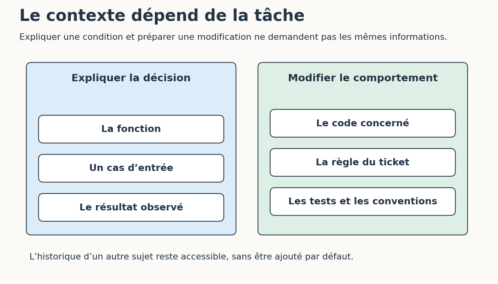

# 2. Donner le contexte utile à l’étape en cours

[Sommaire de la partie](../README.md) · [Sources](.)

[Précédent : Suivre une demande jusqu’à l’outil](../01-boucle/LECTURE.md) · [Suivant : Écrire des consignes que l’on peut contrôler](../03-consignes/LECTURE.md)

**TL;DR** — Le contexte comprend nos messages, mais aussi les extraits et les résultats que l’assistant ajoute. Nous allons comparer deux demandes identiques dont l’une est encombrée par un historique sans rapport.

## Même question, deux contextes

Dans l’atelier, ouvrez `contexte/cible.txt`, puis `contexte/complet.txt`. Les deux contiennent la même fonction, le même cas de remise en stock et la même question. Le second ajoute une série d’anciens messages fictifs sur un tableau de bord.

Ouvrez deux conversations neuves avec le même modèle. Envoyez `cible.txt` dans la première et `complet.txt` dans la seconde, puis conservez les réponses. Demandez seulement une explication : aucune modification de fichier n’est utile ici.

Dans chacune, cherchez les trois valeurs : disponibilité actuelle vraie, baisse de prix fausse, ancienne indisponibilité vraie. Le `or` rend la parenthèse vraie. La réponse doit expliquer pourquoi la fonction initiale décide de notifier malgré le prix identique.

Vous obtiendrez peut-être deux bonnes réponses. Très bien : l’exercice n’a pas été truqué pour garantir une erreur. Comparez aussi les détours, les affirmations sans rapport et, si votre outil les expose, les tokens utilisés et le délai.

Avec deux réponses, nous pouvons examiner notre propre contexte et les mesures disponibles. Il en faudrait bien davantage, sur des tâches définies à l’avance, pour comparer sérieusement des modèles.

## Que faut-il garder ?

Pour expliquer une condition, la fonction et les valeurs d’entrée suffisent souvent. Pour modifier son comportement, il faut aussi la règle attendue, les appels concernés et les tests. Ce qui est utile dépend donc de l’action demandée.

Figure: Le contexte change avec la tâche

Préparez maintenant les informations pour cette demande : « ajoute un test du retour en stock avec hausse ». Retrouvez l’objet `Etat`, la fonction appelée, la façon dont les tests sont écrits et le résultat attendu. Vous devez pouvoir expliquer la présence de chaque extrait ; les anciens échanges sur la couleur d’un bouton resteront très bien là où ils sont.

On peut alléger une recherche en demandant d’abord les noms des fichiers concernés, puis en ouvrant ceux qui nous intéressent. De même, une sortie de commande peut commencer par le nom du test en échec et sa trace, au lieu de recopier des milliers de lignes réussies. Gardez cependant le journal complet accessible si le résumé masque la cause de l’erreur.

Un contexte plus court aide seulement s’il reste complet pour la tâche. Une signature séparée de ses conventions, ou un message d’erreur privé de la commande qui l’a produit, peut faire disparaître précisément l’information dont le modèle avait besoin.

## Quand la session commence à dériver

Vous aviez rejeté une solution ; plus tard dans la session, l’agent la propose de nouveau. Ou il oublie une contrainte et revient sur un fichier déjà vérifié. On parle souvent de *drift* ou de *drifting* pour cette dérive au fil de la session. Le mot décrit ce que nous observons, sans en désigner automatiquement la cause.

La cause peut se trouver dans un contexte incomplet, une consigne contradictoire, un résumé qui a perdu une décision ou les limites du modèle. Agrandir la fenêtre de contexte ne suffit pas toujours : des travaux ont notamment observé des variations selon la position de l’information dans les longs contextes étudiés[^p5-contexte].

Si votre outil compresse l’historique, cherchez ce qu’il a conservé. Le résumé contient-il le cas « retour en stock avec baisse » ? Dit-il quel fichier a été modifié, ou seulement « correction terminée » ?

Un autre agent peut chercher les passages utiles et renvoyer un résumé plus court. Gardez le moyen de retrouver ses sources et relisez ses conclusions. Cette délégation ajoute aussi des appels au modèle, donc du délai et, selon votre accès, des tokens facturés ou du quota consommé.

Lorsque l’historique devient difficile à suivre, revenez au ticket, aux décisions prises et aux fichiers présents. Nous transformerons ces points d’appui en fiche de reprise un peu plus loin.

[^p5-contexte]: Nelson F. Liu et al., [*Lost in the Middle: How Language Models Use Long Contexts*](https://arxiv.org/abs/2307.03172), 2023. Ces expériences portent sur des modèles et des tâches donnés ; elles ne fixent pas un seuil universel de longueur à éviter.

La bonne quantité de contexte dépend de l’action : expliquer une condition, modifier une règle et reprendre une longue session demandent des pièces différentes. Pour guider l’agent dans ces pièces, il nous faut maintenant écrire une demande dont nous pourrons vérifier le résultat.

---

[Précédent : Suivre une demande jusqu’à l’outil](../01-boucle/LECTURE.md) · [Suivant : Écrire des consignes que l’on peut contrôler](../03-consignes/LECTURE.md)
