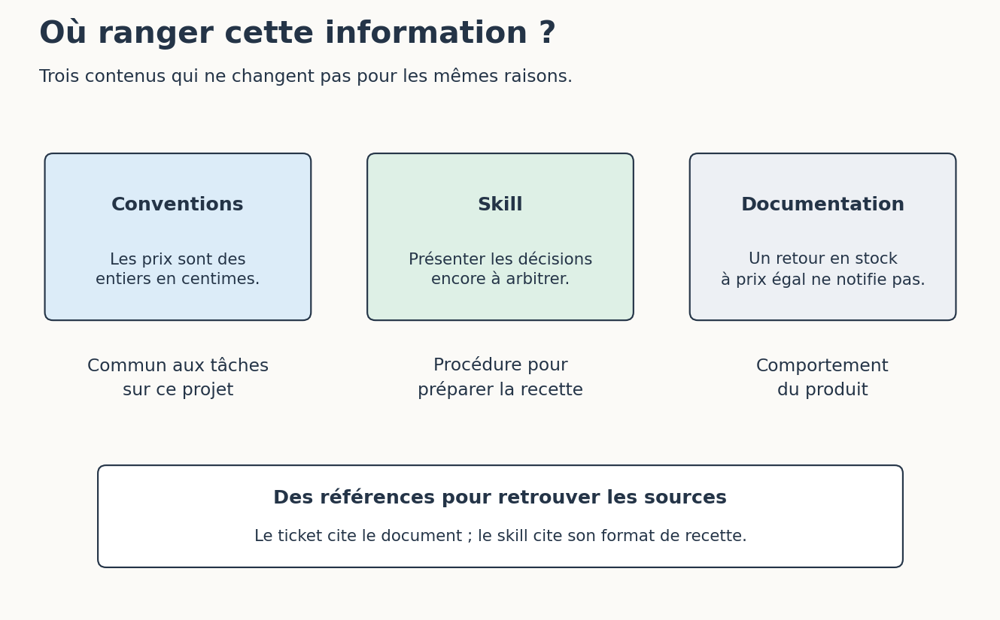

# 7. Articuler skills, conventions et base de connaissances

[Sommaire de la partie](../README.md) · [Sources](.)

[Précédent : Faire évoluer le skill à partir des problèmes rencontrés](../06-adapter/LECTURE.md)

**TL;DR** — La procédure dit comment travailler ; les conventions décrivent les règles communes du projet ; la base de connaissances fournit les faits dont on a besoin. Nous allons ranger un exemple dans chacun de ces endroits.

Au début, tout tient dans un fichier. Puis on ajoute une règle, un extrait de documentation, trois exceptions… et la prochaine personne qui cherche le montant d’un seuil ouvre cinq copies différentes. 😅

## Mettre chaque information à sa place

Prenons trois phrases de notre atelier :

| Information | Où la conserver ? | Pourquoi ? |
| --- | --- | --- |
| « Les prix sont des entiers en centimes. » | Conventions du projet | Cela sert à plusieurs tâches sur le même code |
| « Faire apparaître les résultats encore à arbitrer. » | Skill de préparation de recette | Cela décrit une étape du travail demandé |
| « Une simple remise en stock ne déclenche pas de notification. » | Ticket et documentation métier | Cela décrit le comportement du produit |

La **base de connaissances** désigne ici l’ensemble des documents qui apportent des faits sur le projet : règles métier, décisions, contrats d’API, explications d’un service. Elle peut être constituée de Markdown dans un dépôt, de pages sur un wiki ou de données accessibles par un outil. Le terme n’impose ni base vectorielle ni logiciel particulier.


Figure: Des fichiers différents parce que les informations changent pour des raisons différentes

Si la règle de notification évolue, nous corrigeons sa source métier. Si la présentation des recettes change, nous corrigeons la référence du skill. Si le projet change d’unité monétaire interne, les conventions et le code doivent être revus ensemble.

Les liens rendent cette séparation utilisable. Dans notre atelier, le ticket cite un document par son identifiant et le skill renvoie explicitement vers son format de recette. Un paragraphe déplacé dans un sous-dossier sans indication devient seulement plus difficile à retrouver.

## Faire une petite passe de refacto

Essayez ce rangement sur un brouillon, sans modifier tout de suite votre skill actif. Réunissez ces trois lignes :

```markdown
- Les prix sont exprimés en centimes.
- Si un résultat dépend d’une décision absente, présenter la question.
- Une remise en stock à prix égal ne déclenche pas de notification.
```
Code: Trois informations de nature différente réunies dans un même brouillon

Demandez à l’agent de proposer leur répartition entre les fichiers de l’atelier, avec les références nécessaires pour les retrouver. Comparez avec le tableau précédent. Vous devriez reconnaître les trois rôles, même si les noms de dossiers proposés diffèrent.

Si vous appliquez une telle refacto à vos propres fichiers, relisez aussi ce qui a été supprimé. Une information déplacée doit toujours exister à son nouvel emplacement ; une règle dupliquée doit avoir une source clairement choisie. Sinon, la prochaine correction laissera deux versions contradictoires.

Puis rejouez la préparation des deux tickets et vérifiez que les décisions attendues sont toujours là. Une référence de trois lignes peut très bien rester dans le skill si elle sert à chaque utilisation et ne change jamais indépendamment. Découper davantage ne rapporterait alors que des clics supplémentaires.

Dans mon usage, ces passes viennent après les problèmes rencontrés : une information répétée, une règle perdue, un fichier devenu trop long. Je préfère pouvoir expliquer à quoi sert la séparation que reproduire une arborescence parce qu’elle semble sérieuse.

## Choisir jusqu’où aller

Nous avons construit un serveur pour consulter des sources et un skill pour préparer une recette. Vous pouvez garder l’un sans l’autre. Une commande qui affiche le ticket peut suffire dans un petit projet ; un skill peut travailler à partir de documents déjà présents dans le dépôt.

Avant d’ajouter un MCP, regardez ce qui manque dans votre tâche actuelle. Faut-il retrouver une décision ? Consulter une valeur réelle ? Éviter de recopier un ticket à chaque session ? Chaque nouvel outil apporte aussi sa description et ses réponses dans le contexte, selon la façon dont l’assistant les charge. Ajoutez celui qui résout le problème observé.

Avant de reprendre un skill, regardez ses choix : où commence-t-il, où s’arrête-t-il, qu’est-ce qu’il suppose déjà décidé ? Une procédure qui lance automatiquement l’implémentation, la revue et la publication ne correspond pas à notre simple demande de préparation de recette.

Vous pouvez reprendre nos fichiers pour expérimenter, puis les changer. Gardez ce qui vous aide avec vos outils et vos contraintes. Une étape inutile chez vous peut disparaître, même si elle figure dans le dépôt le plus étoilé du moment.

Dans la partie suivante, notre corpus documentaire va grandir. La recherche littérale échoue déjà sur `alerte` parce que la source parle de `notification` ; nous allons construire une recherche plus utile. Nous pourrons alors voir ce que de meilleurs documents changent dans la réponse, avant de toucher aux poids d’un modèle.

Nous pouvons désormais consulter des faits, les utiliser dans une procédure et modifier cette procédure à partir d’un problème observé. Les fichiers restent assez accessibles pour qu’on puisse les contester, les simplifier et les faire évoluer.

---

[Précédent : Faire évoluer le skill à partir des problèmes rencontrés](../06-adapter/LECTURE.md)
