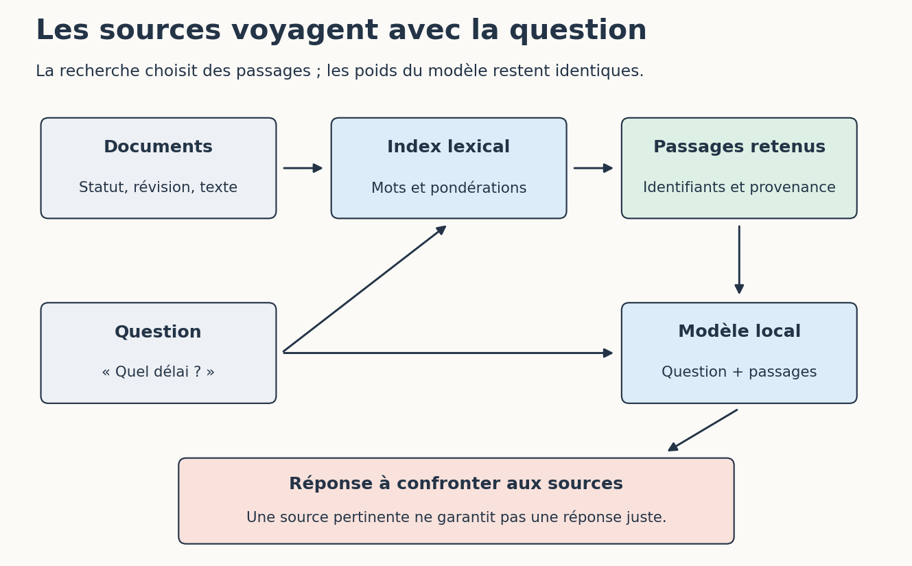

# 1. Choisir ce que l’on veut modifier

[Sommaire de la partie](../README.md) · [Sources](.)

[Suivant : Construire une recherche dans nos documents](../02-rechercher/LECTURE.md)

**TL;DR** — Une information manquante, une procédure mal suivie et un comportement à apprendre ne demandent pas forcément la même intervention.

« Je veux que l’IA connaisse mon projet » est un bon point de départ, mais pas encore une tâche assez précise. Prenons quelques demandes concrètes.

## Qu’est-ce qui manque à notre outil ?

Notre assistant doit répondre à une question sur les notifications. Trois difficultés peuvent se cacher derrière une mauvaise réponse : il n’a pas reçu la règle, il l’a mal interprétée, ou il produit un format inutilisable.

| Besoin | Premier essai raisonnable |
| --- | --- |
| Lire la règle actuelle du service | Donner le document ou le retrouver par une recherche |
| Préparer une recette selon notre façon de travailler | Préciser la procédure, comme dans le skill de la partie 6 |
| Produire régulièrement une forme particulière | Comparer une consigne et des exemples, puis envisager une adaptation si nécessaire |
| Comprendre comment un modèle apprend | Entraîner un petit réseau que l’on peut examiner |

Ces possibilités peuvent se combiner. Un modèle adapté à un format peut encore avoir besoin d’une recherche documentaire pour retrouver une règle récente.

En revanche, modifier ses poids pour chaque changement d’horaire rendrait une simple mise à jour documentaire bien compliquée. Notre première question sera donc : **où l’information devrait-elle vivre ?** Dans une source que l’on consulte, une procédure que l’on suit, ou un comportement que l’on cherche à apprendre ?

Pour les notifications, gardons la règle dans un document versionné. Nous pourrons retrouver sa provenance et la corriger sans réentraîner le modèle.

## Ouvrir les fichiers de la partie

Téléchargez [l’archive de la partie 7](https://github.com/hloiseau/tutoriel-ia-ateliers/raw/main/telechargements/atelier-ia-maison.zip), ou ouvrez `ateliers/07-ia-maison` dans le dépôt. Placez le terminal à côté de `recherche.py`.

Créez un environnement avec Python 3.12 :

```bash
python -m venv .venv
```

Activez-le comme dans les ateliers précédents : `source .venv/bin/activate` sous Bash ou Zsh, `.venv\Scripts\Activate.ps1` sous PowerShell, ou `.venv\Scripts\activate.bat` dans l’invite Windows. Si l’activation PowerShell est refusée, employez directement `.venv\Scripts\python.exe` à la place de `python`.

Installez ensuite les deux dépendances du petit réseau :

```bash
python -m pip install -r requirements.txt
```

La recherche documentaire n’en a pas besoin ; NumPy servira aux calculs du modèle. Le dossier `donnees/documents` contient nos pages fictives, et `donnees/documents.json` indique leur identifiant, leur révision et leur statut.

Ouvrez `temporisation.md`. Il n’y a aucune durée validée pour PRIX-2. Gardez ce détail en tête : nous allons poser la question au modèle plus tard.

## Une recherche n’est pas un entraînement

Nous allons sélectionner des passages, les joindre à une question et demander au modèle de répondre avec ces sources. On parle souvent de **RAG**, pour *Retrieval-Augmented Generation*, ou génération augmentée par recherche documentaire.[^p7-rag]


Figure: Retrouver des sources avant de générer une réponse

Dans notre application, cet appel ne déclenche aucun entraînement. Le contexte transmis change, les poids restent identiques. Si nous redémarrons sans joindre les documents, ils ne sont pas devenus une connaissance acquise par le modèle.

MCP pourrait exposer notre recherche comme outil, de la même manière que `chercher_documentation` dans la partie 6. Le protocole ne choisirait pas pour autant la méthode de classement des passages : cette méthode appartient au programme derrière l’outil.

Commençons avec peu de documents et une recherche que nous pouvons lire. Une base vectorielle n’est pas un passage obligé pour retrouver dix paragraphes.

[^p7-rag]: Lewis et al., [*Retrieval-Augmented Generation for Knowledge-Intensive NLP Tasks*](https://arxiv.org/abs/2005.11401). Notre application utilise une recherche lexicale simple ; elle ne reproduit pas le système entraîné dans cet article.

Nous avons choisi une première tâche : retrouver la source utile à une question. Avant de faire intervenir un modèle de langage, vérifions que cette recherche nous mène au bon endroit.

---

[Suivant : Construire une recherche dans nos documents](../02-rechercher/LECTURE.md)
