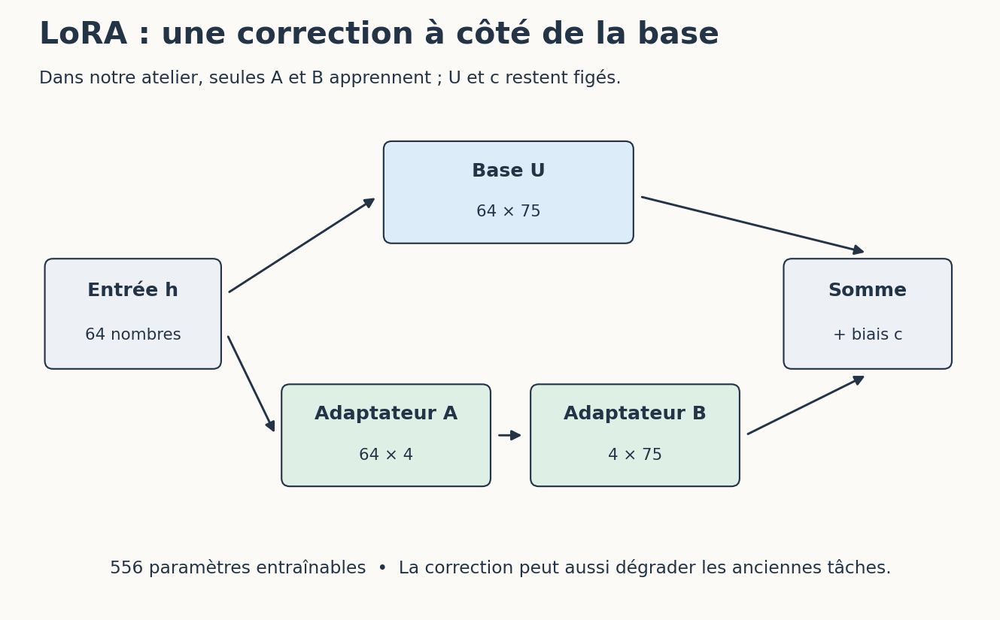
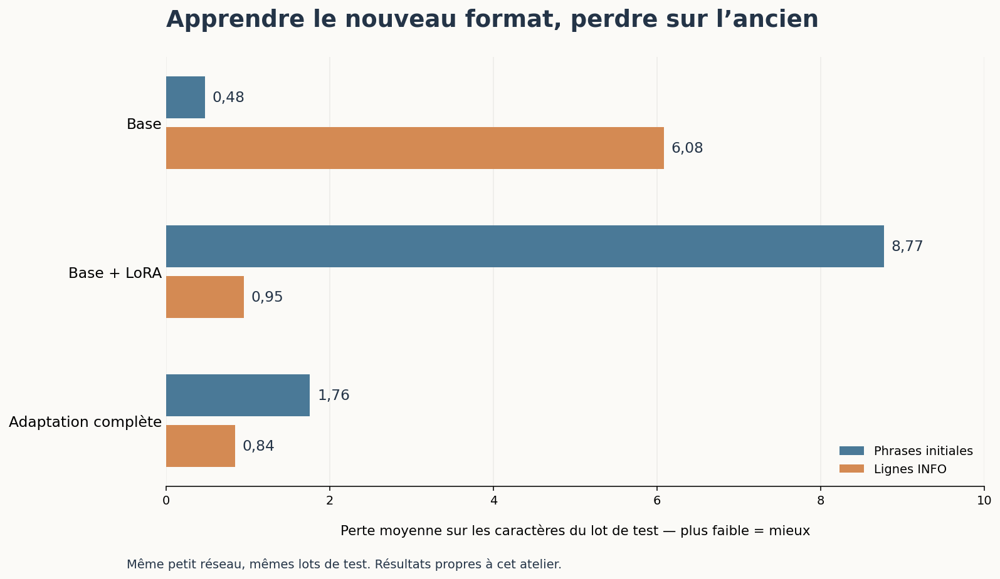

# 6. Ajouter un petit adaptateur

[Sommaire de la partie](../README.md) · [Sources](.)

[Précédent : Préparer ce que notre modèle va apprendre](../05-donnees/LECTURE.md) · [Suivant : Entraîner notre réseau depuis zéro](../07-entrainer/LECTURE.md)

**TL;DR** — LoRA ajoute des matrices entraînables à une transformation existante. Les poids de base peuvent rester figés, mais le comportement du modèle change quand même, parfois dans le mauvais sens.

Peut-on éviter de modifier tous les paramètres à chaque adaptation ? C’est précisément ce que nous allons essayer.

## Une correction ajoutée au calcul

Notre réseau transforme sa représentation interne `h` en scores pour les caractères suivants avec une matrice `U`. Pour l’adapter, nous remplaçons ce calcul par :

```python
scores = h @ (U + A @ B) + c
```

Le symbole `@` désigne un produit de matrices en Python. `U` et le biais `c` restent figés ; seules les matrices `A` et `B` apprennent. C’est le principe d’une adaptation de faible rang, ou **LoRA**.[^p7-lora]


Figure: Deux chemins se rejoignent avant le calcul des probabilités

Dans notre cas, `U` comporte 64 × 75 nombres. Avec un rang de 4, `A` contient 64 × 4 nombres et `B`, 4 × 75 : soit 556 paramètres entraînables, au lieu des 15 055 du modèle complet.

Le rang limite la forme de la correction possible. Ce n’est ni un nombre de connaissances ni un niveau d’intelligence. Notre exemple applique LoRA uniquement à la couche de sortie, avec un facteur d’échelle égal à 1 ; une adaptation de LLM peut viser d’autres couches et employer d’autres réglages.

[^p7-lora]: Hu et al., [*LoRA: Low-Rank Adaptation of Large Language Models*](https://arxiv.org/abs/2106.09685).

## Entraîner puis recharger l’adaptateur

Repartons des mêmes poids de base que pour l’adaptation complète :

```bash
python petit_modele.py entrainer --base resultats-reference/base/modele.npz --mode lora --corpus adaptation --pas 800 --rang 4 --sortie sorties/lora
```

Ouvrez `sorties/lora/rapport.json`. Le rapport indique les paramètres entraînables et les empreintes des poids de base avant et après. Elles doivent être identiques : notre entraînement a modifié `A` et `B`, pas les matrices d’origine.

Deux fichiers sont produits. `modele.npz` rassemble le modèle et son adaptateur pour faciliter les essais. `adaptateur.npz` contient seulement la correction et l’empreinte de la base attendue.

Rechargeons ce deuxième fichier avec la base :

```bash
python petit_modele.py generer --modele resultats-reference/base/modele.npz --adaptateur sorties/lora/adaptateur.npz --debut "INFO "
```

Le programme vérifie que les poids de base correspondent. Pour désactiver l’adaptateur, relancez la génération sans `--adaptateur`. Nous retrouvons alors le modèle de départ, sans devoir « désapprendre » ce que nous venons d’ajouter.

C’est pratique, mais cela ne prouve pas que l’adaptateur soit utile. Regardons ses résultats avant de lui donner un nom impressionnant.

## L’amélioration qui cache une régression

Évaluons chaque modèle sur les deux corpus :

```bash
python petit_modele.py evaluer --modele sorties/lora/modele.npz --corpus adaptation --sortie sorties/lora-test-adaptation.json
python petit_modele.py evaluer --modele sorties/lora/modele.npz --corpus base --sortie sorties/lora-test-base.json
```

Faites la même chose avec `sorties/complet/modele.npz`, puis avec `resultats-reference/base/modele.npz`, en choisissant de nouveaux noms de sortie. Sans option `--lot`, cette commande utilise le test.

La **perte** mesure ici à quel point le modèle attribue de mauvaises probabilités aux caractères attendus. Plus elle est basse, mieux il prédit les caractères de ce lot avec leurs vrais caractères précédents. Nous reviendrons sur ce dernier point.

| Modèle | Test sur les phrases initiales | Test sur les lignes `INFO` |
| --- | ---: | ---: |
| Base | 0,48 | 6,08 |
| Base avec LoRA | 8,77 | 0,95 |
| Adaptation complète | 1,76 | 0,84 |


Figure: Résultats de notre essai, arrondis ; une barre plus courte indique une perte plus faible

Notre adaptateur améliore donc la prédiction du nouveau format, mais dégrade fortement celle des anciennes phrases. Les poids de base sont restés identiques, et pourtant la sortie du modèle a changé : la correction s’ajoute à chaque passage dans la couche.

Désactiver l’adaptateur permet de retrouver la base. Cela ne supprime pas la régression lorsqu’il est activé. Selon l’usage visé, nous pourrions essayer d’autres données, d’autres réglages ou un autre compromis ; il faudrait alors refaire une évaluation indépendante.

Ces résultats concernent notre minuscule réseau et nos gabarits. Ils ne classent pas LoRA et l’adaptation complète pour tous les modèles. Ils montrent surtout pourquoi nous avons gardé les anciens exemples dans l’évaluation.

Nous savons produire un adaptateur, le recharger et mesurer une régression. Mais nous avons encore utilisé des poids de départ fournis. Il est temps de fabriquer cette base nous-mêmes.

---

[Précédent : Préparer ce que notre modèle va apprendre](../05-donnees/LECTURE.md) · [Suivant : Entraîner notre réseau depuis zéro](../07-entrainer/LECTURE.md)
