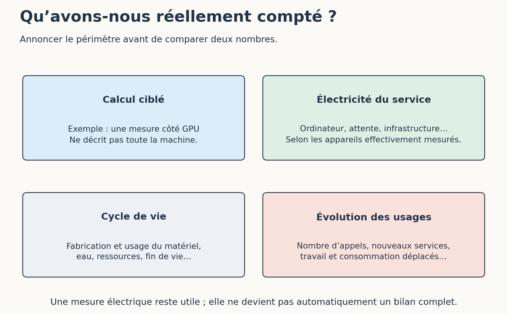

# 3. Coûts, énergie, matériel et environnement

[Sommaire de la partie](../README.md) · [Sources](.)

[Précédent : Licences, transparence et possibilités de vérification](../02-ouverture/LECTURE.md) · [Suivant : Dépendances techniques et économiques](../04-dependances/LECTURE.md)

**TL;DR** — Le prix, l’électricité et l’impact environnemental décrivent des réalités différentes. Un calcul simple, accompagné de son périmètre, nous aidera à voir ce qu’il mesure et ce qu’il laisse de côté.

Un appel gratuit peut mobiliser des machines. Un modèle local peut éviter un abonnement tout en occupant notre carte graphique. Le mot « gratuit » n’arrête pas le compteur électrique.

## Que mettons-nous dans le calcul ?

Pour notre atelier, nous pouvons compter le temps consacré à préparer la demande, à attendre, à relire et à corriger. Pour l’électricité, il faut aussi choisir ce que l’on mesure : la carte graphique seule, l’ordinateur à la prise ou l’ensemble du service ?


Figure: Des périmètres différents, à annoncer avant de comparer

Dans son avis de juillet 2026, l’ADEME demande de considérer le cycle de vie ainsi que les effets indirects, notamment les effets rebonds. La fabrication du matériel, l’eau et les infrastructures ne disparaissent pas parce que l’on a mesuré l’électricité d’une requête.[^p8-ademe]

Un effet rebond peut se comprendre avec notre service : une réponse devient moins coûteuse, nous décidons alors d’en générer pour chaque ligne du catalogue, au lieu de seulement traiter les anomalies. Le coût unitaire baisse pendant que le volume augmente. Notre bilan devra suivre les deux.

Un périmètre étroit, correctement annoncé, reste utile pour comparer deux essais. Sa légende doit simplement rester avec le résultat : la consommation de la carte pendant une tâche ne devient pas le bilan environnemental complet de l’IA.

[^p8-ademe]: ADEME, [*IA générative, comment quantifier les impacts ?*](https://www.ademe.fr/presse/communique-national/ia-generative-comment-quantifier-les-impacts/), 22 juillet 2026.

## Un calcul que nous pouvons refaire

Ouvrez un terminal dans l’atelier de cette partie. Python 3.12 suffit, sans dépendance supplémentaire. Prenons une puissance moyenne **hypothétique** de 200 W pendant 30 minutes :

```bash
python energie.py --puissance-w 200 --minutes 30
```

Le résultat vaut 100 Wh, soit 0,1 kWh. C’est le produit d’une puissance moyenne par une durée. Ces valeurs servent à expliquer le calcul ; elles n’ont pas été mesurées sur notre modèle ni sur la machine de l’auteur.

Pour remplacer l’hypothèse par une mesure, il faudrait relever une consommation sur l’intervalle de l’essai, avec un outil dont on connaît le périmètre. Une puissance maximale annoncée pour une carte ne donne pas sa puissance moyenne pendant notre tâche. Et une lecture instantanée ne décrit pas, à elle seule, toute l’exécution.

Si vous disposez déjà d’un compteur d’énergie à la prise, vous pouvez relever le début et la fin d’un essai. Notez ce qui était branché, les autres tâches actives et la durée. La différence inclut alors ce que le compteur a réellement mesuré, y compris le repos éventuel. Pour estimer un supplément par rapport au repos, il faudrait aussi établir une référence comparable, avec son incertitude.

Le script s’arrête aux Wh. Calculer des émissions de CO₂ demanderait notamment un facteur adapté à l’électricité considérée ; évaluer l’eau ou la fabrication de l’ordinateur élargirait encore le périmètre. En leur absence, gardons l’unité obtenue et la description de la mesure.

## Éviter une dépense qui ne sert pas la tâche

Dans `cas/equipe.md`, l’équipe veut repérer des prix négatifs et des identifiants manquants dans un catalogue. Les règles sont explicites. Nous pouvons les vérifier avec un programme déterministe : un LLM n’a pas besoin de réinterpréter chaque ligne.

Pour un texte libre, le choix peut être différent. Il reste utile de comparer une solution spécialisée à un modèle généraliste. L’étude *Power Hungry Processing* mesure justement des consommations d’inférence différentes selon les tâches et les architectures testées ; ses résultats ne fournissent pas un coût universel de « la requête IA ».[^p8-energie]

Avant d’acheter du matériel, essayez ce qui suffit déjà à votre besoin. Notre recherche lexicale fonctionne sans carte graphique. Notre génération documentaire sur CPU a montré ses limites. Partons de ces observations pour choisir entre calcul local, service distant ou programme ordinaire.

Nous pouvons aussi réduire le nombre d’appels, réutiliser un résultat encore valable ou arrêter une boucle qui ne progresse plus. Mais si une réponse plus courte provoque cinq nouvelles tentatives, l’économie annoncée mérite d’être recalculée.

Les tarifs peuvent changer indépendamment du matériel. Conservez donc séparément le prix payé, les ressources mesurées et ce que vous ne savez pas mesurer ; vous éviterez de transformer une promotion commerciale en progrès environnemental.

[^p8-energie]: Luccioni, Jernite et Strubell, [*Power Hungry Processing: Watts Driving the Cost of AI Deployment?*](https://arxiv.org/abs/2311.16863), étude publiée à FAccT 2024.

Le calcul affiche 100 Wh pour notre hypothèse et s’arrête là. Une autre question très concrète attend l’équipe : que devient son travail si le fournisseur, le réseau ou la machine devient indisponible ?

---

[Précédent : Licences, transparence et possibilités de vérification](../02-ouverture/LECTURE.md) · [Suivant : Dépendances techniques et économiques](../04-dependances/LECTURE.md)
