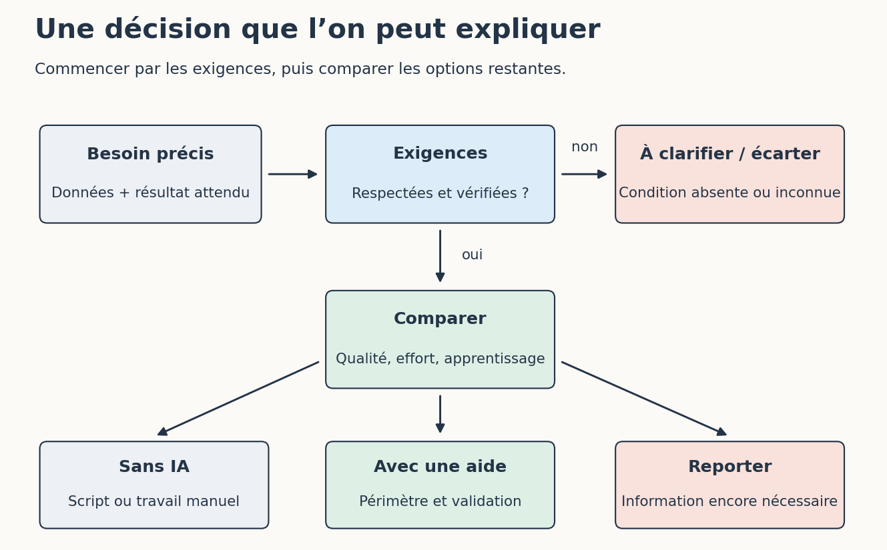

# 7. Construire ses propres critères de choix

[Sommaire de la partie](../README.md) · [Sources](.)

[Précédent : Alternatives, logiciels libres et possibilités de s’en passer](../06-alternatives/LECTURE.md)

**TL;DR** — Nous allons écrire une décision courte, avec un besoin, des limites et une façon de revenir en arrière. Aucun score global ne décidera à notre place de ce qui est acceptable.

L’équipe aimerait « mettre de l’IA ». Après tout ce que nous venons de voir, nous pouvons lui proposer une question un peu plus utile : sur quelle tâche, pour quel résultat ?

## Ce qui se discute et ce qui bloque

Reprenez `cas/equipe.md`. Les incidents contiennent des données de clients ; aucun envoi vers un prestataire externe n’a été autorisé dans ce scénario. Une excellente vitesse ne compense pas cette contrainte. Il faut changer les données, la configuration ou le périmètre de l’essai.

Figure: Une contrainte ne disparaît pas dans une moyenne

C’est pourquoi notre fiche ne donne pas de note sur cent à « l’éthique ». Une formule qui additionnerait prix, confidentialité et confort pourrait masquer une condition que l’équipe juge indispensable.

Écrivez d’abord les exigences : données autorisées, résultat vérifiable, budget de l’essai, personne capable de valider et possibilité de reprendre sans l’outil. Comparez ensuite les options qui restent. Les informations inconnues doivent apparaître comme telles, avec leur conséquence sur la décision.

Un désaccord peut porter sur une valeur, pas sur un chiffre manquant. Certaines personnes ne souhaitent pas utiliser un service pour des raisons liées au travail humain ou aux contenus employés. Il faut pouvoir en parler sans leur répondre seulement avec un benchmark de code.

## Écrire une décision que l’on peut appliquer

Ouvrez `fiches/decision.md`. Le document tient en quelques rubriques : besoin, option retenue, données, validation, limites, solution de repli et raison de réexaminer le choix.

Pour le catalogue, nous pouvons choisir les contrôles déterministes fournis dans `catalogue.py`. Lancez `python catalogue.py` : le fichier fictif contient trois lignes invalides et la commande sort avec le code 1 en indiquant les raisons. Le corrigé `corriges/catalogue.md` explique comment préparer une copie valide pour comparer. Pour la recette manuelle, nous pouvons essayer une aide à la rédaction sur les documents fictifs, en gardant une relecture et les arbitrages humains. Pour les incidents clients, nous pouvons reporter l’essai tant que le trajet des données et les droits nécessaires ne sont pas établis.

Ces trois décisions ne se contredisent pas. Elles répondent à trois besoins différents. Vous trouverez une proposition développée dans `corriges/decision.md` ; d’autres choix peuvent être défendables si leurs conditions sont explicites.

La décision doit aussi dire quand s’arrêter. Par exemple : si l’on ne sait pas vérifier le résultat, si la sortie exige plus de réparation que la procédure habituelle, ou si les données nécessaires dépassent le périmètre accepté. Ces raisons valent mieux qu’une boucle de demandes supplémentaires parce que nous avons déjà passé l’après-midi dessus.

Enfin, choisissez ce qui déclenchera une nouvelle lecture de la décision : changement de modèle, de contrat, de données ou problème observé. Nous n’avons pas besoin de suivre chaque annonce pour garder une procédure saine ; nous avons besoin de remarquer ce qui change notre usage.

## Garder la méthode que l’on peut expliquer

Au début du tutoriel, l’IA pouvait ressembler à une seule grande boîte. Nous avons ouvert plusieurs morceaux : des données, des calculs, un entraînement, un serveur, des outils, des procédures et des personnes qui vérifient le résultat.

Cela permet aussi de discuter des critiques sans les balayer. Comprendre comment fonctionne un modèle ne force pas à accepter la façon dont il a été produit ou commercialisé. À l’inverse, critiquer cette organisation n’empêche pas d’expérimenter un petit réseau chez soi, de contribuer à un logiciel libre ou d’utiliser ponctuellement une aide que l’on juge utile.

Je ne vous propose donc pas de repartir avec ma méthode comme nouvelle obligation. Votre contexte, votre équipe et ce que vous aimez faire comptent. Vous pouvez reprendre une idée, modifier un skill, garder seulement un outil de recherche ou fermer l’assistant.

Si une expérience vous sert, gardez les fichiers et la raison de ce choix. Si elle échoue, gardez aussi ce qu’elle vous a appris. Dans les deux cas, nous aurons fait un peu mieux que choisir notre organisation de travail au nombre d’étoiles sur GitHub. 🙂

Notre décision peut maintenant être expliquée, essayée et révisée. Elle porte sur un usage précis, avec les personnes qui le font vivre et celles qui en subissent les conséquences.

---

[Précédent : Alternatives, logiciels libres et possibilités de s’en passer](../06-alternatives/LECTURE.md)
