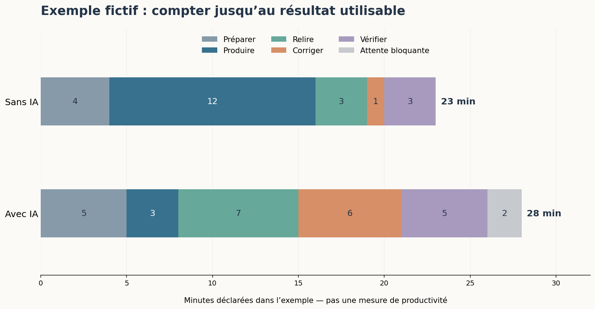

# Choisir la place de l’IA

[Sommaire de la partie](README.md) · [Sommaire global](../../SOMMAIRE.md)

**TL;DR** — Nous allons choisir où utiliser l’IA, où nous en passer et ce que nous voulons garder sous notre contrôle. Pour cela, nous regarderons les données, le travail humain, les licences, les ressources consommées et ce que nous apprenons réellement.

Notre petit modèle fonctionne. Enfin… il calcule, ce qui ne veut pas toujours dire qu’il répond correctement. 🙂 Nous savons aussi qu’un agent peut appeler des outils, préparer une recette ou modifier du code. Reste à décider ce que nous avons envie de lui confier.

J’utilise ces outils au quotidien, mais je ne pense pas que notre métier doive s’organiser autour d’eux par défaut. Si une tâche se résout bien avec un script, gardons le script. Si une aide sur les tests nous permet de mieux travailler, regardons ce qu’elle apporte. Et si nous ne voulons pas développer avec l’IA, nous pouvons aussi faire ce choix.

Nous allons reprendre notre équipe fictive de suivi de prix. Elle hésite entre automatiser une vérification de catalogue, préparer des tests et analyser des incidents clients. Trois demandes proches en apparence, mais des données, des conséquences et des solutions différentes.

Téléchargez [les fichiers de cette partie](https://github.com/hloiseau/tutoriel-ia-ateliers/raw/main/telechargements/atelier-choisir-ia.zip), ou ouvrez `ateliers/08-choisir`. Ils contiennent les cas, des fiches courtes, un exercice de lecture de code et des pistes de correction. Aucun abonnement ni modèle local n’est nécessaire pour commencer. Les documents et études cités sont consultés en septembre 2026 ; leurs dates comptent lorsqu’on compare les résultats.

## 1. D’où viennent les données et le travail humain ?

**TL;DR** — Un modèle ne sort pas seulement d’un calcul. Il dépend de contenus, de décisions et de travail humain dont les conditions ne sont pas toujours visibles dans sa fiche.

Jusqu’ici, nous avons pu ouvrir nos corpus et retrouver comment nos petits modèles avaient été entraînés. Essayons maintenant de remonter la même piste avec un modèle que nous n’avons pas fabriqué.

### Remonter avant le téléchargement

Prenez la fiche du modèle utilisé dans la partie 3, SmolLM2-360M-Instruct. Nous y trouvons des informations sur la famille de modèles, des données et des évaluations. Cela nous donne un point de départ, pas le nom de chaque personne ayant contribué à chaque texte.[^p8-carte]

Il faut distinguer les auteurs des contenus, les personnes qui préparent les données et celles qui conçoivent le modèle. Une documentation de bibliothèque a été écrite pour aider ses utilisateurs. Son passage éventuel dans un corpus ajoute un usage, sans effacer ce premier travail.


Figure: Plusieurs contributions humaines derrière une réponse affichée

Ouvrez `fiches/provenance.md`. Pour notre corpus fictif de la partie 7, nous pouvons indiquer qu’il a été préparé pour le tutoriel, qu’il décrit un service inventé et qu’il est distribué avec sa licence. Pour un corpus externe, nous devons pouvoir retrouver d’où vient l’information que nous écrivons dans cette fiche.

Une source peut être décrite sans être téléchargeable ; un jeu peut être téléchargeable sans que chaque étape de sa préparation soit documentée. Garder ces différences aide à poser une question précise au lieu d’écrire simplement « transparent » dans une case.

[^p8-carte]: Hugging Face, [fiche de SmolLM2-360M-Instruct](https://huggingface.co/HuggingFaceTB/SmolLM2-360M-Instruct), consultée en septembre 2026.

### Les personnes que le mot « automatisation » cache

Dans notre petit atelier, les étiquettes existaient déjà ou étaient faciles à produire. À une autre échelle, des personnes peuvent transcrire, classer, comparer des réponses, vérifier des exemples ou modérer des contenus. Ce travail mérite d’être regardé autrement que comme une ligne « données » dans un budget.

Oskarina Veronica Fuentes Anaya raconte son expérience sur des plateformes de travail de données dans *Life of a Latin American Data Worker*. Elle décrit notamment des tâches qui arrivent de façon irrégulière et du temps passé à attendre sans être payé. C’est son témoignage et celui du milieu qu’elle décrit ; il ne permet pas d’attribuer les mêmes conditions à tous les modèles.[^p8-travail]

Cette distinction compte. Nous pouvons prendre ces récits au sérieux sans inventer la chaîne de sous-traitance d’un fournisseur qui ne la publie pas. Dans notre fiche, une information inconnue reste inconnue. Elle peut néanmoins peser dans notre choix : rien ne nous oblige à considérer son absence comme rassurante.

Les auteurs des textes et du code méritent également une place dans cette discussion. Selon moi, la disponibilité technique d’un contenu ne devrait pas suffire à écarter la question de son usage, de l’accord de ses créateurs et du partage de la valeur produite. Une réponse juridique et une position éthique ne répondent pas forcément à la même question.

Pour un projet auquel nous contribuons, cela devient très concret : qui annote, avec quelles consignes, quel paiement et quelle possibilité de signaler une erreur ou de refuser un contenu difficile ? Si nous commandons ce travail, la rapidité de livraison n’est pas notre seul critère.

[^p8-travail]: Oskarina Veronica Fuentes Anaya, [*Life of a Latin American Data Worker*](https://data-workers.org/oskarina/), 2024, Data Workers’ Inquiry. Présentation et témoignage de l’autrice, avec une animation sous-titrée.

### Ce que nous choisissons de garder

Ouvrez `cas/documents.md`. L’équipe dispose de trois éléments : une règle publique du service, une conversation de support contenant des coordonnées fictives et une ancienne recette dont la décision a changé.

Pour expliquer la règle de notification, le premier document suffit. Ajouter les coordonnées du client ne l’explique pas mieux. Quant à l’ancienne recette, elle pourrait contredire la règle actuelle. Avant de demander quel modèle choisir, nous pouvons déjà améliorer ce que nous lui donnons.

Réduire les données aide aussi à limiter leur exposition. Pour des données personnelles réelles, leur collecte et leur réutilisation demandent une analyse adaptée au but poursuivi ; leur présence sur le Web ne dispense pas de ces questions. Les fiches de la CNIL détaillent notamment la sélection des données pertinentes et leur suivi.[^p8-cnil]

Faites une copie de travail des documents et conservez seulement ce qui sert à répondre à la question. Comparez ensuite avec `corriges/documents.md`. Retirer un nom ne suffit pas toujours à anonymiser un texte : une combinaison de détails peut encore désigner quelqu’un. Ici, toutes les personnes sont fictives, ce qui nous permet d’examiner le problème sans exposer de véritables clients.

La sélection peut également déformer ce que le modèle voit. Si nos exemples ne couvrent que des tickets bien rédigés en anglais, un bon résultat sur ceux-ci ne dit pas ce qui se passera avec des demandes courtes en français. Essayons les usages que nous voulons réellement prendre en charge.

[^p8-cnil]: CNIL, [tenir compte de la protection des données dans la collecte et la gestion des données](https://www.cnil.fr/fr/tenir-compte-de-la-protection-des-donnees-dans-la-collecte-et-la-gestion-des-donnees). Ces recommandations portent sur les données personnelles ; elles ne règlent pas à elles seules les questions de droit d’auteur.

Nous avons commencé par les contenus et les personnes, avant les paramètres du modèle. Passons maintenant aux fichiers que l’on peut obtenir et aux droits qui les accompagnent.

## 2. Licences, transparence et possibilités de vérification

**TL;DR** — Télécharger des poids, lire du code et pouvoir réutiliser un système sont trois choses à examiner séparément. Le mot « open » ne remplit pas notre fiche à notre place.

« C’est ouvert, donc on peut tout faire avec. » Voilà une phrase qui mérite qu’on ouvre au moins le fichier de licence.

### De quoi parle la licence ?

Dans notre dépôt, le code, les textes et certains éléments tiers ont des licences distinctes. Un système d’IA peut lui aussi réunir plusieurs objets : moteur d’inférence, interface, paramètres, jeux de données et documentation.

| Élément | Question concrète |
| --- | --- |
| Interface ou agent | Peut-on étudier et modifier ce programme ? |
| Poids du modèle | Peut-on les obtenir, les utiliser et distribuer une adaptation ? |
| Code d’entraînement | Les étapes et réglages nécessaires sont-ils disponibles ? |
| Données | Leur provenance et leurs conditions de réutilisation sont-elles décrites ? |
| Service hébergé | Quelles conditions s’appliquent à nos entrées, sorties et journaux ? |

Une licence permissive annoncée pour le moteur ne s’étend pas automatiquement au modèle que l’on charge. Inversement, utiliser une interface propriétaire n’efface pas la licence du modèle situé derrière.

Pour SmolLM2-360M-Instruct, la fiche annonce Apache 2.0.[^p8-carte-licence] Nous pouvons le noter avec son lien et la date de consultation. Cela ne constitue pas, à lui seul, un audit de tous les contenus ayant servi à l’entraînement. Pour redistribuer une combinaison précise de fichiers, il faut lire les textes qui leur sont effectivement applicables, avec leurs notices et conditions.[^p8-apache]

Le but de notre exercice est de retrouver ces éléments. Un badge sur une page d’accueil est un début de piste ; ce n’est pas encore le dossier de notre application.

[^p8-apache]: Apache Software Foundation, [texte de la licence Apache 2.0](https://www.apache.org/licenses/LICENSE-2.0), notamment les conditions de redistribution. La portée dépend des éléments effectivement placés sous cette licence.

[^p8-carte-licence]: Hugging Face, [fiche de SmolLM2-360M-Instruct](https://huggingface.co/HuggingFaceTB/SmolLM2-360M-Instruct), licence annoncée à la consultation de septembre 2026.

### Ce que l’ouverture rend possible

La définition *Open Source AI* 1.0 de l’Open Source Initiative associe les libertés d’utiliser, d’étudier, de modifier et de partager à plusieurs éléments accessibles : paramètres, code et informations détaillées sur les données d’entraînement. Elle ne demande pas que toutes les données soient distribuées sans exception ; elle précise les informations attendues pour comprendre et reconstruire un système substantiellement équivalent.[^p8-osi]

C’est un cadre explicite, que nous pouvons examiner, plutôt qu’une impression donnée par un nom. Il ne faut pas pour autant confondre ce cadre avec une garantie de bonnes conditions de travail, de faible consommation ou de réponses justes.

L’ouverture peut nous donner des prises utiles. Si nous pouvons exécuter le modèle ailleurs, inspecter les étapes et modifier le programme, nous avons davantage de moyens d’expérimenter et de continuer sans le service d’origine. Encore faut-il disposer du matériel, du temps et des compétences nécessaires.

Une liberté que l’on peut exercer collectivement reste intéressante même si l’on ne veut pas tout refaire seul. Une équipe, une association ou un hébergeur peut porter une partie de ce travail. L’alternative à un grand fournisseur n’est pas forcément de devenir, à soi seul, administrateur système tous les week-ends. 🙂

[^p8-osi]: Open Source Initiative, [*The Open Source AI Definition — 1.0*](https://opensource.org/ai/open-source-ai-definition).

### Examiner un modèle que nous avons déjà utilisé

Reprenez SmolLM2 dans `fiches/provenance.md`. Nous avons déjà une raison d’être précis : le modèle utilisé dans les parties 3 et 7 est le 360M *Instruct*, avec un fichier GGUF déterminé, pas n’importe quel membre de sa famille.

Notez la référence, la licence annoncée, la langue indiquée, les liens vers les informations de préparation et ce que vous avez effectivement testé. Dans la dernière colonne, séparez trois formulations : « indiqué par l’auteur », « vérifié dans notre essai » et « pas établi avec les éléments consultés ».

Par exemple, l’étiquette de langue anglaise provient de la fiche. La durée de temporisation inventée vient de notre journal d’exécution. Ni l’une ni l’autre ne prouve que toutes les réponses en français seront fausses. Elles nous donnent en revanche une raison concrète de ne pas valider cet usage sur la foi du nom du modèle.

Une piste de correction est disponible dans `corriges/provenance.md`. Elle contient peu de cases remplies, volontairement : mieux vaut trois informations retrouvables qu’un tableau très convaincant où l’on a deviné le reste.

Vous pouvez refaire le même travail avec un autre modèle. Gardez sa révision lorsqu’elle est disponible. Si vous changez de fichier ou de service, relisez les conditions correspondantes au lieu de transporter automatiquement la conclusion précédente.

Nous pouvons maintenant dire plus précisément ce qui est ouvert et ce qui reste à établir. Regardons une autre information souvent résumée trop vite : le coût de l’outil.

## 3. Coûts, énergie, matériel et environnement

**TL;DR** — Le prix, l’électricité et l’impact environnemental ne mesurent pas la même chose. Nous allons faire un calcul simple en annonçant son périmètre, puis regarder ce qu’il laisse de côté.

Un appel gratuit peut mobiliser des machines. Un modèle local peut éviter un abonnement tout en occupant notre carte graphique. Le mot « gratuit » n’arrête pas le compteur électrique.

### Que mettons-nous dans le calcul ?

Pour notre atelier, nous pouvons compter le temps consacré à préparer la demande, à attendre, à relire et à corriger. Pour l’électricité, il faut aussi choisir ce que l’on mesure : la carte graphique seule, l’ordinateur à la prise ou l’ensemble du service ?


Figure: Des périmètres différents, à annoncer avant de comparer

Dans son avis de juillet 2026, l’ADEME demande de considérer le cycle de vie ainsi que les effets indirects, notamment les effets rebonds. La fabrication du matériel, l’eau et les infrastructures ne disparaissent pas parce que l’on a mesuré l’électricité d’une requête.[^p8-ademe]

Un effet rebond peut se comprendre avec notre service : une réponse devient moins coûteuse, nous décidons alors d’en générer pour chaque ligne du catalogue, au lieu de seulement traiter les anomalies. Le coût unitaire baisse, mais le volume change. Il faut regarder les deux avant de conclure que nous avons réduit l’impact.

Cela ne veut pas dire que tout calcul est inutile. Un périmètre étroit, correctement annoncé, peut aider à comparer deux essais. Il faut simplement éviter de le présenter comme le bilan complet de l’IA.

[^p8-ademe]: ADEME, [*IA générative, comment quantifier les impacts ?*](https://www.ademe.fr/presse/communique-national/ia-generative-comment-quantifier-les-impacts/), 22 juillet 2026.

### Un calcul que nous pouvons refaire

Ouvrez un terminal dans l’atelier de cette partie. Python 3.12 suffit, sans dépendance supplémentaire. Prenons une puissance moyenne **hypothétique** de 200 W pendant 30 minutes :

```bash
python energie.py --puissance-w 200 --minutes 30
```

Le résultat vaut 100 Wh, soit 0,1 kWh. C’est le produit d’une puissance moyenne par une durée. Ces valeurs servent à expliquer le calcul ; elles n’ont pas été mesurées sur notre modèle ni sur la machine de l’auteur.

Pour remplacer l’hypothèse par une mesure, il faudrait relever une consommation sur l’intervalle de l’essai, avec un outil dont on connaît le périmètre. Une puissance maximale annoncée pour une carte ne donne pas sa puissance moyenne pendant notre tâche. Et une lecture instantanée ne décrit pas, à elle seule, toute l’exécution.

Si vous disposez déjà d’un compteur d’énergie à la prise, vous pouvez relever le début et la fin d’un essai. Notez ce qui était branché, les autres tâches actives et la durée. La différence inclut alors ce que le compteur a réellement mesuré, y compris le repos éventuel. Pour estimer un supplément par rapport au repos, il faudrait aussi établir une référence comparable, avec son incertitude.

Le script ne calcule ni eau ni émissions de CO₂. Transformer une énergie en émissions nécessite notamment un facteur adapté à l’électricité considérée. Cela ne reconstitue toujours pas la fabrication de l’ordinateur. Sans ces informations, gardons des Wh et une description honnête de la mesure.

### Éviter une dépense qui ne sert pas la tâche

Dans `cas/equipe.md`, l’équipe veut repérer des prix négatifs et des identifiants manquants dans un catalogue. Les règles sont explicites. Nous pouvons les vérifier avec un programme déterministe : un LLM n’a pas besoin de réinterpréter chaque ligne.

Pour un texte libre, le choix peut être différent. Il reste utile de comparer une solution spécialisée à un modèle généraliste. L’étude *Power Hungry Processing* mesure justement des consommations d’inférence différentes selon les tâches et les architectures testées ; ses résultats ne fournissent pas un coût universel de « la requête IA ».[^p8-energie]

Avant d’acheter du matériel, essayez ce qui suffit déjà à votre besoin. Notre recherche lexicale fonctionne sans carte graphique. Notre génération documentaire sur CPU a montré ses limites. Ces deux observations sont plus utiles qu’une règle qui recommanderait toujours le local ou toujours le service distant.

Nous pouvons aussi réduire le nombre d’appels, réutiliser un résultat encore valable ou arrêter une boucle qui ne progresse plus. Mais si une réponse plus courte provoque cinq nouvelles tentatives, l’économie annoncée mérite d’être recalculée.

Une facture moins élevée ne démontre pas une empreinte plus faible : les tarifs peuvent changer indépendamment du matériel. Conservez donc séparément le prix payé, les ressources mesurées et ce que vous ne savez pas mesurer.

[^p8-energie]: Luccioni, Jernite et Strubell, [*Power Hungry Processing: Watts Driving the Cost of AI Deployment?*](https://arxiv.org/abs/2311.16863), étude publiée à FAccT 2024.

Nous savons faire un calcul limité sans lui faire dire plus que ce qu’il mesure. Passons à ce qui arriverait si notre fournisseur, notre réseau ou notre machine devenait indisponible.

## 4. Dépendances techniques et économiques

**TL;DR** — Nous allons suivre le trajet d’une demande et préparer une sortie possible. Héberger un morceau chez soi ne rend pas automatiquement toute l’application locale.

Imaginez que le service utilisé par l’équipe double son tarif, change un modèle ou soit indisponible ce matin. Qu’est-ce qui continue à fonctionner ?

### Suivre les données jusqu’au bout

Dans la partie 6, notre serveur MCP lisait des documents sur notre ordinateur. Cela ne décidait pas où tournait le modèle qui recevait ensuite les résultats. Nous retrouvons la même question avec une interface installée localement : ses fichiers sont chez nous, mais ses requêtes peuvent partir ailleurs.

Ouvrez `fiches/flux.md` et remplissez une ligne par trajet : de l’éditeur au modèle, de l’agent au serveur MCP, du serveur aux tickets, puis vers les éventuels journaux. Pour chaque trajet, notez ce qui passe, où cela arrive et ce qui vous permet de l’affirmer.

| Élément de notre atelier | Information que nous pouvons établir |
| --- | --- |
| Client documentaire de la partie 7 | Son code envoie la requête à `127.0.0.1:8080` |
| Réponse reçue | Le journal conserve le contexte transmis et la sortie |
| Assistant installé pour la partie 4 | Le trajet dépend du produit, de sa configuration et du fournisseur sélectionné |
| Politique d’un service externe | Elle doit être vérifiée pour ce service et l’offre utilisée |

« Non utilisé pour l’entraînement » ne signifie pas forcément « jamais conservé ». La rétention des journaux, l’accès de tiers et la localisation du traitement sont des questions distinctes. Il faut lire les engagements applicables plutôt que déduire toutes les réponses d’une seule option.

Pour notre exercice, restez sur les documents fictifs fournis. Une fois la carte des trajets dessinée, vous pourrez décider quelles données de votre propre projet seraient acceptables dans cette configuration.

### Préparer le jour où l’on change d’outil

Un historique lisible, une procédure dans le dépôt et des tests exécutables nous servent même si nous changeons d’assistant. C’est moins évident pour un réglage qui n’existe que dans un compte ou un format exporté que rien d’autre ne sait relire.

Faisons un essai de sortie sans désinstaller quoi que ce soit. Copiez dans un dossier séparé le ticket fictif, les règles, les tests et le format attendu. Avec ces seuls fichiers, pouvez-vous comprendre ce qu’il reste à faire ? Si la réponse dépend d’une phrase introuvable dans une ancienne conversation, ramenez cette décision dans le dossier.

Changer d’API ne suffit pas toujours : deux modèles acceptant des messages de même forme peuvent répondre différemment, employer les outils autrement ou supporter d’autres longueurs de contexte. Nos cas de PRIX-1 et PRIX-2 permettent justement de vérifier le comportement après un changement.

Le fichier `fiches/sortie.md` distingue ce que l’on possède, ce que l’on peut exporter et ce qu’il faudra reconstruire. Il demande aussi quelle procédure permet de travailler pendant une panne. Une bonne réponse peut être très simple : reprendre les tests et la recette manuellement.

Nous n’avons pas besoin d’une migration parfaite en cinq minutes. Nous avons besoin de savoir où se trouve la dépendance et ce que son remplacement coûterait en travail.

### Ne pas tout faire reposer sur un abonnement individuel

Le choix d’un outil dans une équipe touche aussi les personnes qui ne l’utilisent pas. Qui relit le code supplémentaire ? Qui dépanne la machine locale ? Qui peut accéder à la documentation ? Que fait un collègue qui ne souhaite pas ouvrir un compte chez ce fournisseur ?

Pour moi, imposer un framework d’IA à toute l’organisation parce qu’il est populaire est une mauvaise façon de commencer. Nous devrions d’abord identifier le problème, puis discuter de la place que l’outil prendra et du travail qu’il déplace.

L’auto-hébergement peut rendre une partie de cette dépendance plus maîtrisable. Il ajoute aussi de l’administration, des mises à jour et une responsabilité sur la disponibilité. Un service géré peut retirer certaines de ces tâches, en échange d’autres dépendances. Comparons les deux organisations concrètes, plutôt que deux étiquettes.

Dans notre équipe fictive, les tests restent exécutables sans agent et les procédures restent lisibles sans abonnement. L’aide de l’IA peut s’ajouter à ce fonctionnement ; elle ne devient pas la seule façon de savoir comment fonctionne le service.

Enfin, la dépendance peut être collective : une équipe entière risque de perdre l’habitude d’enquêter si chaque incident est confié au même assistant. C’est le bon moment pour parler de l’apprentissage du métier.

Nous avons une carte des trajets et une possibilité de continuer sans l’outil. Voyons maintenant ce que nous voulons être capables de faire nous-mêmes.

## 5. Apprendre et exercer notre métier

**TL;DR** — Terminer un exercice et apprendre à le refaire sont deux objectifs différents. Nous allons lire une fonction, prévoir ses résultats et la modifier sans assistant avant de comparer une aide éventuelle.

Le test est vert. Très bien. Maintenant, fermez la conversation : pourquoi ce test est-il vert ?

### La relecture demande quelque chose à relire avec

Si je ne connais pas la règle métier, les types manipulés ou la manière dont les tests s’exécutent, « je vais relire le code généré » reste une intention assez fragile. Le modèle peut produire un programme convaincant, et je peux manquer précisément l’erreur qu’il faudrait voir.

C’est pourquoi je ne conseillerais pas à quelqu’un qui découvre la programmation de reprendre directement ma manière de déléguer le développement à un agent. Certaines tâches sont justement des occasions d’apprendre à chercher, à réduire un problème et à comprendre une erreur. Les faire disparaître trop tôt peut nous laisser sans repères pour la suite.

Une expérience publiée par des chercheurs d’Anthropic en janvier 2026 a réparti 52 développeurs, majoritairement juniors, entre des tâches avec ou sans assistance pour découvrir une bibliothèque Python. Le groupe assisté a moins bien réussi l’évaluation immédiate de compréhension ; la différence de vitesse n’était pas statistiquement significative. Ce résultat concerne une petite expérience et une évaluation à court terme, pas toute une carrière.[^p8-apprendre]

Nous pouvons en tirer une question pratique, sans en faire une interdiction générale : **qu’est-ce que je veux apprendre pendant cette tâche ?** Si l’objectif est de comprendre une boucle, générer toute la boucle peut court-circuiter le travail intéressant. Demander une explication sur une erreur après l’avoir examinée laisse une autre place à l’effort.

[^p8-apprendre]: Shen et Tamkin, [*How AI assistance impacts the formation of coding skills*](https://www.anthropic.com/research/AI-assistance-coding-skills), 29 janvier 2026. Étude menée par un fournisseur d’IA ; ses analyses des différentes manières d’interagir avec l’outil sont exploratoires et ne prouvent pas à elles seules un lien causal.

### Fermer l’assistant et ouvrir six lignes

Ouvrez `cas/lecture_code.py`, sans le lancer tout de suite. La fonction décide si un produit doit déclencher une notification. Les prix sont des entiers en centimes ; les entrées sont supposées déjà validées.

```python
def doit_notifier(ancien_prix, nouveau_prix, disponible):
    if not disponible:
        return False
    return nouveau_prix <= ancien_prix
```
Code: Une fonction volontairement incorrecte

La règle demandée est celle de notre service : notifier uniquement si le nouveau prix baisse strictement et que le produit est disponible. Prévoyez le résultat pour un prix qui baisse, un prix inchangé, un prix qui monte et un produit indisponible. Écrivez aussi le résultat attendu par la règle.

Vous pouvez ensuite lancer :

```bash
python cas/lecture_code.py
```

Le programme affiche les cas, le résultat obtenu et le résultat attendu, puis sort avec le code 1 : le cas du prix égal révèle le bug prévu dans l’exercice. Corrigez la fonction et relancez. Le corrigé est dans `corriges/lecture_code.py`, accompagné d’une explication dans `corriges/lecture_code.md`.

Le lendemain, ou simplement après une autre tâche, essayez une petite variante sans rouvrir la réponse : ne notifier que si la baisse atteint au moins 100 centimes, toujours avec un produit disponible. Que se passe-t-il pour une baisse de 99, de 100 et de 101 centimes ? La correction de cette variante est fournie elle aussi.

Ce n’est pas un examen à envoyer à quelqu’un. L’intérêt est de constater ce que nous savons encore expliquer et modifier après avoir fermé l’outil.

### Garder de la place pour apprendre au travail

L’IA peut aider à reformuler une erreur, à proposer des cas de test ou à donner un exemple plus petit. Nous pouvons demander un indice avant la solution, puis vérifier l’explication dans la documentation et par une exécution. Une explication agréable à lire reste une réponse à examiner.

Une équipe peut aussi garder des moments où l’on enquête à deux, où l’on présente pourquoi une correction fonctionne et où les débutants écrivent des changements qu’ils peuvent expliquer. Sinon, demander à un junior de « vérifier ce que l’agent a fait » lui confie une responsabilité sans forcément lui donner les moyens de l’exercer.

Cela ne concerne pas seulement les juniors. Après plusieurs semaines à déléguer un domaine, nous pouvons nous demander si nous saurions encore diagnostiquer sa panne. L’exercice précédent est volontairement petit ; dans un vrai projet, la reprise peut porter sur un test qui échoue ou un incident réduit.

Quant à l’avenir du métier, une tâche exposée à l’automatisation n’est pas un emploi dont la disparition est démontrée. Les travaux de l’OIT sur l’exposition aux IA génératives examinent des tâches et des métiers ; ils ne permettent pas de prédire le destin de chaque développeur.[^p8-oit]

Les décisions d’organisation restent donc centrales : qui reçoit du temps pour apprendre, qui relit, qui arbitre, et que fait-on du temps éventuellement gagné ? Nous pouvons discuter de ces choix maintenant, sans attendre qu’une prédiction sur « la fin des développeurs » se réalise ou se trompe.

[^p8-oit]: OIT, [*Generative AI and Jobs: A Refined Global Index of Occupational Exposure*](https://www.ilo.org/publications/generative-ai-and-jobs-refined-global-index-occupational-exposure), 2025.

Nous avons un moyen de regarder ce que nous apprenons, en plus de ce que nous produisons. Comparons maintenant plusieurs façons de faire le travail demandé.

## 6. Alternatives, logiciels libres et possibilités de s’en passer

**TL;DR** — Nous allons comparer des solutions à une tâche précise. Le temps de préparation, de relecture et de correction fait partie du résultat, tout comme la possibilité de travailler sans IA.

Pour repérer un prix négatif, Python sait déjà comparer deux nombres. Il n’a pas besoin qu’on lui explique gentiment de faire attention.

### Repartir de la difficulté réelle

Ouvrez les trois demandes de `cas/equipe.md`. Pour chacune, essayez d’abord de formuler ce qui est pénible ou fragile aujourd’hui.

| Difficulté | Une première possibilité |
| --- | --- |
| Vérifier les mêmes contraintes sur chaque ligne | Script, contraintes de données ou tests automatisés |
| Retrouver une règle dans quelques pages | Recherche classique ou documentation mieux rangée |
| Oublier des scénarios lors d’une recette | Gabarit, revue par un collègue ou proposition de scénarios par une IA |
| Comprendre un bug inhabituel | Débogueur, documentation, réduction du cas, discussion ou aide ciblée de l’IA |

Le choix peut combiner ces outils. Un modèle peut proposer des scénarios, puis un humain les vérifier et un programme exécuter les assertions. Nous n’avons pas besoin de lui confier également le droit de décider que le résultat est bon.

Pour gagner en autonomie, nous pouvons privilégier des formats exportables, des logiciels libres et des modèles dont les conditions permettent l’usage envisagé. Cela ne dispense pas de regarder les données et le travail humain, mais donne davantage de moyens d’agir sur l’outil.

Vous pouvez aussi garder l’IA hors de votre développement. Si les tests manuels sont la partie qui vous épuise, commencez éventuellement par une aide sur leur préparation. Si cette aide ne vous convient pas, un gabarit amélioré peut rester le meilleur résultat de l’expérience.

### Compter jusqu’au résultat utilisable

Choisissez une petite tâche dont vous saurez vérifier le résultat, par exemple préparer les scénarios d’un ticket bien déterminé. Avant de commencer, définissez ce que vous attendez : les cas importants, les résultats attendus et les décisions qui doivent rester ouvertes.

Dans `fiches/comparaison.md`, préparez deux essais : l’un sans IA, avec documentation et outils habituels ; l’autre avec l’aide que vous souhaitez examiner. Évitez de faire deux fois exactement le même problème en appelant cela une comparaison équitable : le deuxième essai profite du premier. Deux tâches proches, un ordre alterné sur plusieurs essais et des critères identiques réduisent certains biais, sans transformer notre carnet personnel en étude scientifique.

Notez le temps actif consacré à préparer, produire, relire, corriger et vérifier, sans compter deux fois le même intervalle. Ajoutez séparément l’attente qui vous a réellement bloqué. Si le modèle travaille pendant que vous faites autre chose, ce temps n’est pas une attente bloquante ; vous pouvez le noter dans le commentaire.

Pour voir la forme du bilan avant de remplir le vôtre :

```bash
python bilan.py exemples/temps-fictifs.json
```

Les nombres du fichier sont **inventés pour montrer le calcul**. L’essai assisté produit plus vite, mais prend davantage de relecture et de correction : son occupation totale atteint 28 minutes, contre 23 pour l’autre. Ce n’est pas un résultat sur un outil réel.


Figure: Durées inventées pour illustrer le calcul, sans comparaison d’outils réels

Copiez ensuite `exemples/temps-a-remplir.json`, remplacez ses valeurs manquantes par vos observations et lancez le même script sur votre copie. Il refuse de traiter une durée inconnue comme zéro. Il affiche aussi le statut du résultat : un travail abandonné ou encore incorrect ne devient pas « meilleur » parce qu’il s’est arrêté plus tôt.

Vous pouvez ouvrir `corriges/comparaison.md` pour examiner les pièges du bilan fictif et la façon de décrire un essai resté incomplet.

### Quand les études ne racontent pas toutes la même chose

Une expérience METR menée en 2025 sur 16 développeurs expérimentés travaillant dans leurs dépôts a mesuré un ralentissement avec les outils alors disponibles. Les participants avaient pourtant l’impression d’être accélérés. Il faut garder le contexte : développeurs, tâches, dépôts et outils précis.[^p8-metr25]

En février 2026, METR explique que son expérience suivante rencontre des biais de sélection et des difficultés de mesure, notamment avec des usages parallèles. L’organisme considère ces nouvelles données insuffisantes pour donner une estimation fiable de l’effet courant. On ne peut donc pas transporter le résultat de 2025 jusqu’à aujourd’hui comme une constante, ni annoncer son contraire avec la même assurance.[^p8-metr26]

C’est une bonne raison de conserver nos traces. « J’ai eu l’impression d’aller plus vite » et « le résultat vérifié m’a demandé moins de travail » sont deux observations possibles, qui peuvent diverger.

Le confort compte aussi. Une aide peut réduire une tâche pénible sans réduire son temps total. Nous pouvons décider que cela nous convient, à condition de le dire ainsi. De la même manière, produire davantage de lignes n’est pas forcément produire un meilleur logiciel.

Enfin, notre essai doit inclure les personnes qui récupèrent le travail. Si nous économisons vingt minutes en passant une heure de correction à un collègue, nous avons surtout changé l’endroit où le coût apparaît.

[^p8-metr25]: Becker et al., [*Measuring the Impact of Early-2025 AI on Experienced Open-Source Developer Productivity*](https://arxiv.org/abs/2507.09089), 2025.
[^p8-metr26]: METR, [*We are Changing our Developer Productivity Experiment Design*](https://metr.org/blog/2026-02-24-uplift-update/), 24 février 2026.

Le bilan ne choisit pas à notre place. Il rend simplement visibles des éléments que la vitesse d’apparition du code pouvait cacher. Nous pouvons maintenant formuler une décision pour l’équipe.

## 7. Construire ses propres critères de choix

**TL;DR** — Nous allons écrire une décision courte, avec un besoin, des limites et une façon de revenir en arrière. Aucun score global ne décidera à notre place de ce qui est acceptable.

L’équipe aimerait « mettre de l’IA ». Après tout ce que nous venons de voir, nous pouvons lui proposer une question un peu plus utile : sur quelle tâche, pour quel résultat ?

### Ce qui se discute et ce qui bloque

Reprenez `cas/equipe.md`. Les incidents contiennent des données de clients ; aucun envoi vers un prestataire externe n’a été autorisé dans ce scénario. Une excellente vitesse ne compense pas cette contrainte. Il faut changer les données, la configuration ou le périmètre de l’essai.


Figure: Une contrainte ne disparaît pas dans une moyenne

C’est pourquoi notre fiche ne donne pas de note sur cent à « l’éthique ». Une formule qui additionnerait prix, confidentialité et confort pourrait masquer une condition que l’équipe juge indispensable.

Écrivez d’abord les exigences : données autorisées, résultat vérifiable, budget de l’essai, personne capable de valider et possibilité de reprendre sans l’outil. Comparez ensuite les options qui restent. Les informations inconnues doivent apparaître comme telles, avec leur conséquence sur la décision.

Un désaccord peut porter sur une valeur, pas sur un chiffre manquant. Certaines personnes ne souhaitent pas utiliser un service pour des raisons liées au travail humain ou aux contenus employés. Il faut pouvoir en parler sans leur répondre seulement avec un benchmark de code.

### Écrire une décision que l’on peut appliquer

Ouvrez `fiches/decision.md`. Le document tient en quelques rubriques : besoin, option retenue, données, validation, limites, solution de repli et raison de réexaminer le choix.

Pour le catalogue, nous pouvons choisir les contrôles déterministes fournis dans `catalogue.py`. Lancez `python catalogue.py` : le fichier fictif contient trois lignes invalides et la commande sort avec le code 1 en indiquant les raisons. Le corrigé `corriges/catalogue.md` explique comment préparer une copie valide pour comparer. Pour la recette manuelle, nous pouvons essayer une aide à la rédaction sur les documents fictifs, en gardant une relecture et les arbitrages humains. Pour les incidents clients, nous pouvons reporter l’essai tant que le trajet des données et les droits nécessaires ne sont pas établis.

Ces trois décisions ne se contredisent pas. Elles répondent à trois besoins différents. Vous trouverez une proposition développée dans `corriges/decision.md` ; d’autres choix peuvent être défendables si leurs conditions sont explicites.

La décision doit aussi dire quand s’arrêter. Par exemple : si l’on ne sait pas vérifier le résultat, si la sortie exige plus de réparation que la procédure habituelle, ou si les données nécessaires dépassent le périmètre accepté. Ces raisons valent mieux qu’une boucle de demandes supplémentaires parce que nous avons déjà passé l’après-midi dessus.

Enfin, choisissez ce qui déclenchera une nouvelle lecture de la décision : changement de modèle, de contrat, de données ou problème observé. Nous n’avons pas besoin de suivre chaque annonce pour garder une procédure saine ; nous avons besoin de remarquer ce qui change notre usage.

### Garder la méthode que l’on peut expliquer

Au début du tutoriel, l’IA pouvait ressembler à une seule grande boîte. Nous avons ouvert plusieurs morceaux : des données, des calculs, un entraînement, un serveur, des outils, des procédures et des personnes qui vérifient le résultat.

Cela permet aussi de discuter des critiques sans les balayer. Comprendre comment fonctionne un modèle ne force pas à accepter la façon dont il a été produit ou commercialisé. À l’inverse, critiquer cette organisation n’empêche pas d’expérimenter un petit réseau chez soi, de contribuer à un logiciel libre ou d’utiliser ponctuellement une aide que l’on juge utile.

Je ne vous propose donc pas de repartir avec ma méthode comme nouvelle obligation. Votre contexte, votre équipe et ce que vous aimez faire comptent. Vous pouvez reprendre une idée, modifier un skill, garder seulement un outil de recherche ou fermer l’assistant.

Si une expérience vous sert, gardez les fichiers et la raison de ce choix. Si elle échoue, gardez aussi ce qu’elle vous a appris. Dans les deux cas, nous aurons fait un peu mieux que choisir notre organisation de travail au nombre d’étoiles sur GitHub. 🙂

Notre décision peut maintenant être expliquée, essayée et révisée. Elle porte sur un usage précis, avec les personnes qui le font vivre et celles qui en subissent les conséquences.

## Conclusion

Nous avons appris à faire fonctionner ces outils, mais aussi à regarder ce qu’ils demandent : du travail humain, des données, des ressources et du temps pour vérifier ce qu’ils produisent.

Selon moi, leur intérêt est justement de pouvoir les adapter à nos besoins. Nous n’avons pas à réorganiser notre métier autour d’un agent simplement parce qu’il sait générer beaucoup de code. Un outil qui nous oblige à renoncer à comprendre ce que nous livrons ne nous rend pas le service attendu.

Vous pouvez continuer à développer sans IA. Vous pouvez aussi lui demander de vous aider sur une tâche précise, comme préparer des tests que vous trouvez répétitifs, tout en gardant la main sur les scénarios et les résultats. Ce choix n’a pas besoin de s’étendre à tout votre travail.

Regardez ce qui vous pose problème aujourd’hui. Essayez quelque chose d’assez petit pour en comprendre le résultat. Puis gardez, adaptez ou abandonnez l’outil en fonction de ce qu’il vous apporte réellement.
