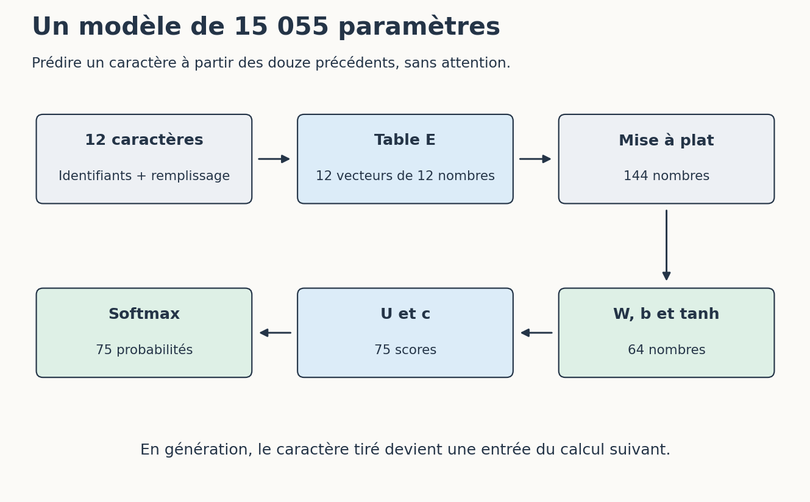

# Construire et adapter son IA maison

[Sommaire de la partie](README.md) · [Sommaire global](../../SOMMAIRE.md)

**TL;DR** — Nous allons retrouver des documents pour répondre à des questions, construire une petite application locale, puis adapter et entraîner un modèle de caractères. À chaque étape, nous garderons aussi les ratés : ce sont eux qui montrent où intervenir.

Dans l’atelier MCP et skills de la partie 6, nous avons donné des outils et une procédure à notre agent. Ses poids sont restés intacts. Si nous voulons maintenant fabriquer quelque chose qui corresponde davantage à nos besoins, encore faut-il préciser ce que nous voulons changer : « faire son IA » recouvre des travaux très différents.

Cette partie est un approfondissement de programmation. Elle reprend les fichiers du service de suivi de prix, les bases de Python et, pour les appels documentaires, le serveur de modèle local. Si vous suivez le parcours de tâches de travail, vous pouvez rejoindre directement la partie 9. Le dossier de la journée d’ateliers suffit pour y réfléchir aux choix d’usage.

Nous commencerons par aider un modèle à retrouver les informations de notre service de prix. Puis nous modifierons réellement les paramètres d’un réseau minuscule, dont le code et les poids sont fournis. Il tient sur CPU et s’entraîne assez vite pour que nous puissions recommencer, comparer et lire les sorties sans y passer la nuit.

La recherche et l’entraînement de ce petit modèle ne demandent ni service payant ni carte graphique. Pour la génération documentaire, nous réutiliserons le serveur local de la partie 3. L’adaptation d’un LLM plus grand sur RTX 3090 Ti reste une expérience à mener séparément ; aucun résultat GPU n’est supposé dans cette partie.

Nous garderons des résultats observables : les passages trouvés, les réponses réellement produites, les poids modifiés et les erreurs conservées. C’est nettement plus utile qu’un nom de modèle qui finit par « expert ». 🙂

## 1. Choisir ce que l’on veut modifier

**TL;DR** — Une information manquante, une procédure mal suivie et un comportement à apprendre ne demandent pas forcément la même intervention.

« Je veux que l’IA connaisse mon projet » donne une direction. Pour savoir quoi construire, il nous faut maintenant un problème observable. Prenons quelques demandes concrètes.

### Qu’est-ce qui manque à notre outil ?

Notre assistant doit répondre à une question sur les notifications. S’il échoue, nous pouvons déjà chercher à quel moment les choses se gâtent : la règle manque dans son contexte, il la lit de travers, ou sa réponse arrive dans un format inutilisable.

| Besoin | Premier essai raisonnable |
| --- | --- |
| Lire la règle actuelle du service | Donner le document ou le retrouver par une recherche |
| Préparer une recette selon notre façon de travailler | Préciser la procédure, comme dans le skill de la partie 6 |
| Produire régulièrement une forme particulière | Comparer une consigne et des exemples, puis envisager une adaptation si nécessaire |
| Comprendre comment un modèle apprend | Entraîner un petit réseau que l’on peut examiner |

Ces interventions peuvent se combiner. Un modèle habitué à produire un format précis peut encore avoir besoin d’une recherche documentaire pour retrouver la dernière règle en vigueur.

Modifier ses poids à chaque changement d’horaire transformerait une simple mise à jour documentaire en chantier d’entraînement. Demandons-nous d’abord : **où l’information devrait-elle vivre ?** Dans une source que l’on consulte, une procédure que l’on suit, ou un comportement que l’on cherche à apprendre ?

Pour les notifications, gardons la règle dans un document versionné. Nous pourrons retrouver sa provenance et la corriger sans réentraîner le modèle.

### Ouvrir les fichiers de la partie

Téléchargez [l’archive de la partie 8](https://github.com/hloiseau/tutoriel-ia-ateliers/raw/main/telechargements/atelier-ia-maison.zip), ou ouvrez `ateliers/07-ia-maison` dans le dépôt. Placez le terminal à côté de `recherche.py`.

Créez un environnement avec Python 3.12 :

```bash
python -m venv .venv
```

Activez-le comme dans les ateliers précédents : `source .venv/bin/activate` sous Bash ou Zsh, `.venv\Scripts\Activate.ps1` sous PowerShell, ou `.venv\Scripts\activate.bat` dans l’invite Windows. Si l’activation PowerShell est refusée, employez directement `.venv\Scripts\python.exe` à la place de `python`.

Installez ensuite les deux dépendances du petit réseau :

```bash
python -m pip install -r requirements.txt
```

La recherche documentaire n’en a pas besoin ; NumPy servira aux calculs du modèle. Le dossier `donnees/documents` contient nos pages fictives, et `donnees/documents.json` indique leur identifiant, leur révision et leur statut.

Ouvrez `temporisation.md`. Il n’y a aucune durée validée pour PRIX-2. Gardez ce détail en tête : nous allons poser la question au modèle plus tard.

### Une recherche n’est pas un entraînement

Nous allons sélectionner des passages, les joindre à une question et demander au modèle de répondre avec ces sources. On parle souvent de **RAG**, pour *Retrieval-Augmented Generation*, ou génération augmentée par recherche documentaire.[^p7-rag]


Figure: Retrouver des sources avant de générer une réponse

Dans notre application, cet appel ne déclenche aucun entraînement. Nous changeons le contexte transmis à chaque question, tandis que les poids restent identiques. Redémarrez sans joindre les documents : le modèle ne saura pas soudain retrouver la règle de notification.

Un serveur MCP pourrait exposer cette recherche comme outil, à la manière de `chercher_documentation` dans la partie 6. Le programme placé derrière l’outil garderait la responsabilité de découper et classer les passages.

Avec dix paragraphes, nous pouvons commencer par une recherche que nous savons lire de bout en bout. Nous verrons son premier échec avant d’envisager une base vectorielle.

[^p7-rag]: Lewis et al., [*Retrieval-Augmented Generation for Knowledge-Intensive NLP Tasks*](https://arxiv.org/abs/2005.11401). Notre application utilise une recherche lexicale simple ; elle ne reproduit pas le système entraîné dans cet article.

Nous avons choisi une première tâche : retrouver la source utile à une question. Avant de faire intervenir un modèle de langage, vérifions que cette recherche nous mène au bon endroit.

## 2. Construire une recherche dans nos documents

**TL;DR** — Nous allons découper les textes, comparer leurs mots à ceux de la question et conserver les références des passages sélectionnés.

Notre règle de notification occupe deux phrases au milieu d’un document. Envoyer toute la page au modèle ajouterait surtout du bruit ; essayons de ramener le passage qui répond à la question.

### Garder des morceaux que l’on peut retrouver

Ouvrez `recherche.py` et regardez `charger`. La fonction lit le catalogue des documents, exclut ceux qui sont archivés, puis sépare les textes en paragraphes. Nos pages sont petites et leurs paragraphes portent chacun une idée ; cette découpe suffit pour commencer.

Chaque passage conserve un identifiant comme `notification#2`, son texte, son fichier, son statut, sa révision et l’empreinte du document. Le `#2` désigne le deuxième paragraphe dans cette version. Si nous insérons un nouveau paragraphe, les numéros peuvent changer : c’est pour cela que le journal conserve aussi le texte et la version consultés.

Un morceau trop court pourrait perdre sa condition. Séparer « une remise en stock » de « à prix égal » ferait disparaître précisément ce qui nous intéresse. Un morceau trop long ramènerait des règles sans rapport avec la question. La découpe se juge donc en lisant les passages obtenus.

Le statut est traité **avant** le classement : l’ancienne règle de notification ne doit pas gagner simplement parce qu’elle répète les mots de la question. Nous conservons en revanche le document « à arbitrer », car dire qu’une décision manque est une information utile.

### Des mots à un score de recherche

Commençons par une recherche rudimentaire. Créez `ma_recherche.py` à côté de `recherche.py` et écrivez :

```python
from recherche import charger, mots

question = "remise en stock à prix égal"
attendus = set(mots(question))
for passage in charger():
    communs = attendus & set(mots(passage["texte"]))
    if communs:
        print(len(communs), passage["id"], sorted(communs))
```

Lancez `python ma_recherche.py`. La fonction `mots` du module fourni normalise la casse et les accents, puis écarte quelques mots fréquents comme « le » et « des ». Vous voyez les mots communs qui ont fait remonter chaque passage.

Ce premier résultat donne le même poids à tous les mots communs. Or, un terme présent dans presque tous les documents nous aide peu à choisir. Le classement livré dans `Index` utilise **TF-IDF** : la fréquence dans le passage est pondérée par la rareté du mot dans le corpus. Les vecteurs sont ensuite normalisés et comparés par leur produit scalaire, ce qui revient ici à une similarité cosinus.[^p7-tfidf]

Lancez cette version :

```bash
python recherche.py "Une remise en stock à prix égal envoie-t-elle une notification ?" --sortie sorties/recherche.json
```

Le deuxième paragraphe de `notification` doit apparaître en tête. Ouvrez le journal et lisez son texte. Le score nous a aidés à le classer ; il ne dit rien sur la vérité d’une future réponse. De même, le seuil de `0.12` sert uniquement à cet exercice : ce nombre n’est pas une probabilité minimale de vérité.

[^p7-tfidf]: Manning, Raghavan et Schütze, [pondération TF-IDF](https://nlp.stanford.edu/IR-book/html/htmledition/tf-idf-weighting-1.html). Notre code utilise une variante lissée de l’IDF.

### Quand les mots ne sont pas les mêmes

Essayez :

```bash
python recherche.py "À quelle heure purge-t-on les fixtures ?" --sortie sorties/recherche-synonymes.json
```

Notre moteur ne trouve rien. Pourtant, `staging.md` explique quand les données de démonstration sont réinitialisées. La question emploie simplement un autre vocabulaire.

Le document existe ; notre recherche vient simplement de le manquer. Nous pouvons ajouter des synonymes adaptés au domaine, reformuler la question ou utiliser des embeddings appris pour rapprocher certaines formulations. Cette dernière méthode devra elle aussi être évaluée sur les passages retrouvés : deux textes proches par le sens peuvent rester hors sujet pour notre question précise.

Pour le constater sans ajouter un modèle, remplacez la question par « Quand les données de staging sont-elles réinitialisées ? », avec un nouveau nom de sortie. Le passage attendu remonte alors.

Notre index est reconstruit en mémoire à chaque lancement. Avec un corpus plus grand, nous pourrions le conserver entre deux exécutions ; il faudrait alors prévoir sa mise à jour et la suppression des documents retirés. Pour l’instant, cette version simple nous laisse voir exactement ce qui remonte et ce qui lui échappe.

La règle de staging remonte avec une formulation et disparaît avec « purge des fixtures ». Gardons les deux questions : si nous changeons le classement, elles nous diront tout de suite ce que nous avons gagné — et peut-être perdu.

## 3. Évaluer les sources avant les réponses

**TL;DR** — Nous allons séparer trois questions : le passage utile a-t-il été retrouvé, la réponse est-elle juste, et ses citations la soutiennent-elles ?

Une seule note de « qualité de l’IA » cacherait l’endroit où l’application échoue. Nous allons donc tester séparément la recherche, la réponse et l’usage des citations.

### Garder des questions de côté

Le fichier `questions-validation.json` rassemble des questions dont nous connaissons les sources attendues. Il sert à examiner nos choix de recherche. Lancez :

```bash
python evaluer_recherche.py --lot validation --sortie sorties/recherche-validation.json
```

Le rapport indique quels identifiants ont été retrouvés. Il compte la présence d’au moins une source pertinente parmi les trois passages retenus. Il ne mesure ni la précision de chaque passage ni la qualité d’une réponse générée.

Une fois vos choix fixés, lancez le lot de test :

```bash
python evaluer_recherche.py --lot test --sortie sorties/recherche-test.json
```

Dans notre exécution, une source pertinente est présente pour trois des quatre questions de test qui en ont une. La question sur la « purge des fixtures » est manquée. La question hors corpus ne retourne aucun passage.

Avec cinq exemples, nous cherchons des erreurs concrètes plutôt qu’un score général. Si nous ajoutons des synonymes spécialement pour corriger la question ratée, elle devient un exemple de développement. Pour évaluer la modification, il nous faudra alors de nouvelles questions qu’elle n’aura pas déjà rencontrées — autrement, nous lui soufflerions le sujet de l’examen. 😅

### Dire ce que l’on n’a pas trouvé

Il y a deux cas à distinguer dans nos documents. Pour l’horaire de staging, la réponse existe mais peut être mal retrouvée. Pour la temporisation de PRIX-2, le document est trouvé et dit précisément que la durée reste à décider.

Dans le premier cas, notre application peut seulement dire « aucun passage retrouvé » : le document est bien là, hors de portée de cette formulation. Dans le second, le passage remonte et la réponse attendue est une décision ouverte. Ajouter un nombre pour remplir la phrase contredirait la source.

Un seuil de recherche ne tranche pas cette différence. Un score élevé peut rapprocher une question d’un paragraphe qui décrit le problème sans donner la solution. C’est ce qui rend utile le champ `reponse_attendue` du jeu de questions : un humain peut comparer le sens de la réponse aux sources.

Gardez également les questions auxquelles le système devrait s’abstenir. Un jeu rempli uniquement de réponses présentes dans le corpus passerait sous silence son comportement lorsque les documents sont insuffisants.

### Une citation peut être vraie et mal utilisée

Une réponse pourrait écrire « la durée est de dix minutes [temporisation#2] ». L’identifiant existe, tandis que le passage dit qu’aucun délai chiffré n’est validé. La référence mène donc tout droit à la preuve que la phrase est fausse.

Notre petit contrôle automatique sait repérer un identifiant qui ne fait pas partie des passages transmis. Il ne sait pas décider si chaque phrase est soutenue par le texte cité. Pour relire une réponse, ouvrez donc la source et comparez l’affirmation exacte, notamment les nombres, les négations et les conditions.

| Observation | Ce qu’elle permet de dire |
| --- | --- |
| Le passage attendu est sélectionné | La recherche a fourni une source utile |
| L’identifiant cité appartient à la sélection | La référence n’a pas été inventée hors de cette sélection |
| La phrase correspond au contenu de la source | Cette affirmation est soutenue par ce passage |
| La source est ancienne ou incomplète | Il reste à vérifier qu’elle s’applique à la question |

Les deux premiers contrôles s’automatisent facilement. Pour les suivants, il faut encore confronter chaque affirmation au passage cité. Notre modèle local va justement nous fournir un cas très parlant.

Nous savons maintenant dire si l’échec vient de la recherche avant d’accuser le modèle de langage. Relions les deux, tout en conservant dans le journal les passages que le modèle a réellement reçus.

## 4. Assembler notre assistant documentaire

**TL;DR** — Nous allons relier la recherche au serveur local, puis comparer les réponses avec les passages transmis. Le modèle peut se tromper même lorsque la bonne source est sous ses yeux.

Nous savons quels passages ont été sélectionnés. Il reste à voir exactement ce que le modèle recevra, puis à comparer sa réponse aux sources placées sous ses yeux.

### Regarder ce que le modèle va recevoir

Commençons sans lancer le serveur :

```bash
python assistant_local.py "Quel délai de temporisation est validé ?" --sortie sorties/contexte-delai.json
```

Ouvrez le fichier produit. `passages` contient les résultats de recherche avec leur provenance. `messages` contient ce qui serait envoyé au modèle : une consigne, puis les passages et la question.

La consigne demande de répondre avec les sources, de citer leurs identifiants et de signaler une décision encore ouverte. Elle précise aussi que les documents sont des données à lire, pas des ordres à exécuter. Vous retrouvez le problème rencontré avec la documentation piégée de la partie 6.

À ce stade, aucun appel réseau n’a eu lieu. Vous pouvez lire tranquillement le contexte avant de lancer le serveur. Si la recherche ne ramène aucun passage, le programme s’arrête là au lieu de demander au modèle de combler le vide.

Ce comportement correspond à notre besoin : nous interrogeons les règles du service. Une application chargée de répondre à des questions générales pourrait faire un autre choix, à condition de l’annoncer clairement au lecteur de la réponse.

### Relier les deux morceaux

Créez `mon_assistant.py` à côté de `assistant_local.py`. Nous réutilisons les fonctions de recherche et d’appel HTTP pour nous concentrer sur l’enchaînement :

```python
import argparse
from assistant_local import preparer, appeler

parser = argparse.ArgumentParser()
parser.add_argument("question")
parser.add_argument("--generer", action="store_true")
args = parser.parse_args()

contexte = preparer(args.question)
if not contexte["passages"]:
    print("Aucun passage retrouvé. Essayez une autre formulation.")
else:
    for passage in contexte["passages"]:
        print(passage["id"], "—", passage["texte"])

    if args.generer:
        reponse = appeler(contexte["messages"])
        print("\nRéponse à relire :")
        print(reponse["texte"])
```
Code: Notre première application documentaire

Essayez d’abord sans génération :

```bash
python mon_assistant.py "Quand les données de staging sont-elles réinitialisées ?"
```

Vous devez voir les sources sélectionnées. Relancez ensuite le [serveur de la partie 3](https://github.com/hloiseau/tutoriel-ia-ateliers/blob/main/tutoriel/03-modele-local/02-installer/LECTURE.md), depuis le dossier de cet ancien atelier, avec le modèle SmolLM2-360M-Instruct Q8_0, l’alias `atelier-local` et le port `8080`. Gardez ce serveur ouvert dans un autre terminal, revenez dans le dossier de la partie 8, puis ajoutez `--generer` à la commande.

Dans `assistant_local.py`, ouvrez maintenant `appeler`. L’application envoie les messages à `http://127.0.0.1:8080/v1/chat/completions` et extrait le texte de la réponse. Le modèle reste servi par `llama-server` ; notre programme ne charge pas lui-même ses poids.

Notre premier fichier laisse apparaître une erreur Python si le serveur est absent. C’est un bon prochain problème à traiter : la version fournie intercepte ce cas et conserve un journal, y compris lorsque l’appel échoue.

```bash
python assistant_local.py "Quand les données de staging sont-elles réinitialisées ?" --appeler --sortie sorties/reponse-staging.json
```

Le journal contient le contexte, la requête et la réponse brute. Utilisez un autre nom de sortie pour chaque essai : le programme refuse d’écraser un fichier existant.

### Le bon document, la mauvaise réponse

Voici deux réponses réellement obtenues avec le modèle de la partie 3, sur CPU. Les journaux complets sont dans `resultats-reference/reponse-staging.json` et `reponse-delai.json`.

À propos de staging :

> Les documents de staging sont réinitialisées chaque mardi à 06 h 00 UTC. Cet horaire concerne uniquement le service fictif de cet atelier.

L’horaire correspond au document. La phrase est maladroite et ne cite aucun identifiant, malgré la consigne. Mais pour la temporisation, nous obtenons ceci :

> Délai de temporisation validé : 10 minutes.

Aïe. Ouvrez `reponse-delai.json` : `temporisation#2` figure bien dans les passages et dit qu’aucune durée chiffrée n’est validée. La recherche a fait son travail ; les dix minutes viennent du modèle. Une troisième question sur la baisse de prix produit également une réponse confuse, qui ne restitue pas correctement les conditions.

Notre application transmet bien les sources, mais ce modèle ne les exploite pas de manière fiable dans cet essai. Sa fiche indique l’anglais comme langue ; notre utilisation en français ne lui facilite pas la tâche.[^p7-smollm] Cela n’explique pas à lui seul chaque erreur. Pour comparer un autre modèle, nous rejouerions les mêmes questions et relirions à nouveau les passages envoyés.

Évitons de corriger la règle de temporisation pour donner raison au modèle. 🙂 Conservons plutôt cet échec dans nos essais, puis comparons une autre formulation ou un modèle plus adapté. Grâce au journal, nous pourrons vérifier si le changement touche la recherche, le contexte ou la génération.

Pour une question très structurée comme un horaire, nous pourrions aussi afficher directement le passage retrouvé. Le modèle ajouterait ici une étape et une occasion de déformer une réponse déjà lisible.

[^p7-smollm]: Hugging Face, [fiche de SmolLM2-360M-Instruct](https://huggingface.co/HuggingFaceTB/SmolLM2-360M-Instruct).

Notre programme retrouve des sources et interroge un modèle, mais ses réponses restent trop fragiles pour décider à la place de l’équipe. Nous allons maintenant changer complètement d’échelle et de modèle afin d’observer ce qui se passe lorsque l’on modifie les poids eux-mêmes.

## 5. Préparer ce que notre modèle va apprendre

**TL;DR** — Nous quittons SmolLM2 pour un réseau de caractères assez petit pour être entraîné sur CPU. Avant de toucher à ses poids, nous séparons les données d’entraînement, de validation et de test.

Les réponses précédentes venaient du modèle local de la partie 3. Pour observer un entraînement sans carte graphique, nous passons maintenant à un autre réseau, beaucoup plus petit : son code tient dans un fichier et nous pourrons recommencer les essais autant que nécessaire.

### Un terrain de jeu que nous maîtrisons

Ouvrez `donnees/langage/base-train.txt`, puis `adaptation-train.txt`. Le premier contient des phrases de notre service fictif. Le second exprime des situations sous forme de lignes de journal :

```text
INFO produit=... prix=... stock=oui decision=...
```
Code: Forme du deuxième corpus ; les points de suspension représentent ici les valeurs

Ces textes ont été fabriqués à partir de quelques gabarits. Les journaux montrent une forme d’écriture ; aucun service n’a réellement exécuté les décisions qu’ils racontent. Nous pourrons mesurer si le modèle apprend cette forme, pas lui attribuer la maîtrise de toutes les règles métier.

Les caractères sont volontairement simples et sans accents. Le vocabulaire fixé dans le code contient 75 caractères, dont un caractère de remplissage. Nous ne sommes plus en train d’adapter SmolLM2 : `petit_modele.py` décrit un autre réseau, créé pour cet atelier.

Ces exemples nous appartiennent et leur licence est fournie. Avec des données réelles, le travail commencerait déjà ici : a-t-on le droit de les utiliser ? Contiennent-elles des données personnelles, des secrets ou des réponses erronées ? Ajouter des milliers de lignes ne réparera pas un corpus incohérent.

### Séparer les exemples avant de les découper

Lancez l’audit :

```bash
python auditer_donnees.py
```

Pour chacun des deux formats, nous avons 180 lignes d’entraînement, 30 de validation et 30 de test. Les identifiants sont répartis avant de fabriquer les fenêtres de caractères : les groupes 10 à 69 servent à l’entraînement, 70 à 79 à la validation et 80 à 89 au test.

Pourquoi cet ordre ? Si nous découpions d’abord une phrase en fenêtres presque identiques, puis les répartissions au hasard, le test pourrait présenter au modèle des morceaux qu’il a déjà vus à un caractère près. Ce serait un examen un peu arrangeant.

L’audit vérifie l’absence de lignes et d’identifiants communs entre les lots. Regardez néanmoins les trois fichiers : ils reprennent les mêmes gabarits. Notre test mesure donc un apprentissage très limité, sur des formes proches.

L’entraînement lit le lot `train`. Pendant le développement, la validation permet d’observer l’évolution et de choisir les réglages. Nous n’ouvrons le test qu’une fois l’essai fixé. Si ses erreurs vous conduisent ensuite à modifier les réglages, il rejoint de fait vos données de développement : prévoyez de nouveaux exemples pour l’évaluation finale.

### Partir d’un premier modèle déjà entraîné

Le dossier `resultats-reference/base` contient les poids d’un modèle entraîné sur le premier corpus. Nous referons cet entraînement depuis zéro au chapitre 7. Pour l’instant, essayons ce qu’il produit :

```bash
python petit_modele.py generer --modele resultats-reference/base/modele.npz
```

Le résultat commence comme une phrase du corpus, puis déraille. Gardez-le sous les yeux : ce modèle de départ sait reproduire quelques régularités, pas écrire une réponse que nous pourrions confier à une application.

Nous allons lui faire apprendre les lignes `INFO`. Une première possibilité consiste à continuer l’entraînement en autorisant la modification de tous ses paramètres : c’est ici notre **adaptation complète**.

```bash
python petit_modele.py entrainer --base resultats-reference/base/modele.npz --mode complet --corpus adaptation --pas 800 --sortie sorties/complet
```

Le dossier de sortie doit être nouveau. Il recevra les poids, le rapport et un échantillon généré. Les poids de départ restent dans leur dossier d’origine ; nous pouvons donc toujours revenir à eux.

Cette commande nous donnera un premier résultat. Nous le comparerons à une adaptation beaucoup plus petite, qui entraîne seulement 556 paramètres.

Nous avons séparé les lots et produit une première adaptation qui peut modifier les 15 055 paramètres. Essayons maintenant d’obtenir une correction avec 556 paramètres entraînables, ajoutés à une base figée.

## 6. Ajouter un petit adaptateur

**TL;DR** — LoRA ajoute de petites matrices entraînables à une transformation existante. La base reste figée ; l’adaptateur actif modifie tout de même les sorties, y compris parfois celles que nous voulions préserver.

Notre adaptation complète pouvait toucher 15 055 paramètres. Repartons des mêmes poids et limitons la correction à deux matrices beaucoup plus petites.

### Une correction ajoutée au calcul

Notre réseau transforme sa représentation interne `h` en scores pour les caractères suivants avec une matrice `U`. Pour l’adapter, nous remplaçons ce calcul par :

```python
scores = h @ (U + A @ B) + c
```

Le symbole `@` désigne un produit de matrices en Python. `U` et le biais `c` restent figés ; seules les matrices `A` et `B` apprennent. C’est le principe d’une adaptation de faible rang, ou **LoRA**.[^p7-lora]


Figure: Deux chemins se rejoignent avant le calcul des probabilités

Dans notre cas, `U` comporte 64 × 75 nombres. Avec un rang de 4, `A` contient 64 × 4 nombres et `B`, 4 × 75 : soit 556 paramètres entraînables, au lieu des 15 055 du modèle complet.

Le rang limite la forme de la correction possible. Il ne compte ni des connaissances ni des niveaux d’intelligence. Notre exemple applique LoRA uniquement à la couche de sortie, avec un facteur d’échelle égal à 1 ; une adaptation de LLM peut viser d’autres couches et employer d’autres réglages.

[^p7-lora]: Hu et al., [*LoRA: Low-Rank Adaptation of Large Language Models*](https://arxiv.org/abs/2106.09685).

### Entraîner puis recharger l’adaptateur

Repartons des mêmes poids de base que pour l’adaptation complète :

```bash
python petit_modele.py entrainer --base resultats-reference/base/modele.npz --mode lora --corpus adaptation --pas 800 --rang 4 --sortie sorties/lora
```

Ouvrez `sorties/lora/rapport.json`. Le rapport indique les paramètres entraînables et les empreintes des poids de base avant et après. Elles doivent être identiques : notre entraînement a modifié `A` et `B`, pas les matrices d’origine.

Deux fichiers sont produits. `modele.npz` rassemble le modèle et son adaptateur pour faciliter les essais. `adaptateur.npz` contient seulement la correction et l’empreinte de la base attendue.

Rechargeons ce deuxième fichier avec la base :

```bash
python petit_modele.py generer --modele resultats-reference/base/modele.npz --adaptateur sorties/lora/adaptateur.npz --debut "INFO "
```

Le programme vérifie que les poids de base correspondent. Relancez ensuite la génération sans `--adaptateur` : vous retrouvez le modèle de départ sans devoir « désapprendre » ce que nous venons d’ajouter.

Le mécanisme est pratique. Reste à savoir ce que la correction a réellement amélioré — et abîmé. Ouvrons les résultats avant de lui donner un nom impressionnant.

### L’amélioration qui cache une régression

Évaluons chaque modèle sur les deux corpus :

```bash
python petit_modele.py evaluer --modele sorties/lora/modele.npz --corpus adaptation --sortie sorties/lora-test-adaptation.json
python petit_modele.py evaluer --modele sorties/lora/modele.npz --corpus base --sortie sorties/lora-test-base.json
```

Faites la même chose avec `sorties/complet/modele.npz`, puis avec `resultats-reference/base/modele.npz`, en choisissant de nouveaux noms de sortie. Sans option `--lot`, cette commande utilise le test.

La **perte** mesure ici à quel point le modèle attribue de mauvaises probabilités aux caractères attendus. Plus elle est basse, mieux il prédit les caractères de ce lot avec leurs vrais caractères précédents. Nous reviendrons sur ce dernier point.

| Modèle | Test sur les phrases initiales | Test sur les lignes `INFO` |
| --- | ---: | ---: |
| Base | 0,48 | 6,08 |
| Base avec LoRA | 8,77 | 0,95 |
| Adaptation complète | 1,76 | 0,84 |


Figure: Résultats de notre essai, arrondis ; une barre plus courte indique une perte plus faible

Sur les lignes `INFO`, la perte passe de 6,08 à 0,95 avec LoRA. Sur les anciennes phrases, elle bondit de 0,48 à 8,77. Les poids de base sont restés identiques ; la correction active s’ajoute pourtant à chaque passage dans la couche et transforme la sortie du modèle.

Désactiver l’adaptateur permet de retrouver la base. Lorsqu’il est actif, la régression demeure. Selon l’usage visé, nous pourrions essayer d’autres données, d’autres réglages ou un autre compromis, puis reprendre l’évaluation avec des exemples restés à l’écart de ces choix.

Ces valeurs appartiennent à notre minuscule réseau et à ses gabarits ; elles ne servent pas à classer LoRA et l’adaptation complète sur tous les modèles. En revanche, elles donnent une excellente raison de garder les anciennes tâches dans l’évaluation.

Nous savons produire un adaptateur, le recharger et retrouver la régression qu’il provoque. Les poids de départ étaient toutefois fournis. Pour suivre toute l’histoire du modèle, nous allons maintenant fabriquer cette base nous-mêmes.

## 7. Entraîner notre réseau depuis zéro

**TL;DR** — Notre réseau prédit le prochain caractère à partir des douze précédents. Nous allons initialiser ses 15 055 paramètres au hasard, les entraîner sur CPU, puis comparer la baisse de perte au texte réellement généré.

Tout le modèle tient dans `petit_modele.py`. Sa seule tâche consiste à prédire un caractère ; il ne possède ni outils ni mémoire documentaire. Cette taille volontairement modeste nous permet de lire ses calculs et de rejouer son entraînement sur CPU.

### Douze caractères pour deviner le suivant

Prenons un début de phrase : `le produit 2`. Le modèle reçoit les douze caractères et doit attribuer une probabilité à chaque caractère possible pour la suite.


Figure: Le réseau utilisé dans cet atelier

Chaque caractère devient un identifiant, puis un vecteur de douze nombres grâce à la table `E`. Nous réunissons ces vecteurs en 144 nombres. Une couche de 64 unités les transforme avec `tanh`, puis la couche de sortie produit 75 scores. `softmax` les convertit en probabilités.

Les tableaux `E`, `W`, `b`, `U` et `c` contiennent au total 15 055 paramètres. Les petits `b` et `c` sont des biais, ajoutés aux transformations. Ce réseau utilise une fenêtre fixe de douze caractères. Sans mécanisme d’attention, il ne peut pas revenir consulter le début d’une phrase sorti de cette fenêtre, comme le ferait un Transformer.

Dans `charger_lot`, chaque ligne donne plusieurs couples entrée/cible. Au début d’une ligne, un caractère spécial remplit les places encore vides. Une fenêtre ne passe jamais de la fin d’une ligne au début de la suivante.

Ouvrez `calculer` pour retrouver ces transformations dans le code. Les noms courts correspondent aux matrices du schéma ; les dimensions permettent de suivre les produits sans devoir deviner ce que contient chaque tableau.

### Des nombres aléatoires aux premières régularités

Lancez cette fois la commande sans `--base` :

```bash
python petit_modele.py entrainer --pas 1200 --sortie sorties/depuis-zero
```

Le programme initialise les paramètres, lit le corpus de base et effectue 1 200 mises à jour. À chaque pas, il sélectionne un petit lot de fenêtres, prédit les caractères suivants, calcule la perte et ajuste les paramètres.

La perte pénalise les probabilités trop faibles attribuées aux caractères attendus. La rétropropagation calcule comment chaque paramètre contribue à cette erreur. L’optimiseur Adam utilise ces gradients pour choisir les mises à jour. Ici, leurs calculs sont écrits avec NumPy ; les tests comparent également quelques gradients à des variations numériques de la perte.

Regardez `rapport.json`. Dans l’exécution fournie, la perte de validation passe d’environ 4,31 à 0,17. Le réseau a donc appris des régularités de nos phrases à partir des exemples, sans que nous inscrivions à la main chaque probabilité de caractère dans ses poids. La courbe est encourageante ; le texte généré va nous dire jusqu’où.

Pour rejouer l’essai avec moins de pas, choisissez un autre dossier de sortie. Comparez alors la validation et les échantillons. Gardez le test pour évaluer le réglage finalement retenu ; sinon, il devient progressivement un deuxième lot de validation.

La graine aléatoire et les versions des dépendances sont indiquées dans les fichiers. Gardez-les avec vos résultats : elles facilitent la comparaison entre essais, même si deux environnements ne produisent pas forcément chaque valeur à l’identique.

### Pourquoi une petite perte peut produire du charabia

Ouvrez `echantillon.txt`. L’échantillon fourni commence ainsi :

```text
le produit 27 revient en stock. son prix reste a 50 centimes. le service prepare une notification.
```
Code: Début réellement généré par notre modèle de base

La phrase ressemble à notre corpus. Son sens pose déjà problème : elle prépare une notification après un simple retour en stock à prix inchangé. Puis la génération se détériore. Avec l’adaptateur, l’échantillon commence par `INFO produit=28 prix=44`, avant de partir lui aussi dans une suite incohérente.

Comment peut-on obtenir cela avec une perte en baisse ? Pendant l’évaluation, nous donnons au modèle les **vrais caractères précédents**. Pendant la génération, il reçoit progressivement ses **propres caractères produits**. Une erreur peut donc l’amener dans un contexte qu’il a peu rencontré, puis en provoquer d’autres.

Ajoutons la courte fenêtre, le petit réseau et les gabarits très répétitifs : nous sommes loin d’un assistant capable de comprendre notre service. La génération tire aussi les caractères selon les probabilités produites, avec une graine fixée pour nos échantillons.

Nous avons bel et bien entraîné le modèle et changé ses prédictions. Les sorties montrent tout aussi clairement qu’il ne génère pas des règles ou des journaux fiables. Gardons la courbe et le charabia ensemble : séparés, ils raconteraient chacun une histoire beaucoup trop flatteuse.

Nous avons entraîné de vrais paramètres sur une tâche volontairement minuscule. Faisons maintenant le bilan de ce qui a réellement tourné sur CPU, avant d’ouvrir le protocole d’une expérience beaucoup plus exigeante sur GPU.

## 8. Choisir la suite sans changer de machine par défaut

**TL;DR** — La recherche, les trois appels documentaires et les entraînements du petit réseau ont tourné sur CPU. L’adaptation d’un LLM sur GPU reste à exécuter ; son budget mémoire ne se déduit pas de la seule taille des poids.

Nos essais ont laissé plusieurs pistes très concrètes : une formulation que la recherche manque, une durée inventée et une forte régression avec LoRA. Avant de choisir un modèle plus gros, décidons lequel de ces problèmes nous voulons réellement résoudre.

### Ce qui a réellement tourné ici

| Expérience | Matériel utilisé ici | Ce que nous avons observé |
| --- | --- | --- |
| Recherche dans les paragraphes | CPU | Une question reformulée échappe à la recherche lexicale |
| Réponses avec SmolLM2-360M-Instruct Q8_0 | CPU, serveur local | Une réponse correcte sur l’horaire, un délai inventé, une réponse confuse sur le prix |
| Entraînement du modèle de caractères | CPU | La perte baisse ; la génération reste mauvaise |
| Adaptation complète et LoRA de ce petit réseau | CPU | Le nouveau format est mieux prédit ; l’ancien se dégrade |
| Adaptation d’un LLM sur RTX 3090 Ti | À faire sur la machine locale | Aucun résultat annoncé pour cet atelier |

Ces usages n’ont pas le même coût. Notre réseau de caractères tient dans de petits tableaux. Le modèle documentaire contient beaucoup plus de paramètres ; nous l’avons seulement utilisé pour trois appels courts, sans longue session ni appels d’outils répétés.

Ces trois réponses sur CPU ne disent donc rien du confort d’un agent de code sur la même machine. Pour travailler sur un dépôt, reprenez les critères pratiques de la partie 4 : qualité des modifications, temps d’attente, contexte utile et vérification du résultat.

### Préparer une expérience sur la 3090 Ti

La machine prévue pour cette expérience dispose d’une RTX 3090 Ti de 24 Go et de 64 Go de RAM. Nous n’avons pas encore identifié son système ni exécuté l’adaptation. Avant de choisir une recette d’entraînement, il faudra vérifier le système, les pilotes et la mémoire réellement disponible.

Le fichier de poids ne représente pas toute la mémoire nécessaire. L’entraînement conserve aussi des informations pour calculer les gradients et mettre à jour les paramètres. La longueur des séquences, la taille des lots, la précision numérique et les couches adaptées changent le budget.[^p7-memoire]

LoRA réduit le nombre de paramètres entraînés, mais le calcul traverse toujours une partie du modèle de base. On ne peut donc pas déduire la consommation totale de mémoire de la seule taille du fichier d’adaptateur.

Le dossier `experience-gpu` contient un protocole de reprise à donner à un agent de code sur cette machine. Il demande de commencer par un essai court, avec un modèle et une révision identifiés, de mesurer la mémoire, puis de sauvegarder et recharger l’adaptateur dans un nouveau processus. Il prévoit aussi la comparaison avec la base et la recherche de régressions. Tant que ce protocole n’a pas été exécuté, il ne constitue ni une procédure validée ni un résultat.

Lors de cet essai, des bibliothèques d’entraînement comme Transformers et PEFT remplaceront notre petit calcul NumPy.[^p7-peft] Le GGUF de la partie 3 ne servira pas de fichier de départ : il faudra récupérer des poids compatibles avec la méthode d’entraînement choisie.

Vous pouvez poursuivre le tutoriel sans cette expérience GPU. Les essais CPU que nous venons de faire suffisent pour distinguer un document ajouté au contexte, un adaptateur et un modèle entraîné depuis zéro.

[^p7-memoire]: Hugging Face, [mémoire et optimisation des LLM](https://huggingface.co/docs/transformers/main/en/llm_tutorial_optimization).
[^p7-peft]: Hugging Face, [prise en main de PEFT](https://huggingface.co/docs/peft/main/en/quicktour).

### Revenir au besoin de départ

Pour retrouver une règle récente, travaillons d’abord sur la recherche documentaire. La question « purge des fixtures » nous donne déjà un cas à conserver pendant que nous enrichissons les formulations ou comparons une autre méthode.

Lorsque les bons passages sont présents et que le modèle invente tout de même dix minutes, le chantier se déplace vers la génération, ses consignes et le modèle utilisé. Pour certaines réponses, afficher la source ou calculer directement le résultat sera plus simple.

Une adaptation peut valoir un essai pour apprendre une forme stable à partir de nombreux exemples. Notre régression sur les anciennes phrases nous a appris à garder ces tâches dans l’évaluation, et le charabia généré à lire les sorties en plus des métriques.

Enfin, entraîner un petit réseau aide à comprendre ces mécanismes, même lorsque son résultat reste inutilisable en production. Nous pouvons expérimenter pour apprendre, puis constater honnêtement qu’un script ordinaire répond mieux au besoin. 🙂

Les fichiers de poids ne décident cependant pas de la place que nous voulons donner à ces outils. Les données utilisées, les personnes concernées, la dépendance à un service et les ressources consommées vont maintenant entrer dans le choix : c’est le sujet de la dernière partie.

Gardez les journaux et les exemples ratés avec les résultats encourageants. Ensemble, ils indiquent où porter le prochain effort. La dernière partie élargit maintenant la question : voulons-nous consentir cet effort, avec quelles données, quelles dépendances et quelles conséquences ?

## Conclusion

Nous avons suivi trois chemins que l’expression « IA maison » mélange facilement : retrouver des informations, construire une application qui les transmet à un modèle, puis modifier les paramètres d’un petit réseau.

La recherche a manqué une formulation. Le modèle documentaire a inventé une durée malgré la bonne source placée dans son contexte. L’adaptateur a mieux prédit le nouveau format tout en dégradant fortement l’ancien. Nous savons donc où porter la prochaine modification, et surtout quel essai rejouer ensuite.

Si nous décidons plus tard d’entraîner un modèle plus grand, les mêmes habitudes resteront utiles : séparer les données, garder une référence, rejouer les essais et lire ce qui est réellement produit. L’expérience GPU, elle, attend encore son exécution ; les résultats de cette partie viennent du parcours CPU décrit dans les journaux.

Il reste maintenant à décider si les bénéfices observés justifient les données, les dépendances et le travail que chaque piste demande.
