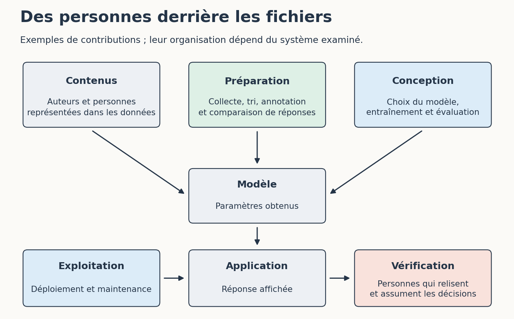

# 1. D’où viennent les données et le travail humain ?

[Sommaire de la partie](../README.md) · [Sources](.)

[Suivant : Licences, transparence et possibilités de vérification](../02-ouverture/LECTURE.md)

**TL;DR** — Un modèle ne sort pas seulement d’un calcul. Il dépend de contenus, de décisions et de travail humain dont les conditions ne sont pas toujours visibles dans sa fiche.

Dans les ateliers, les données fictives sont accessibles et nous pouvons retrouver leur origine. Pour les modèles que nous utilisons, cette remontée est parfois plus difficile. Essayons de comprendre ce que leur documentation permet réellement de connaître.

## Remonter avant le téléchargement

Prenons la fiche de SmolLM2-360M-Instruct, un modèle utilisé dans le parcours développement. Vous pouvez la consulter sans avoir installé ce modèle ni suivi la partie 3. Nous y trouvons des informations sur sa famille, ses données et ses évaluations. C’est un point de départ. La fiche ne donne pas le nom de chaque personne ayant contribué à chaque texte.[^p8-carte]

Plusieurs groupes contribuent au résultat : les auteurs des contenus, les personnes qui préparent les données et celles qui conçoivent le modèle. Une documentation de bibliothèque a d’abord été écrite pour aider ses utilisateurs. Son passage éventuel dans un corpus ajoute un usage à ce premier travail.

Figure: Plusieurs contributions humaines derrière une réponse affichée

Ouvrez `fiches/provenance.md` dans l’archive de cette partie. Pour les courriels de la journée d’ateliers, nous pouvons indiquer qu’ils ont été écrits pour le tutoriel, qu’ils décrivent un événement inventé et qu’ils sont distribués sous CC BY-SA 4.0. Le corpus documentaire de la partie 8 a lui aussi une provenance déclarée. Pour un corpus externe, nous devons pouvoir retrouver d’où vient l’information que nous écrivons dans cette fiche.

Une source peut être décrite sans être téléchargeable ; un jeu peut être téléchargé alors que les étapes de sa préparation restent inconnues. Ces différences donnent des questions précises à inscrire dans la fiche. La seule case « transparent » ne nous apprendrait pas grand-chose.

[^p8-carte]: Hugging Face, [fiche de SmolLM2-360M-Instruct](https://huggingface.co/HuggingFaceTB/SmolLM2-360M-Instruct), consultée en septembre 2026.

## Les personnes que le mot « automatisation » cache

Dans l’atelier d’apprentissage, les étiquettes des chiffres sont déjà fournies. Elles associent chaque image à la réponse attendue. À une autre échelle, des personnes peuvent transcrire, classer, comparer des réponses, vérifier des exemples ou modérer des contenus. Ce travail mérite d’être regardé autrement que comme une ligne « données » dans un budget.

Oskarina Veronica Fuentes Anaya raconte son expérience sur des plateformes de travail de données dans *Life of a Latin American Data Worker*. Elle décrit notamment des tâches qui arrivent de façon irrégulière et du temps passé à attendre sans être payé. C’est son témoignage et celui du milieu qu’elle décrit ; il ne permet pas d’attribuer les mêmes conditions à tous les modèles.[^p8-travail]

Prenons ce récit au sérieux sans inventer la chaîne de sous-traitance d’un fournisseur qui ne la publie pas. Dans notre fiche, une information inconnue reste inconnue. Cette absence peut tout de même peser dans notre choix ; elle n’a rien de rassurant par défaut.

Les auteurs des textes et du code méritent également une place dans cette discussion. Selon moi, la disponibilité technique d’un contenu ne devrait pas suffire à écarter la question de son usage, de l’accord de ses créateurs et du partage de la valeur produite. La réponse du droit ne tranche pas à elle seule la position éthique que nous voulons adopter.

Pour un projet auquel nous contribuons, cela devient très concret : qui annote, avec quelles consignes, quel paiement et quelle possibilité de signaler une erreur ou de refuser un contenu difficile ? Si nous commandons ce travail, la rapidité de livraison n’est pas notre seul critère.

[^p8-travail]: Oskarina Veronica Fuentes Anaya, [*Life of a Latin American Data Worker*](https://data-workers.org/oskarina/), 2024, Data Workers’ Inquiry. Présentation et témoignage de l’autrice, avec une animation sous-titrée.

## Ce que nous choisissons de garder

Ouvrez `cas/documents.md`. L’équipe dispose de trois éléments : une règle publique du service, une conversation de support contenant des coordonnées fictives et une ancienne recette dont la décision a changé.

Pour expliquer la règle de notification, le premier document suffit. Ajouter les coordonnées du client ne l’explique pas mieux. Quant à l’ancienne recette, elle pourrait contredire la règle actuelle. Avant de demander quel modèle choisir, nous pouvons déjà améliorer ce que nous lui donnons.

Réduire les données aide aussi à limiter leur exposition. Pour des données personnelles réelles, leur collecte et leur réutilisation demandent une analyse adaptée au but poursuivi ; leur présence sur le Web ne dispense pas de ces questions. Les fiches de la CNIL détaillent notamment la sélection des données pertinentes et leur suivi.[^p8-cnil]

Faites une copie de travail des documents et conservez seulement ce qui sert à répondre à la question. Comparez ensuite avec `corriges/documents.md`. Un nom retiré peut laisser derrière lui assez de détails pour reconnaître la personne. Ici, toutes les personnes sont fictives : nous pouvons examiner le problème sans exposer de véritables clients.

La sélection peut également déformer ce que le modèle voit. Si nos exemples ne couvrent que des tickets bien rédigés en anglais, un bon résultat sur ceux-ci ne dit pas ce qui se passera avec des demandes courtes en français. Essayons les usages que nous voulons réellement prendre en charge.

[^p8-cnil]: CNIL, [tenir compte de la protection des données dans la collecte et la gestion des données](https://www.cnil.fr/fr/tenir-compte-de-la-protection-des-donnees-dans-la-collecte-et-la-gestion-des-donnees). Ces recommandations portent sur les données personnelles ; elles ne règlent pas à elles seules les questions de droit d’auteur.

Notre fiche de provenance contient déjà des informations, quelques inconnues et des personnes que le mot « données » aurait facilement cachées. Les fichiers disponibles et leurs licences vont maintenant préciser ce que nous pouvons étudier, modifier et partager.

---

[Suivant : Licences, transparence et possibilités de vérification](../02-ouverture/LECTURE.md)
